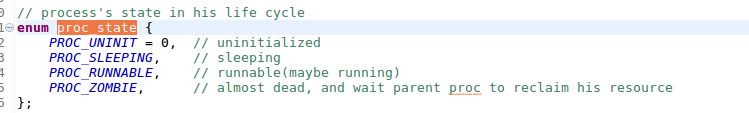
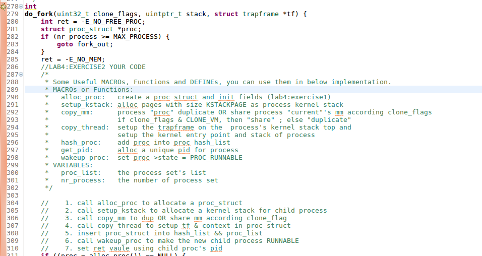

#### 练习1：分配并初始化一个进程控制块（需要编码）

alloc_proc函数（位于kern/process/proc.c中）负责分配并返回一个新的struct proc_struct结构，用于存储新建立的内核线程的管理信息。ucore需要对这个结构进行最基本的初始化，你需要完成这个初始化过程。

> 【提示】在alloc_proc函数的实现中，需要初始化的proc_struct结构中的成员变量至少包括：state/pid/runs/kstack/need_resched/parent/mm/context/tf/cr3/flags/name。

请在实验报告中简要说明你的设计实现过程。请回答如下问题：

- 请说明proc_struct中`struct context context`和`struct trapframe *tf`成员变量含义和在本实验中的作用是啥？（提示通过看代码和编程调试可以判断出来）

现在/kern/process中找到proc.c


alloc_proc申请了一个proc_struct,即进程控制块

在同一目录下找到pro_struct的定义，里面有各个成员的定义


可以找到proc_state，是表示一个进程在其生命周期里面的状态，分别有未分配，休眠，可运行，和僵尸状态。僵尸状态需要等待其父进程来回收其资源。由于此时是申请，所以为PROC_UNINIT。



pid指的是进程号，运行中的进程的进程号一般为非负数，所以此时设置一个负数来表示是刚申请未分配

比如在linux下

```c
ps aux
```


可以看到绝大部分进程的pid

runs:运行时间为0

● state：进程所处的状态。

● kstack: 每个线程都有一个内核栈，并且位于内核地址空间的不同位置。对于内核线程，该栈就是运行时的程序使用的栈；而对于普通进程，该栈是发生特权级改变的时候使保存被打断的硬件信息用的栈。uCore在创建进程时分配了 2 个连续的物理页（参见memlayout.h中KSTACKSIZE的定义）作为内核栈的空间。这个栈很小，所以内核中的代码应该尽可能的紧凑，并且避免在栈上分配大的数据结构，以免栈溢出，导致系统崩溃。kstack记录了分配给该进程/线程的内核栈的位置。主要作用有以下几点。首先，当内核准备从一个进程切换到另一个的时候，需要根据kstack 的值正确的设置好 tss （可以回顾一下在实验一中讲述的 tss 在中断处理过程中的作用），以便在进程切换以后再发生中断时能够使用正确的栈。其次，内核栈位于内核地址空间，并且是不共享的（每个线程都拥有自己的内核栈），因此不受到 mm 的管理，当进程退出的时候，内核能够根据 kstack 的值快速定位栈的位置并进行回收。

● parent：用户进程的父进程（创建它的进程）。在所有进程中，只有一个进程没有父进程，就是内核创建的第一个内核线程idleproc。内核根据这个父子关系建立一个树形结构，用于维护一些特殊的操作，例如确定某个进程是否可以对另外一个进程进行某种操作等等。

● mm：内存管理的信息，包括内存映射列表、页表指针等。mm成员变量在lab3中用于虚存管理。但在实际OS中，内核线程常驻内存，不需要考虑swap page问题，在lab5中涉及到了用户进程，才考虑进程用户内存空间的swap page问题，mm才会发挥作用。所以在lab4中mm对于内核线程就没有用了，这样内核线程的proc_struct的成员变量*mm=0是合理的。mm里有个很重要的项pgdir，记录的是该进程使用的一级页表的物理地址。由于*mm=NULL，所以在proc_struct数据结构中需要有一个代替pgdir项来记录页表起始地址，这就是proc_struct数据结构中的cr3成员变量。

● context：进程的上下文，用于进程切换（参见switch.S）。在 uCore中，所有的进程在内核中也是相对独立的（例如独立的内核堆栈以及上下文等等）。使用 context 保存寄存器的目的就在于在内核态中能够进行上下文之间的切换。实际利用context进行上下文切换的函数是在*kern/process/switch.S*中定义switch_to。

● tf：中断帧的指针，总是指向内核栈的某个位置：当进程从用户空间跳到内核空间时，中断帧记录了进程在被中断前的状态。当内核需要跳回用户空间时，需要调整中断帧以恢复让进程继续执行的各寄存器值。除此之外，uCore内核允许嵌套中断。因此为了保证嵌套中断发生时tf 总是能够指向当前的trapframe，uCore 在内核栈上维护了 tf 的链，可以参考trap.c::trap函数做进一步的了解。

● cr3: cr3 保存页表的物理地址，目的就是进程切换的时候方便直接使用 lcr3实现页表切换，避免每次都根据 mm 来计算 cr3。mm数据结构是用来实现用户空间的虚存管理的，但是内核线程没有用户空间，它执行的只是内核中的一小段代码（通常是一小段函数），所以它没有mm 结构，也就是NULL。当某个进程是一个普通用户态进程的时候，PCB 中的 cr3 就是 mm 中页表（pgdir）的物理地址；而当它是内核线程的时候，cr3 等于boot_cr3。而boot_cr3指向了uCore启动时建立好的饿内核虚拟空间的页目录表首地址。

● static struct proc *current：当前占用CPU且处于“运行”状态进程控制块指针。通常这个变量是只读的，只有在进程切换的时候才进行修改，并且整个切换和修改过程需要保证操作的原子性，目前至少需要屏蔽中断。可以参考 switch_to 的实现。

● static struct proc *initproc：本实验中，指向一个内核线程。本实验以后，此指针将指向第一个用户态进程。

● static list_entry_t hash_list[HASH_LIST_SIZE]：所有进程控制块的哈希表，proc_struct中的成员变量hash_link将基于pid链接入这个哈希表中。

● list_entry_t proc_list：所有进程控制块的双向线性列表，proc_struct中的成员变量list_link将链接入这个链表中。

最后填写如下:


#### 练习2：为新创建的内核线程分配资源（需要编码）

创建一个内核线程需要分配和设置好很多资源。kernel_thread函数通过调用**do_fork**函数完成具体内核线程的创建工作。do_kernel函数会调用alloc_proc函数来分配并初始化一个进程控制块，但alloc_proc只是找到了一小块内存用以记录进程的必要信息，并没有实际分配这些资源。ucore一般通过do_fork实际创建新的内核线程。do_fork的作用是，创建当前内核线程的一个副本，它们的执行上下文、代码、数据都一样，但是存储位置不同。在这个过程中，需要给新内核线程分配资源，并且复制原进程的状态。你需要完成在kern/process/proc.c中的do_fork函数中的处理过程。它的大致执行步骤包括：

- 调用alloc_proc，首先获得一块用户信息块。
- 为进程分配一个内核栈。
- 复制原进程的内存管理信息到新进程（但内核线程不必做此事）
- 复制原进程上下文到新进程
- 将新进程添加到进程列表
- 唤醒新进程
- 返回新进程号

请在实验报告中简要说明你的设计实现过程。请回答如下问题：

- 请说明ucore是否做到给每个新fork的线程一个唯一的id？请说明你的分析和理由。




从get_pid()看，每当申请一个新的块，都会和原来的pid进行范围比较，以此来保证申请到唯一的pid


#### 项目组成 

相对与实验三，实验四中主要改动如下：

- kern/process/ （新增进程管理相关文件）
  - proc.[ch]：新增：实现进程、线程相关功能，包括：创建进程/线程，初始化进程/线程，处理进程/线程退出等功能
  - entry.S：新增：内核线程入口函数kernel_thread_entry的实现
  - switch.S：新增：上下文切换，利用堆栈保存、恢复进程上下文
- kern/init/
  - init.c：修改：完成进程系统初始化，并在内核初始化后切入idle进程
- kern/mm/ （基本上与本次实验没有太直接的联系，了解kmalloc和kfree如何使用即可）
  - kmalloc.[ch]：新增：定义和实现了新的kmalloc/kfree函数。具体实现是基于slab分配的简化算法 （只要求会调用这两个函数即可）
  - memlayout.h：增加slab物理内存分配相关的定义与宏 （可不用理会）。
  - pmm.[ch]：修改：在pmm.c中添加了调用kmalloc_init函数,取消了老的kmalloc/kfree的实现；在pmm.h中取消了老的kmalloc/kfree的定义
  - swap.c：修改：取消了用于check的Line 185的执行
  - vmm.c：修改：调用新的kmalloc/kfree
- kern/trap/
  - trapentry.S：增加了汇编写的函数forkrets，用于do_fork调用的返回处理。
- kern/schedule/
  - sched.[ch]：新增：实现FIFO策略的进程调度
- kern/libs
  - rb_tree.[ch]：新增：实现红黑树，被slab分配的简化算法使用（可不用理会）