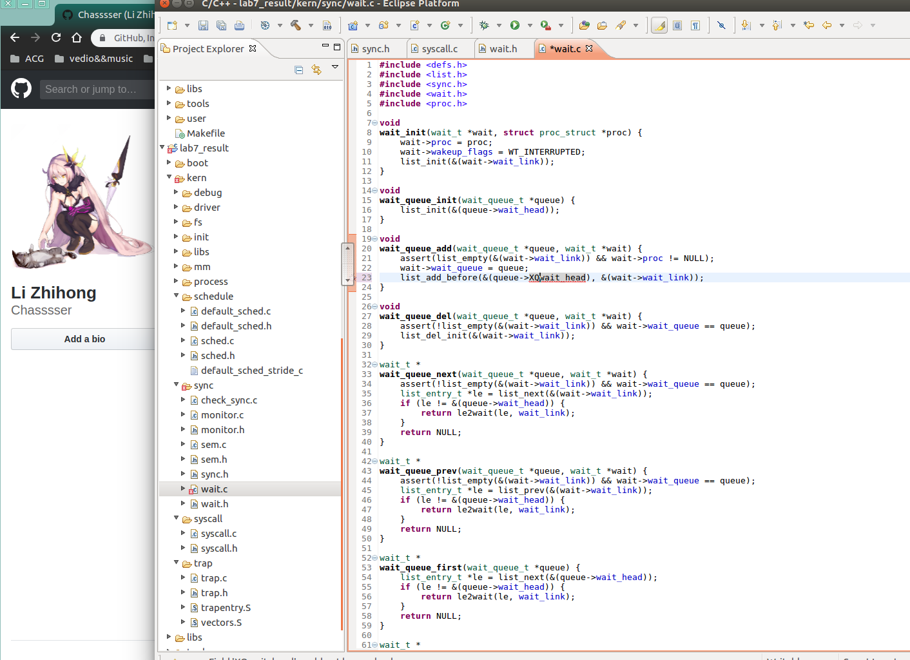
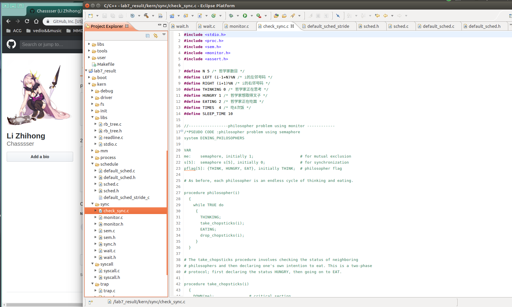
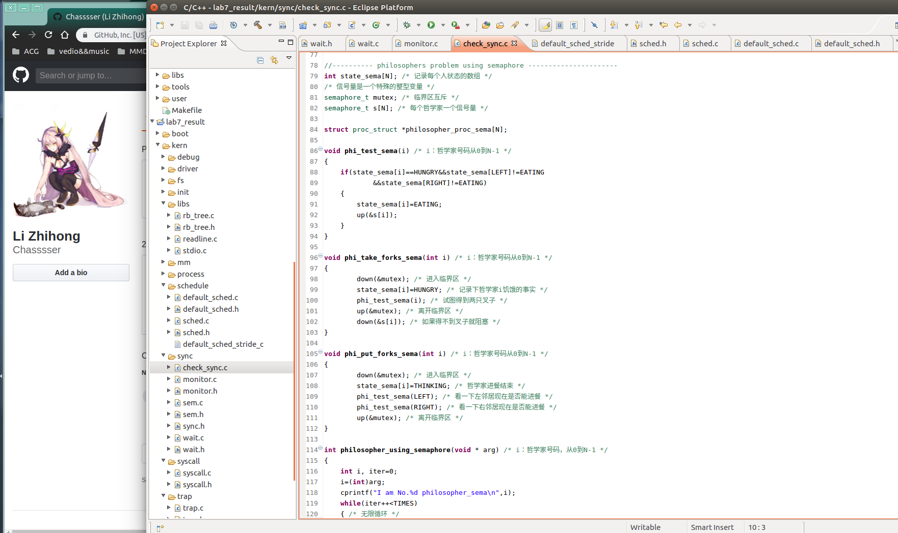
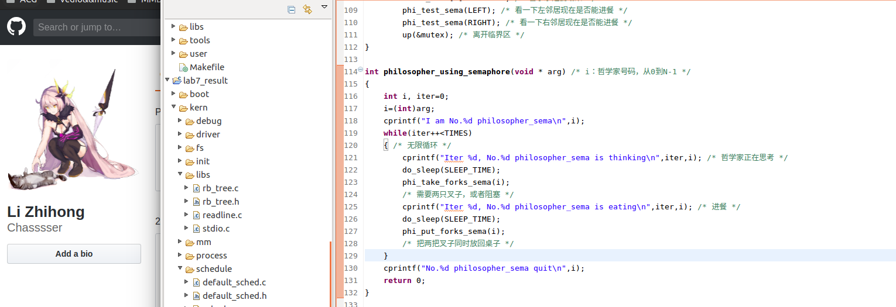
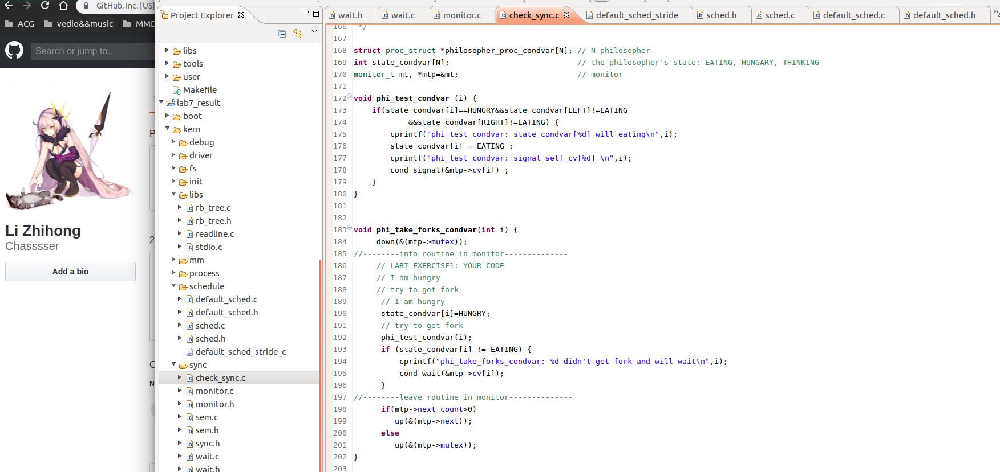

## 实验题目 

仔细阅读实验文档lab7同步互斥，完成以下练习（不做实验文档中的题目）。扩展练习选做，有能力者完成。

 练习1: 了解信号量和管程的实现机制

1） 同步互斥的底层支持是如何实现的？

2） 对比原理课上学到的信号量和p，v操作，说明Ucore中信号量机制的实现。

3） Ucore中的信号量是基于信号量和条件变量实现的，请说明其中的数据结构和函数方法的设计。

练习2: 了解基于信号量和管程的哲学家就餐问题

1） 说明ucore中基于信号量的哲学家就餐问题的实现机制。

2） 说明ucore中基于管程的哲学家就餐问题的实现机制。

扩展练习：了解java中同步互斥的实现机制，说明其与操作系统原理课的管程之间的关系，并用其实现写者优先的读者写者问题。

## 实验步骤

#### 练习1:

##### 1.同步互斥的底层支持是如何实现的？

根据操作系统原理的知识，我们知道如果没有在硬件级保证读内存-修改值-写回内存的原子性，我们只能通过复杂的软件来实现同步互斥操作。但由于有开关中断和test_and_set_bit等原子操作机器指令的存在，使得我们在实现同步互斥原语上可以大大简化。

在ucore中提供的底层机制包括中断屏蔽/使能控制等。kern/sync.c中实现的开关中断的控制函数local_intr_save(x)和local_intr_restore(x)，它们是基于kern/driver文件下的intr_enable()、intr_disable()函数实现的。


具体调用关系为：

```c++
关中断：local_intr_save --> __intr_save --> intr_disable --> cli
开中断：local_intr_restore--> __intr_restore --> intr_enable --> sti
```

最终的cli和sti是x86的机器指令，最终实现了关（屏蔽）中断和开（使能）中断，即设置了eflags寄存器中与中断相关的位。通过关闭中断，可以防止对当前执行的控制流被其他中断事件处理所打断。既然不能中断，那也就意味着在内核运行的当前进程无法被打断或被重新调度，即实现了对临界区的互斥操作。所以在单处理器情况下，可以通过开关中断实现对临界区的互斥保护，需要互斥的临界区代码的一般写法为：

```c++
local_intr_save(intr_flag);
{
  临界区代码
}
local_intr_restore(intr_flag);
……
```

由于目前ucore只实现了对单处理器的支持，所以通过这种方式，就可简单地支撑互斥操作了。在多处理器情况下，这种方法是无法实现互斥的，因为屏蔽了一个CPU的中断，只能阻止本地CPU上的进程不会被中断或调度，并不意味着其他CPU上执行的进程不能执行临界区的代码。所以，开关中断只对单处理器下的互斥操作起作用。在本实验中，开关中断机制是实现信号量等高层同步互斥原语的底层支撑基础之一。

##### 2.对比原理课上学到的信号量和p，v操作，说明Ucore中信号量机制的实现。

信号量是一种同步互斥机制的实现，普遍存在于现在的各种操作系统内核里。相对于spinlock 的应用对象，信号量的应用对象是在临界区中运行的时间较长的进程。等待信号量的进程需要睡眠来减少占用 CPU 的开销。

**在原理课上的信号量中，对于整型信号量，除了初始化之外，仅能通过两个标准的原子操作(Atomic Operation)wait(S)和signal(s)来访问，即P,V操作，由于是原子操作，所以执行时不可中断。并且，只要信号量S<=0,则不断测试,会造成忙等状态。**

**对于记录型信号量，每次wait操作都会请求一个单位的该类资源，使得可分配数减少，描述为S->vlaue--;当value<0时，表示分配完毕，进程开始调用block进行自我阻塞。同理，每次signal操作(P操作)都会使得执行进程释放一个资源，使得可分配的资源数增加，表现为S->value++。**

**上面两个是多个并发程序仅仅共享一个临界资源单位的时候，对于一个进程获取多个资源单位的任务，就要用到AND信号量，其基本思想是:将进程在整个运行过程中需要的所有资源，一次性全部分配给进程，在进程使用完后再一起释放。此时只要有一个资源未能分配给进程，其他有可能分配的资源**

ucore中信号量参照上述原理描述，建立在开关中断机制和wait_queue的基础上进行了具体实现。信号量的数据结构定义如下：

```c++
typedef struct {
    int value;                   //信号量的当前值
    wait_queue_t wait_queue;     //信号量对应的等待队列
} semaphore_t;
```

semaphore_t是最基本的记录型信号量（record semaphore)结构，包含了用于计数的整数值value，和一个进程等待队列wait_queue，一个等待的进程会挂在此等待队列上。

在ucore中最重要的信号量操作是P操作函数down(semaphore_t *sem)和V操作函数 up(semaphore_t *sem)。但这两个函数的具体实现是__down(semaphore_t *sem, uint32_t wait_state) 函数和__up(semaphore_t *sem, uint32_t wait_state)函数，二者的具体实现描述如下：

● __down(semaphore_t *sem, uint32_t wait_state, timer_t *timer)：具体实现信号量的P操作，首先关掉中断，然后判断当前信号量的value是否大于0。如果是>0，则表明可以获得信号量，故让value减一，并打开中断返回即可；如果不是>0，则表明无法获得信号量，故需要将当前的进程加入到等待队列中，并打开中断，然后运行调度器选择另外一个进程执行。如果被V操作唤醒，则把自身关联的wait从等待队列中删除（此过程需要先关中断，完成后开中断）。具体实现如下所示：

```c++
static __noinline uint32_t __down(semaphore_t *sem, uint32_t wait_state) {
    bool intr_flag;
    local_intr_save(intr_flag);
    if (sem->value > 0) {
        sem->value --;
        local_intr_restore(intr_flag);
        return 0;
    }
    wait_t __wait, *wait = &__wait;
    wait_current_set(&(sem->wait_queue), wait, wait_state);
    local_intr_restore(intr_flag);

    schedule();

    local_intr_save(intr_flag);
    wait_current_del(&(sem->wait_queue), wait);
    local_intr_restore(intr_flag);

    if (wait->wakeup_flags != wait_state) {
        return wait->wakeup_flags;
    }
    return 0;
}
```

与`__down`相关的调用和被调用函数关系图如下所示：

```c++
digraph "__down" {
  graph [bgcolor="#F7F5F3", fontname="Arial", fontsize="10", label="", rankdir="LR"];
  node [shape="box", style="filled", color="blue", fontname="Arial", fontsize="10", fillcolor="white", label=""];
  edge [color="#CC0044", fontname="Arial", fontsize="10", label=""];
  graph [bgcolor="#F7F5F3"];
  __N1 [color="red", label="__down"];
  __N2 [label="__intr_save"];
  __N3 [label="__intr_restore"];
  __N4 [label="wait_current_set"];
  __N5 [label="schedule"];
  __N6 [label="wait_in_queue"];
  __N7 [label="wait_queue_del"];
  __N8 [label="down"];
  __N9 [label="phi_take_forks_sema"];
  __N10 [label="cond_signal"];
  __N11 [label="phi_put_forks_sema"];
  __N12 [label="cond_wait"];
  __N13 [label="lock_mm"];
  __N14 [label="phi_take_forks_condvar"];
  __N15 [label="phi_put_forks_condvar"];
  __N1 -> __N2;
  __N1 -> __N3;
  __N1 -> __N4;
  __N1 -> __N5;
  __N1 -> __N6;
  __N1 -> __N7;
  __N9 -> __N8;
  __N10 -> __N8;
  __N11 -> __N8;
  __N12 -> __N8;
  __N13 -> __N8;
  __N14 -> __N8;
  __N15 -> __N8;
  __N8 -> __N1;
}
```

● __up(semaphore_t *sem, uint32_t wait_state)：具体实现信号量的V操作，首先关中断，如果信号量对应的wait queue中没有进程在等待，直接把信号量的value加一，然后开中断返回；如果有进程在等待且进程等待的原因是semophore设置的，则调用wakeup_wait函数将waitqueue中等待的第一个wait删除，且把此wait关联的进程唤醒，最后开中断返回。具体实现如下所示：

```c++
static __noinline void __up(semaphore_t *sem, uint32_t wait_state) {
    bool intr_flag;
    local_intr_save(intr_flag);
    {
        wait_t *wait;
        if ((wait = wait_queue_first(&(sem->wait_queue))) == NULL) {
            sem->value ++;
        }
        else {
            wakeup_wait(&(sem->wait_queue), wait, wait_state, 1);
        }
    }
    local_intr_restore(intr_flag);
}
```

与`__up`相关的调用和被调用函数关系图如下所示：

```c++
digraph "__up" {
  graph [bgcolor="#F7F5F3", fontname="Arial", fontsize="10", label="", rankdir="LR"];
  node [shape="box", style="filled", color="blue", fontname="Arial", fontsize="10", fillcolor="white", label=""];
  edge [color="#CC0044", fontname="Arial", fontsize="10", label=""];
  graph [bgcolor="#F7F5F3"];
  __N1 [color="red", label="__up"];
  __N2 [label="__intr_save"];
  __N3 [label="wait_queue_first"];
  __N5 [label="wakeup_wait"];
  __N6 [label="__intr_restore"];
  __N7 [label="up"];
  __N8 [label="phi_test_sema"];
  __N9 [label="phi_take_forks_sema"];
  __N10 [label="cond_signal"];
  __N11 [label="phi_put_forks_sema"];
  __N12 [label="cond_wait"];
  __N13 [label="unlock_mm"];
  __N14 [label="phi_take_forks_condvar"];
  __N15 [label="phi_put_forks_condvar"];
  __N1 -> __N2;
  __N1 -> __N3;
  __N1 -> __N5;
  __N1 -> __N6;
  __N8 -> __N7;
  __N9 -> __N7;
  __N10 -> __N7;
  __N11 -> __N7;
  __N12 -> __N7;
  __N13 -> __N7;
  __N14 -> __N7;
  __N15 -> __N7;
  __N7 -> __N1;
}
```

对照信号量的原理性描述和具体实现，可以发现二者在流程上基本一致，只是具体实现采用了关中断的方式保证了对共享资源的互斥访问，通过等待队列让无法获得信号量的进程睡眠等待。另外，我们可以看出信号量的计数器value具有有如下性质：

- value>0，表示共享资源的空闲数
- vlaue<0，表示该信号量的等待队列里的进程数
- value=0，表示等待队列为空

##### 3.Ucore中的信号量是基于信号量和条件变量实现的，请说明其中的数据结构和函数方法的设计。

core在kern/sync/{ wait.h, wait.c }中实现了等待项wait结构和等待队列wait queue结构以及相关函数），这是实现ucore中的信号量机制和条件变量机制的基础，进入wait queue的进程会被设为等待状态（PROC_SLEEPING），直到他们被唤醒。

###### 数据结构定义

```c++
typedef  struct {
    struct proc_struct *proc;     //等待进程的指针
    uint32_t wakeup_flags;        //进程被放入等待队列的原因标记
    wait_queue_t *wait_queue;     //指向此wait结构所属于的wait_queue
    list_entry_t wait_link;       //用来组织wait_queue中wait节点的连接
} wait_t;

typedef struct {
    list_entry_t wait_head;       //wait_queue的队头
} wait_queue_t;

le2wait(le, member)               //实现wait_t中成员的指针向wait_t 指针的转化
```

###### 相关函数说明

与wait和wait queue相关的函数主要分为两层，底层函数是对wait queue的初始化、插入、删除和查找操作，相关函数如下：

```c++
void wait_init(wait_t *wait, struct proc_struct *proc);    //初始化wait结构
bool wait_in_queue(wait_t *wait);                          //wait是否在wait queue中
void wait_queue_init(wait_queue_t *queue);                 //初始化wait_queue结构
void wait_queue_add(wait_queue_t *queue, wait_t *wait);    //把wait前插到wait queue中
void wait_queue_del(wait_queue_t *queue, wait_t *wait);    //从wait queue中删除wait
wait_t *wait_queue_next(wait_queue_t *queue, wait_t *wait);//取得wait的后一个链接指针
wait_t *wait_queue_prev(wait_queue_t *queue, wait_t *wait);//取得wait的前一个链接指针
wait_t *wait_queue_first(wait_queue_t *queue);             //取得wait queue的第一个wait
wait_t *wait_queue_last(wait_queue_t *queue);              //取得wait queue的最后一个wait
bool wait_queue_empty(wait_queue_t *queue);                //wait queue是否为空
```

高层函数基于底层函数实现了让进程进入等待队列--`wait_current_set`，以及从等待队列中唤醒进程--`wakeup_wait`，相关函数如下：

```c++
//让wait与进程关联，且让当前进程关联的wait进入等待队列queue，当前进程睡眠
void wait_current_set(wait_queue_t *queue, wait_t *wait, uint32_t wait_state);
//把与当前进程关联的wait从等待队列queue中删除
wait_current_del(queue, wait);
//唤醒与wait关联的进程
void wakeup_wait(wait_queue_t *queue, wait_t *wait, uint32_t wakeup_flags, bool del);
//唤醒等待队列上挂着的第一个wait所关联的进程
void wakeup_first(wait_queue_t *queue, uint32_t wakeup_flags, bool del);
//唤醒等待队列上所有的等待的进程
void wakeup_queue(wait_queue_t *queue, uint32_t wakeup_flags, bool del);
```

###### 调用关系举例

如下图所示，对于唤醒进程的函数`wakeup_wait`，可以看到它会被各种信号量的V操作函数`up`调用，并且它会调用`wait_queue_del`函数和`wakup_proc`函数来完成唤醒进程的操作。

```c++
digraph "wakeup_wait" {
  graph [bgcolor="#F7F5F3", fontname="Arial", fontsize="10", label="", rankdir="LR"];
  node [shape="box", style="filled", color="blue", fontname="Arial", fontsize="10", fillcolor="white", label=""];
  edge [color="#CC0044", fontname="Arial", fontsize="10", label=""];
  graph [bgcolor="#F7F5F3"];
  __N1 [color="red", label="wakeup_wait"];
  __N2 [label="wait_queue_del"];
  __N3 [label="wakeup_proc"];
  __N4 [label="__up"];
  __N5 [label="up"];
  __N6 [label="phi_test_sema"];
  __N7 [label="phi_take_forks_sema"];
  __N8 [label="cond_signal"];
  __N9 [label="phi_put_forks_sema"];
  __N10 [label="cond_wait"];
  __N11 [label="unlock_mm"];
  __N12 [label="phi_take_forks_condvar"];
  __N13 [label="phi_put_forks_condvar"];
  __N14 [label="wakeup_first"];
  __N15 [label="wakeup_queue"];
  __N1 -> __N2;
  __N1 -> __N3;
  __N6 -> __N5;
  __N7 -> __N5;
  __N8 -> __N5;
  __N9 -> __N5;
  __N10 -> __N5;
  __N11 -> __N5;
  __N12 -> __N5;
  __N13 -> __N5;
  __N5 -> __N4;
  __N4 -> __N1;
  __N14 -> __N1;
  __N15 -> __N1;
}
```

如下图所示，而对于让进程进入等待状态的函数`wait_current_set`，可以看到它会被各种信号量的P操作函数｀down`调用，并且它会调用`wait_init`完成对等待项的初始化，并进一步调用`wait_queue_add`来把与要处于等待状态的进程所关联的等待项挂到与信号量绑定的等待队列中。

```c++
digraph "wait_current_set" {
  graph [bgcolor="#F7F5F3", fontname="Arial", fontsize="10", label="", rankdir="LR"];
  node [shape="box", style="filled", color="blue", fontname="Arial", fontsize="10", fillcolor="white", label=""];
  edge [color="#CC0044", fontname="Arial", fontsize="10", label=""];
  graph [bgcolor="#F7F5F3"];
  __N1 [color="red", label="wait_current_set"];
  __N3 [label="wait_init"];
  __N4 [label="list_init"];
  __N5 [label="wait_queue_add"];
  __N6 [label="list_empty"];
  __N7 [label="list_add_before"];
  __N8 [label="__down"];
  __N9 [label="down"];
  __N10 [label="phi_take_forks_sema"];
  __N11 [label="cond_signal"];
  __N12 [label="phi_put_forks_sema"];
  __N13 [label="cond_wait"];
  __N14 [label="lock_mm"];
  __N15 [label="phi_take_forks_condvar"];
  __N16 [label="phi_put_forks_condvar"];
  __N3 -> __N4;
  __N1 -> __N3;
  __N5 -> __N6;
  __N5 -> __N7;
  __N1 -> __N5;
  __N10 -> __N9;
  __N11 -> __N9;
  __N12 -> __N9;
  __N13 -> __N9;
  __N14 -> __N9;
  __N15 -> __N9;
  __N16 -> __N9;
  __N9 -> __N8;
  __N8 -> __N1;
}
```

#### 练习2: 了解基于信号量和管程的哲学家就餐问题

##### 1） 说明ucore中基于信号量的哲学家就餐问题的实现机制。



##### 



##### 2） 说明ucore中基于管程的哲学家就餐问题的实现机制。

```c++
monitor dp
{
    enum {THINKING, HUNGRY, EATING} state[5];	//哲学家状态
    condition self[5];

    void pickup(int i) {		//试图拿起叉子
        state[i] = HUNGRY;		
        test(i);
        if (state[i] != EATING)
            self[i].wait_cv();
    }

    void putdown(int i) {		//放下叉子
        state[i] = THINKING;
        test((i + 4) % 5);
        test((i + 1) % 5);
    }

    void test(int i) {
        if ((state[(i + 4) % 5] != EATING) &&
           (state[i] == HUNGRY) &&
           (state[(i + 1) % 5] != EATING)) {
              state[i] = EATING;
              self[i].signal_cv();
        }
    }

    initialization code() {
        for (int i = 0; i < 5; i++)
        state[i] = THINKING;
        }
}
```





## 实验小结

复习了一下信号量和管程相关内容。

