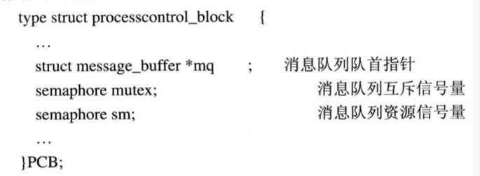
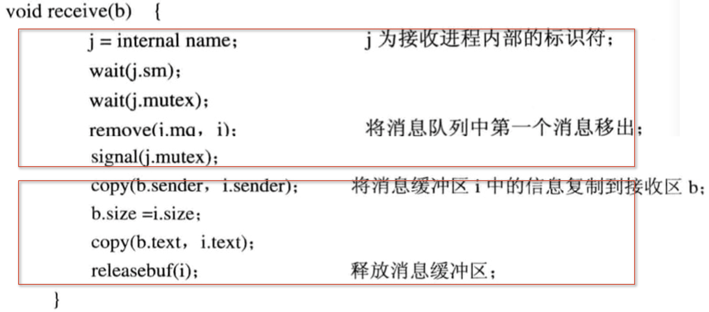
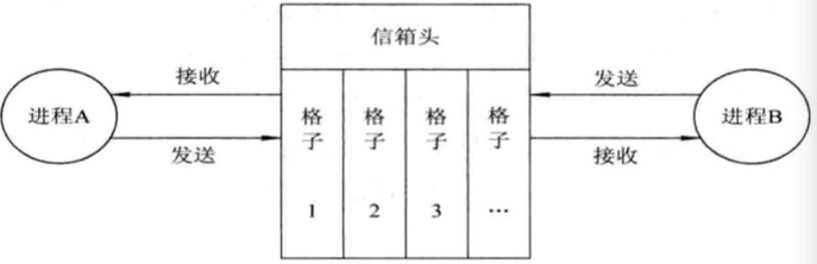
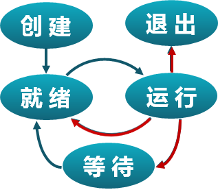
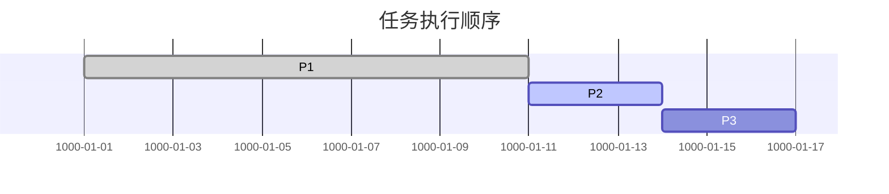
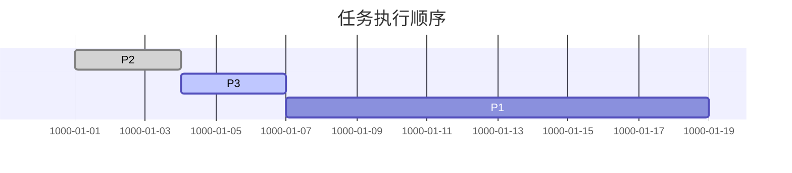
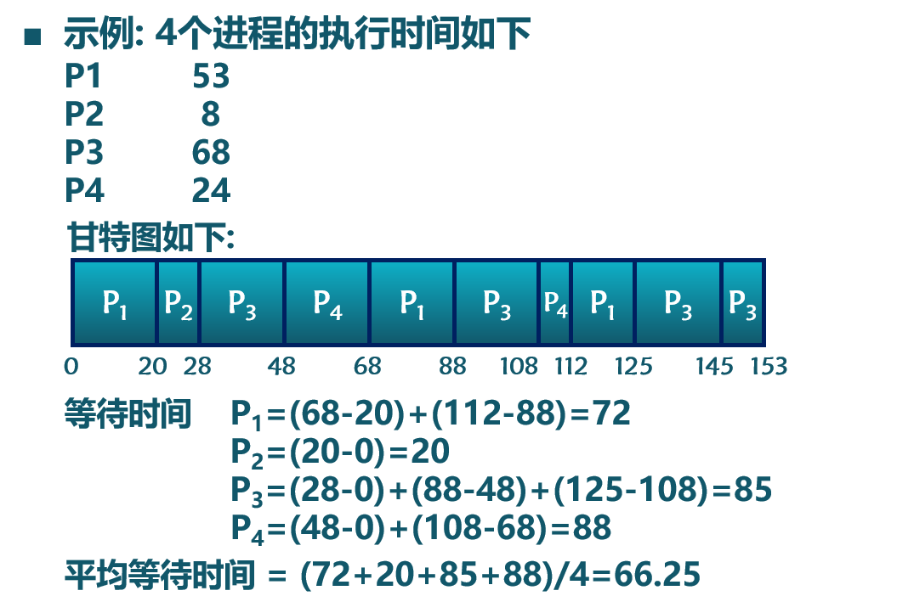
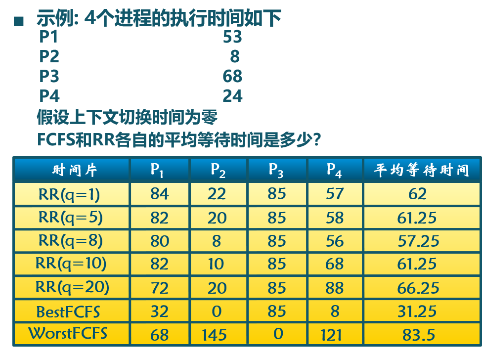
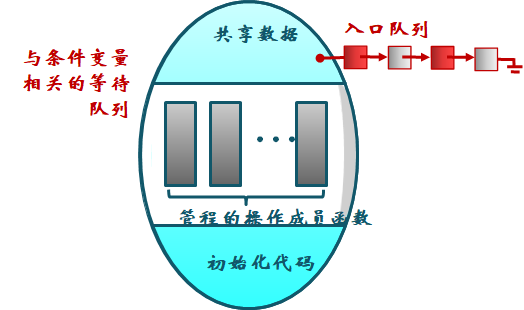
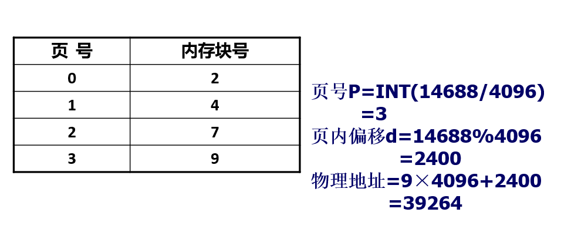

[TOC]


# 一.操作系统概述-- by LZH

## (一)操作系统的概念、特征、功能和提供的服务

### <1>概念

操作系统是配置在计算机硬件上的第一层软件，是对硬件系统的首次扩充。其主要作用是管理好这些设备，提高他们的利用率和系统的吞吐量，并为用户和应用程序提供一个简单的接口，便于用户使用。(第一章第一段)

### <2>操作系统的特征 （1.3）

#### #1并发

计算机系统中同时存在多个运行的程序，需要OS管理和调度。

**并行性**:两个或者多个事件在**同一时刻**发生。

**并发性**:两个或者多个事件在**同一时间间隔**内发生。

#### #2共享

**“同时”访问**:有的资源允许一段时间内由多个进程"同时"对它们进行访问，"同时"在微观上意义上，进程对该资源的访问是交替进行的。

**互斥共享**:有的资源虽然可以供给多个进程使用，但是一段时间内只允许一个进程访问该资源，故建立进程对这类资源的互斥访问。

#### #3虚拟

**利用多道程序设计技术，让每个用户都觉得有一个计算机专门为他服务**

**时分复用**：利用某设备为一用户服务的空闲时间内，又转去为其他用户服务。通过利用处理机的空闲时间运行其它程序，提高处理的利用率

**空分复用**：利用存储器的空闲空间分区域存放和运行其他的多道程序，以此提高内存的利用率。

#### #4异步

程序的执行不是一贯到底，而是走走停停，向前推进的速度不可预知，这就是进程的异步性。

但是只要运行环境相同，OS需要保证程序运行的结果也要相同

### <3>操作系统的功能和提供的服务（1.4）

#### #1处理机管理功能

进程控制：为作业创建进程、撤销（终止）已结束的进程、控制进程在运行过程中的状态转换

进程同步：为多个进程（线程）的运行进行协调。

**进程通信：实现相互合作进程之间的信息交换。**

#### #2存储器管理功能

内存分配

内存保护

地址映射

内存扩充

#### #3.设备管理功能

缓冲管理：缓和CPU和I/O设备速度不匹配的矛盾。

设备分配：设备控制表、控制器控制表

设备处理：设备驱动程序，实现CPU和设设备控制器之间的通信。

#### #4.文件管理系统

文件存储空间的管理

目录管理

文件的读／写管理和保护

#### #5.操作系统与用户之间的接口

用户接口

程序接口	

#### #6.现代操作系统的新功能

系统安全

网络的功能和服务

支持多媒体

## (二)操作系统的发展与分类

### <1>操作系统的演变（1.2）

#### #1单用户系统（’45-’55)-书上没有

■ 操作系统=装载器+通用子程序库

■ 问题：昂贵组件的低利用率

#### #2单道批处理系统（’55-’65)

■ 顺序执行与批处理

■ 主要缺点:系统中的资源得不到充分利用，因为内存中只有一道程序

#### #3多道批处理系统（’65-’80)

■ 保持多个工作在内存中并且在各工作间复用CPU

■ 多道程序交替执行，交替的条件是前一个正在执行的程序主动让出CPU的使用权。

■ 多道批处理系统主要考虑的是系统效率和系统的吞吐量(优点)。

■ 多道批处理系统缺点:平均周转时间长，无交互能力

#### #4分时（’70-)

■ 定时中断用于工作对CPU的复用

■ 交互性和及时性是分时系统的主要特征。

#### #5实时操作系统

■ 实时系统的正确性，不仅有计算的逻辑结果来决定，还取决于产生结果的时间。

■ 实时任务的类型：

周期性实时任务和非周期性实时任务，前者是指外部设备周期性地发出激励信号给计算机，使其周期性执行，以便周期性地控制某外部设备，后者无明显的周期性，但是都必须联系着一个截止时间。

硬实时和软实时，前者必须满足对截止时间的要求，后者对此没有严格要求

## (三)操作系统体系结构

#### <1>传统结构

无结构

模块化

分层 

自底向上的分层原则，确定每一步的设计都是建立在可靠的基础上。

#### <2>现代结构

微内核结构

只将最基本的部分放入微内核中。

## (四)操作系统的启动流程

## (五)操作系统的运行环境

### <1>内核态与用户态 

防止OS本身及相关数据遭到应用程序或无意的破坏，通常将处理机的执行状态分为：

系统态（内核态，内核态又称为管态）：高权限，能访问所有的寄存器。

用户态：低权限，能访问指定的寄存器。

**例子:**

**CPU执行操作系统代码的时候称为处理机处于管态。**

**函数调用并不会切换到内核态，而除零操作引发中断，中断和系统调用都会切换到内核态进行相应处理。**

### <2>中断、异常、系统调用 (切换到内核态)

#### #1为什么需要中断、异常和系统调用

计算机的一些功能只有内核有权利访问，通过中断、异常和系统调用为应用程序提供方便。

在计算机运行中，内核是被信任的第三方

只有内核可以执行特权指令

方便应用程序

#### #2中断和异常希望解决的问题(用于解决意外的情况)

当外设连接计算机时，会出现什么现象？(中断)

当应用程序处理意想不到的行为时，会出现什么现象？(异常)

#### #3系统调用希望解决的问题

###### 用户应用程序是如何得到系统服务？

**通过调用函数库，函数库又会调用对应的系统调用接口，从而得到系统服务。**

###### 系统调用和功能调用的不同之处是什么？	

系统调用时会有堆栈切换和特权级的转换，INT和IRET用于系统调用。

功能调用时没有堆栈切换，CALL和RET用于功能调用。

#### #4无法预计用户在什么时候敲键盘\除法除以0

我们要解决用户程序如何来解决系统的服务。就好象说我们提供给银行对外提供服务，银行为了保证安全，它有很多的防护，这个防护又和对外提供服务这是有矛盾的。

为了方便用户来使用银行的服务，应该必须提供灵活的访问接口，又不能影响到银行的安全。

操作系统内核也是一样的，我们需要来通过系统调用来提供一个接口，让应用程序既方便的使用内核提供的服务，又不至于用户的行为对我内核的安全产生影响

#### #5定义

##### 系统调用 (system call)

- 应用程序 **主动** 向操作系统发出的服务器请求
- **系统调用是应用程序向操作系统发出服务请求并获得操作系统服务的唯一通道和结果（操作系统与用户的接口）。**

##### 异常 (exception)

- 非法指令或其他原因导致当前 **指令执行失败**
  - 如: 内存出错后的处理请求

##### 中断(hardware interrupt)

- 来自硬件设备的处理请求

##### **中断向量地址**

- 即存储中断向量的存储单元地址，中断服务例行程序入口地址

### <3>中断、异常和系统调用的比较

#### #1源头

- 中断：外设
- 异常：应用程序意想不到的行为
- 系统调用：应用程序请求操作系统提供服务

#### #2响应方式

- 中断：异步
- 异常：同步
- 系统调用：异步或同步

#### #3处理机制

- **中断：持续，对用户应用程序是透明的**
- **异常：杀死或重新执行意想不到的应用程序指令**
- **系统调用：等待和持续**

#### #4中断(此处为三者总称)处理机制

- **硬件处理**

  - 在CPU初始化时设置 **中断使能** 标志

    - 依据内部或外部事件设置**中断标志**
    - 依据 **中断向量** 调用相应 **中断服务** 例程

  - **注释:1）**在许可外界打扰CPU的执行之前，CPU是不会对外界的任何中断请求发出响应的。

    **2）**生成中断标志，通常是一个电平的上升沿或者说是一个高电平，CPU会记录这个事件。

    我有一个中断标志，表示出现了一个中断，什么设备产生的，需要知道中断源的编号。

- **软件**

  - 现场保持 **(编译器)**

  - 中断服务处理 **(服务例程)**

  - 清除中断标记 **(服务例程)**

  - 现场恢复 **(编译器)**

  - 注: 都到了**中断向量表**，中断--中断服务例程，异常--异常服务例程，系统调用--总共占有一个中断编号，不同系统调用功能由系统调用表来表示的。由系统调用表的不同，选中不同的系统调用实现。

  - 如果是系统调用，由于系统调用的量很大，他在中断向量表里只占一个中断编号，不同的系统调用的功能由系统调用表实现。

    需要保存上下文信息。

#### #5中断(此处为三者总称)嵌套

- ##### 硬件中断服务例程可以被打断

  - 不同**硬件中断源**可能**硬件中断处理**时出现
  - **硬件中断服务例程**中需要**临时禁止中断** 请求
  - 中断请求会保持到cpu做出响应
  - **中断处理例程**（也可称为中断处理程序）需要**执行打开中断，关闭中断等特权指令**，而这些指令只能在**内核态**下才能正确执行，所以中断处理例程位于操作系统内核中。

- ##### 异常服务例程可被打断

  - 异常服务例程执行时可能出现硬件中断

- ##### 异常服务例程可嵌套

- - 异常服务例程可能出现缺页

#### #6中断例子

我正在处理一个请求的时候，又来了一个请求这时候我怎么办，那我们说在操作系统的里头呢？

它是硬件的中断，它是允许被打断的，也就是说我正在处理一个中断的时候，可以允许你再出现其他的中断。

如果两个中断源不同，那这时候我可以通过优先级的高低，让一个往后推一段，或者说让一个暂停下来，那使得我可以同时在做交替在做处理。

中断服务例程里头，并不是说我任何一个时刻都可以做任何一个处理，它会在一定的时间里禁止中断请求。

 比如说我电源有问题，那可能其他的问题就变得不重要了，这时候我在做电源的处理的时候，我就会禁止掉其他中断。中断服务请求会一直保持到CPU做出响应。

比如说我在这里头虚拟存储里头，它访问到的存储单元的数据不存在，我正在从硬盘上倒数据进来。倒的过程当中，它会用到磁盘I/O，这时候也会再有磁盘设备的中断，这时候是允许它可以做嵌套的。

#### #7注意点

系统调用是提供给应用程序使用的，由用户态发出，进入内核态执行。外部中断随时可能发生；应用程序执行时可能发生缺页；进程切换完全由内核来控制。

### <4>系统调用

1. ##### 操作系统服务的编程接口

2. ##### 通常由高级语言编写(C或者C++)

3. ##### 程序访问通常是通过高层次的API接口而不是直接进行系统调用

4. 三种最常用的应用程序编程接口(API)

  - Win32 API 用于WIndows
  - POSIX API 用于POSIX-based systems(包括UNIX，LINUX，Mac OS X)
  - Java API 用于java虚拟机(JVM)

# 二.进程管理

## (一)进程与线程

### <1>进程概念

#### #1定义

进程是指一个具有一定**独立功能的程序**在一个**数据集合**上的一次**动态执行**过程。

#### #2组成

进程包含了正在运行的一个程序的**所有状态信息** ：

1. 代码
2. 数据
3. 状态寄存器
  - CPU状态CR0，指令指针IP
4. 通用寄存器
  - AX,BX,CX
5. 进程占用系统资源
  - 打开文件、已分配内存

#### #3特点

1. 动态性:可动态地创建、结束进程
2. 并发性:进程可以被独立调度并占用处理机运行
3. 独立性:不同进程的工作不相互影响
4. 制约性:因访问共享数据/资源或进程间同步而产生制约

#### #4进程与程序的联系

1. 进程是操作系统处于执行状态程序的抽象
  - 程序 = 文件 (静态的可执行文件)
  - 进程 = 执行中的程序 = 程序 + 执行状态
2. 同一个程序的多次执行过程对应为不同进程
  - 如命令“ls”的多次执行对应多个进程
3. 进程执行需要的资源
  - 内存：保存代码和数据
  - CPU：执行指令

#### #5进程与程序的区别

1. 进程是动态的，程序是静态的
  - 程序是有序代码的集合
  - 进程是程序的执行，进程有核心态/用户态
2. 进程是暂时的，程序的永久的
  - 进程是一个状态变化的过程
  - 程序可长久保存
3. 进程与程序的组成不同
  - 进程的组成包括程序、数据和进程控制块

### <2>进程控制块（PCB，Process Control Block）
#### #1概念

1. 操作系统管理控制进程运行所用的信息集合
2. 操作系统用PCB来描述进程的基本情况以及运行变化的过程
3. PCB是进程存在的唯一标志
  - 每个进程都在操作系统中有一个对应的PCB

#### #2进程控制块的使用

1. 进程创建
  - 生成该进程的PCB
2. 进程终止
  - 回收它的PCB
3. 进程的组织管理
  - 通过对PCB的组织管理来实现

#### #3进程控制块PCB的内容

1. 进程标识信息

2. 处理机现场保存

3. 进程控制信息

  - 调度和状态信息

    - 调度进程和处理机使用情况
  - 进程间通信信息

    - 进程间通信相关的各种标识
  - 存储管理信息

    - 指向进程映像存储空间数据结构
  - 进程所用资源

    - 进程使用的系统资源，如打开文件等
  - 有关数据结构的连接信息
    - 与PCB相关的进程队列
    - 进程状态的变化体现于其进程控制块所在的链表，通过进程队列实现。

#### #4进程控制块的组织方式

1. 链表形式:同一状态的进程的PCB组成一个链表，多个状态对应多个不同的链表
  - 各个状态的进程形成不同的链表:就绪链表，阻塞链表
2. 索引表形式:同一状态的进程归于一个索引表(由索引指向PCB)，多个状态对应多个不同的索引表
  - 进程状态的变化体现于其进程控制块所在的链表，通过进程队列实现。


### <3>进程状态与转换

#### #1进程的生命周期划分

1. 进程创建
2. 进程执行
3. 进程等待
4. 进程抢占
5. 进程唤醒
6. 进程结束

#### #2导致进程创建的情况

1. 系统初始化时
2. 用户请求创建一个新进程
3. 正在运行的进程执行了创建进程的系统调用

#### #3进程执行

内核选择一个就绪的进程，让它占用处理机并运行

如何选择？处理机调度算法

#### #4进程进入等待(阻塞)的情况

只有进程本身才知道何时需要等待某种事件的发生，即导致其进入等待状态的一定是进程本身内部原因所导致的，不是外部原因所导致的。

1. 请求并等待系统服务,无法马上完成
2. 启动某种操作，无法马上完成
3. 需要的数据没有到达

#### #5进程被抢占的情况

1. 高优先级的进程变成就绪状态
2. 调度算法为每个进程设置的时间片，进程执行的时间片用完了，操作系统会抢先让下一个进程投入运行。

#### #6唤醒进程的情况

**进程只能被别的进程或者操作系统给唤醒。**

1. 被阻塞进程需要的资源可被满足
2. 被阻塞进程等待的事件到达

#### #7进程结束的情况

1. 正常退出(自愿的)
2. 错误退出(自愿的)
3. 致命错误(强制性的)
4. 被其他进程所杀(强制性的)
5. **进程退出了，但还没被父进程回收，此时进程处于zombie态**

### <3>三状态进程模型


#### #1每种状态的含义

##### 1.**运行状态(Running)**

- 进程正在处理机上运行

##### 2.就绪状态(Ready)

- 进程获得了除了处理机之外的所有所需的资源，得到处理机即可运行

##### **3.等待状态(有成阻塞状态Blocked)**

- 进程正在等待某一事件的出现而暂停运行

##### **4.创建状态(New)**

- 一个进程正在被创建，还没被转到就绪状态之前的状态，是一个过渡状态。也就是在分配资源和相应的数据结构

##### **5.退出状态(Exit)**

- 一个进程反正在从系统中消失时的状态，这是因为进程结束或者由于其他原因所致(也就是系统正在回收资源)

#### **#2各种状态的变迁**

##### 1.NULL->创建(启动)

一个新进程被产生出来执行一个程序

##### 2.创建->就绪(进入就绪队列)

当进程被创建完成并初始化后，一切就绪准备运行时，变为就绪状态

##### 3.就绪->运行(被调度)

处于就绪状态的进程被进程调度程序选中后，就分配到处理机上运行

##### 4.运行->结束(结束)

当进程表示它已经完成或者因出错，当前运行进程会由操作系统作结束处理(回收资源)

##### 5.运行->就绪(时间片完或者被抢先)

处于运行状态的进程在其运行期间，由于分配给它的处理时间片用完而让出处理机

##### 6.运行->等待(等待事件)

当进程请求某资源且必须等待时

##### 7.等待(阻塞)->就绪(事件发生)

当进程要等待某事件到来时，它从阻塞状态变到就绪状态。

### <4>进程挂起


#### #1作用

处在挂起状态的进程映像在磁盘上，目的是减少进程占用内存

#### #2每种状态的含义

##### 1.等待挂起状态

进程在外存并等待某事件的出现(多加了一个关于进程的位置信息)

##### 2.就绪挂起状态

进程在外存，但只要进入内存，即可运行

(无法进入内存原因:内存空间不够或者进程本身优先级不够高)

#### #3从内存到外存的变迁

##### 0.挂起:把一个进程从内存转到外存

##### 1.等待->等待挂起:

没有进程处于就绪状态或者就绪进程要求更多内存资源

##### 2.就绪->就绪挂起:

当有高优先级等待(系统认为会很快就绪的)进程和低优先级就绪进程

##### 3.运行->就绪挂起:

对抢先式分时系统，当有高优先级等待挂起进程因为事件出现而进入就绪挂起(比如内存不够)

#### #4在外存时的状态变迁

##### 1.等待挂起->就绪挂起

当有等待挂起进程因为相关事件出现

#### #5激活:把一个进程从外存转到内存

##### 1.就绪挂起->就绪

没有就绪进程或者挂起就绪进程优先级高于就绪进程

##### 2.等待挂起->等待

当一个进程释放足够内存，并有高优先级等待挂起进程

#### #6状态队列

##### 1.由操作系统来维护一组队列，表示系统中所有进程的当前状态

##### 2.不同队列表示不同状态

​    就绪队列、各种等待队列

##### 3.根据进程状态不同，进程PCB加入相应队列

​    进程状态变化时，它所在的PCB会从一个队列

​    换到另一个

### <5>进程通信

#### #1基本概念

进程通信是进程之间的信息交换，是进程进行通信和同步的机制。

#### #2消息传递系统

**进程不借助任何共享存储区或数据结构，而是以格式化的消息（message）为单位，将数据封装在消息中，并利用操作系统提供一组通信命令（原语）完成信息传递和数据交换。**

#### #2.1消息传递系统中实现方式

##### 1.直接消息传递系统(消息缓冲队列(教材中))

发送进程利用OS所提供的通信指令，直接把消息放到目标进程

###### [1]直接通信原语

（1）对称寻址方式；该方式要求发送和接受进程必须以显示方式提供对方的标识符。

系统提供命令:

```c++
send(receiver,message);//发送一个消息给接受进程receiver
receive(sender,message);//接受进程sender发来的消息
```

（2）非对称寻址方式；在接受程序原语中，不需要命名发送进程。

系统提供命令:

```c++
send(P,message);//发送一个消息给接受进程P
receive(id,message);//接受来自任何进程的消息，id变量可以设置为发送进程的id或者名字
```

###### [2]消息格式

（1）定长（消息长度）

（2）变长（消息长度）

###### [3]进程的同步方式(同步机制，进程之间)

（1）发送阻塞，接收阻塞

（2）发送不阻塞，接收阻塞

（3）发送不阻塞，接收不阻塞

###### [4]对应通信链路的属性

建立方式：（1）显示建立链接命令；（2）发送命令自动建立链路

通信方式（1）单向（2）双向

##### 2.直接消息传递系统的实例--消息缓冲队列

###### [1-1]数据结构--消息缓冲区


###### [1-2]数据结构--PCB中关于通信的数据项

(增加了消息队列的队首指针，互斥和资源信号量)



###### [2]发送原语

发送原语首先根据发送区a中的消息长度a.size来申请一个缓冲区i，接着把a中的信息复制到缓冲区i中。获得接受进程内部标识符j,然后将i挂在j.mq上，由于该队列属于临界资源，所以执行insert前后都要执行wait和signal操作。


其中

```c++
mq//消息队列
mutex//对消息队列的互斥访问
sm//消息的资源信号量
```


###### [3]接受原语

调用接受原语receive(b),从自己的消息缓冲队列mq中摘下第一个消息缓冲区i,并将其中的数据复制到以b为首地址的指定消息接收区内。



##### 3.间接消息传递系统(信箱)

发送和 接收进程，通过共享中间实体（邮箱 ）完成通信。该实体建立在随机存储器的公用缓冲区上，用来暂存信息。

###### [1]信箱结构--数据结构

信箱头：用于存放信箱的描述信息，如信箱标识符等

信箱体：由若干个可以存放信息的信箱格组成，信箱格数目和大小是在创建信箱时确定的。



###### [2]信箱通信原语

（1）邮箱的创建和撤销

（2）消息的发送和接收

```c++
Send(mailbox,message);//将一个消息发送到指定邮箱
Receive(mailbox,message);//从指定邮箱中接受一个消息
```

###### [3]邮箱的类型：

（1）私用邮箱：只有创建者才能接收消息

（2）公用邮箱：操作系统创建

（3）共享邮箱：创建进程指明接收进程

###### [4]使用邮箱通讯时，发送进程和接收进程之间的关系：

（1）一对一：专用通信链路

（2）多对一：客户／服务器

（3）一对多：广播

（4）多对多：公共邮箱

#### #3管道通信

##### 1.概念

- 管道是进程间基于内存文件的通信机制;
  - 管道在父进程创建子进程过程中继承文件描述符;
  - 缺省文件描述符：0 stdin, 1 stdout, 2 stderr;
- 进程不关心另一端
  - 创建一个管道时，只关心通信的管道是谁，不关心另一端是谁放入的数据
  - 数据可能从键盘、文件、程序读取
  - 数据可能写入到终端、文件、程序

##### 2.与管道相关的系统调用

- 读管道：read(fd,buffer, nbytes)
  - scanf()是基于它实现的
- 写管道：write(fd,buffer, nbytes)
  - printf()是基于它实现的
- 创建管道：pipe(rgfd)
  - 结果生成的rgfd是2个文件描述符组成的数组
  - rgfd**[0]是读**文件描述符
  - rgfd**[1]是写**文件描述符

##### 3.一个管道的例子


其中

- shell
  - 在ls和more之间创建管道
  - 为ls创建一个进程, 设置stdout为管道写端
  - 为more创建一个进程,设置stdin为管道读端

#### #4共享存储器

##### 1.共享内存概念

共享内存是把同一个物理内存区域同时映射到多个进程的内存地址空间的通信机制

##### 2.在进程里时

每个进程都有私有内存地址空间

每个进程的内存地址空间需明确设置共享内存段

##### 3.在线程里时

同一进程中的线程总是共享相同的内存地址空间

##### 4.优点

快速、方便地共享数据；

最快的通信方法；

一个进程写另外一个进程立即可见；

没有系统调用干预；

没有数据复制；

##### 5.不足

不提供同步，必须用额外的同步机制来协调数据访问，比如由程序员提供同步

#### #5嵌套字

##### 1.概念

一个嵌套字就是一个通信标识类型的数据结构，包含通信目的的地址，端口号，传输层协议等

##### 2.分类

基于文件型:两个进程都运行在同一台机器上,嵌套字基于本地文件系统支持

基于网络型:非对称通信方式，需要发送者提供接收者的命名

##### 3.优点

不仅使用与同一台计算机内部的进程通信，而且适用于网络环境中不同计算机之间的进程通信。

### <6>线程概念与多线程模型

#### #1为什么引入进程和线程?

在OS中引入进程是为了让多个程序能并发执行，来提高资源利用率和系统吞吐量。

在OS中映入线程是为了减少程序在并发执行时所付出的时空开销，使得OS有更高的并发性。

#### #2线程的概念

线程**是进程的一部分**，描述指令流执行状态，它是**进程中的指令执行流的最小单元**，是**CPU调度的基本单位。**

##### 1.PCB变化

- 进程的资源分配角色：进程由一组相关资源构成，包括地址空间（代码段、数据段）、打开的文件等各种资源
- 线程的处理机调度角色：线程描述在进程资源环境中的指令流执行状态

#### #3.线程 = 进程 - 共享资源
- 线程的优点：
  - 一个进程中可以同时存在多个线程
  - 各个线程之间可以并发地执行
  - 各个线程之间可以共享地址空间和文件等资源
- 线程的缺点：
  - 一个线程崩溃，会导致其所属进程的所有线程都崩溃

#### #4.线程与进程的比较 

- 进程是资源分配单位，线程是CPU调度的单位
- 进程拥有一个完整的资源平台，而线程只独享指令流执行的必要资源，如寄存器和栈
- 原来和进程执行有关的状态都转为线程的状态，所以线程具有就绪、等待和运行三种基本状态和状态之间的转换关系
- 线程能减少并发执行的时间和空间开销
  - 线程的创建时间比进程短
  - 线程的结束时间比进程短
  - 同一进程内的线程切换时间比进程短
  - 同一进程的各个线程之间共享内存和文件资源，**可以不通过内核进程直接通信**

#### #5.线程的三种实现方式

- 用户线程：在用户空间实现(函数库实现，不依赖内核)	
  - POSIX Pthreads，Mach C-threads，Solaris threads
- 内核线程：在内核中实现(通过系统调用实现，由内核维护内核线程的线程控制块)
  - Windows，Solaris，Linux
- 轻量级进程：在内核中实现，支持用户线程
  - Solaris       (LightWeight Process)

## (二)处理机调度

### <1>调度的基本概念

#### #1处理机调度

调度的实质是一种资源分配，处理机调度是对处理机资源进行分配。

处理机调度决定系统运行时的性能：系统吞入量、资源利用率、作业周转时间、作业响应时间等….

#### #2处理机调度的层次

高级调度（又称长程调度或者作业调度）－》作业级

低级调度（又称短程调度或者进程调度）－》进程（线程）级

中级调度（内存调度）－》内存

#### #3处理机调度算法功能--CPU的时分复用

- 处理机调度算法
  - 从**就绪队列中挑选**下一个占用CPU运行的进程
  - 从多个**可用CPU中挑选**就绪进程可使用的CPU资源

- 调度程序：挑选就绪进程的内核函数
  - 调度策略：依据什么原则挑选进程/线程？
  - 调度时机：什么时候进行调度？

### <2>调度时机、切换与过程

在进程/线程的生命周期中的什么时候进行调度？



#### #1内核运行调度程序的条件

- 进程从运行状态切换到等待状态
- 进程被终结(退出)了

#### #2非抢占系统

- 当前进程主动放弃CPU时

#### #3可抢占系统

- 中断请求被服务例程响应完成时
- 当前进程被抢占
  - 进程时间片用完
  - (高优先级)进程从等待切换到就绪

### <3>调度的基本准则

#### #1处理机调度算法的共同目标

- 资源利用率：CPU处于忙状态的时间百分比（包括I/O）
  - $CPU利用率=$  $\frac{CPU有效工作时间}{CPU有效工作时间+CPU空闲等待时间}$
- 公平性：各个进程都能合理的使用CPU，不会发送进程饥饿状态
- 平衡性：使各个资源经常处于繁忙状态
- 策略强制执行

#### #2批处理系统的目标

- 平均周转时间**T**短(周转时间是指作业到达时间开始一直到作业完成的时间)
  - $$T={\frac{1}{n}}\left [\sum_{i=0}^n T_i \right]$$
-  带权的平均周转时间
  - $$T={\frac{1}{n}}\left [\sum_{i=0}^n \frac{T_i}{T_s} \right]$$
  - 其中$T_i$为作业周转时间，$T_s$为系统为其提供服务的时间
- 系统吞吐量高
- 处理机利用率高

#### #3分时系统的目标

- 响应时间快
- 均衡性

#### #4实时系统的目标

- 截止时间的保证
- 可预测性
- 哪些系统是实时系统？
  - 硬实时操作系统的代表：VxWorks
  - 软实时操作系统的代表：各种实时Linux

### <4>调度方式

### <5>典型调度算法 

#### #1先来先服务调度算法(FCFS)

##### 1.依据进程进入就绪状态的先后顺序排列

##### **2.周转时间(从到达时间~作业结束时间)**

比如3个进程，计算时间为12，3，3，到达顺序为P1,P2,P3（假设同一时刻到达）



则周转时间=(12+15+18)/3=15

如果到达顺序为P2,P3,P1



则测试周转时间=(3+6+18)/3=9

##### 3.优点

简单

##### 4.缺点

平均等待时间波动比较大，比如短进程可能排在长进程后面

#### #2短进程（短作业、短线程）优先调度算法(SPN,SJF)

##### 1.概念

选择就绪队列中**执行时间最短的进程占用CPU**进入运行状态

##### 2.排序

就绪队列**按照预期的执行时间长度**来排序

##### 3.SPN的可抢占改进--SRT(短剩余时间优先算法)

新进程所需要的执行时间比当前正在执行的进程剩余的执行时间还要短，那么允许它抢先。

##### 4.SPN具有最优平均周转时间

SPN算法中一组进程的平均周转时间


此时周转时间$=(r_1+r_2+r_3+r_4+r_5+r_6)/6$

修改进程执行顺序可能减少平均等待时间吗?


周转时间$=(r_1+r_2+r_4-c_3+r_5-c_3+r_4+c_4+c_5+r_6)/6$

​		$=(r_1+r_2+r_3+r_4+r_5+r_6+(c_4+c_5-2c_3))/6$

$c_i$表示进程$P_i$的执行时间(不一定等于周转时间)

##### 5.缺点

- **可能导致饥饿**
  - 连续的短进程流会使长进程无法获得CPU资源(在就绪队列中)
- **需要预知未来**
  - 如何预估下一个CPU计算的持续时间？
  - 简单的解决办法：询问用户
    - 用户欺骗就杀死相应进程
    - 用户不知道怎么办？（用历史的执行时间来预估未来的执行时间）
- 人机无法交互
- 未考虑作业的紧迫程度，不能保证紧迫性作业能得到及时处理

#### #3最高响应比优先算法(HRRN)

##### 1.排序选择

**选择就绪队列中响应比R值最高的进程**

**即按照R值来排序**

Ｒ＝（ｗ+s)/s   

​        w: 等待时间(waiting time)

​         s: 执行时间(service time)

##### 2.优点

- 在短进程优先算法的基础上改进
- 不可抢占
- 关注进程的等待时间
- 防止无限期推迟(w越大，优先级越高)

#### #4时间片轮转调度算法(依靠时钟中断)

##### 1.思想

时间片结束时，按照FCFS算法切换到下一个就绪进程

每隔(n-1)个时间片进程，进程执行一个时间片q

##### 2.时间片为20的RR算法示例



##### 3.进程切换时机

进程在一个时间片内**已执行完**，立刻调度，并将该进程从就绪队列中删除

进程在一个时间片内**未执行完**，立刻调度，并将该进程放入就绪队列末尾

##### 4.RR的时间片长度

- RR开销主要在于额外的上下文切换
- 如果时间片太大
  - 那么等待时间过长
  - 极限情况下RR就退化为FCFS
- 如果时间片太小
  - 反应迅速，会产生大量的上下文切换
  - 从而增加了系统的开销，影响系统吞吐量
- 时间片长度选择目标
  - 选择合适的时间片长度
  - 经验规则:维持上下文开销处于1%

#### #4.1比较FCFS和RR例子

##### **0.等待时间$=$周转时间$-$执行时间**



##### 1.最好FCFS相当于短进程优先

##### 2.最坏FCFS相等于长进程优先

#### #5多级队列调度算法(MQ)

##### 1.就绪队列被划分成多个独立的子队列

如：前台(交互)、后台(批处理)

##### 2.每个队列拥有自己的调度策略(进程不能在队列间移动)

如：前台–RR、后台–FCFS

##### 3.队列间的调度

- 如果固定优先级

  - 先处理前台，然后处理后台

  - 可能导致饥饿

- 如果时间片轮转
  - 每个队列都得到一个确定的能够调度其进程的CPU总时间
  - 如：80%CPU时间用于前台，20%CPU时间用于后台

#### #6多级反馈队列调度算法(MLFQ)

##### 1.调度机制

**设置多个就绪队列，为每个队列赋予不同的优先级，每个队列采用FCFS算法，按队列优先级调度**

- 进程可在不同队列间移动的多级队列算法
  - 队列时间片大小随优先级级别增加而增加(倍增)，即时间片越小队列优先级越高
  - 如进程在当前的时间片没有完成，则降到下一个优先级队列

##### 2.MLFQ算法的特征

- CPU密集型进程的优先级下降很快，并且时间片会分得很大
- I/O密集型进程停留在高优先级

## (三)同步与互斥

### <1>进程同步的基本概念

#### #1进程同步

**对多个进程在执行顺序**上进行**调节**，使**并发执行**的诸程序之间能按照一定的规则（时序）**共享系统资源**，并能够很好的相互合作，从而使**程序**的执行具有**可再现性**。

#### #2两种形式的制约

间接相互制约关系（互斥）：由于共享系统资源导致

直接相互制约关系（同步）：为完成同一任务而合作

#### #3.临界资源（Critical resource, 进程需要互斥访问的资源）

比如打印机，磁带机，producer-consumer问题

#### #4.临界区（Critical Section，进程中访问临界资源的代码）

```c++
enter section		//进入区
	critical section //临界区
exit section		//退出区
	remainder seciton//剩余区
```

- 临界区
  - 进程中**访问临界资源**的一段需要**互斥执行**的**代码**
- 进入区(entry section)
  - 检查可否进入临界区的一段代码
  - 如可进入，**设置相应"正在访问临界区"标志**
- 退出区(exit section)
  - 清除“正在访问临界区”标志
- 剩余区(remainder section)
  - 代码中的其余部分,与同步互斥无关的代码

#### #5.同步机制规则(临界区的访问规则)

空闲让进：无进程时，任何进程可进去

忙则等待：有进程在临界区时，其他进程均不能进入临界区

有限等待：有点等待时间，不能无限等待

让权等待（可选）：不能进入临界区的进程，应释放CPU

#### #6.实现临界区互斥的基本方法

软件实现方法，硬件实现方法。

##### 方法一:禁用硬件中断

- 没有中断，没有上下文切换，因此没有并发
  - 硬件将中断处理延迟到中断被启用之后
  - 现代计算机体系结构都提供指令来实现禁用中断

```c++
local_irq_save(unsigned long flags); //关中断
critical section					//临界区
local_irq_restore(unsigned long flags); //使能中断
```

- 进入临界区
  - 禁止所有中断，并保存标志 
- 离开临界区
  - 使能所有中断，并恢复标志 
- 缺点
  - 关中断后，进程无法被停止，可能导致其他进程饥饿或者系统停止
  - 临界区可能很长，因为无法确定响应中断所需要的时间，并且可能存在硬件影响
  - 不适用于多CPU系统，因为一个处理器上关中断不影响其他处理器执行临界区代码

##### 方法二:软件方法-Peterson算法

满足线程$T_i$和$T_j$之间互斥的经典的基于软件的方法

- 共享变量

```c++
int turn;	//表示允许进入临界区的线程ID
boolean flag[];	//表示进程请求进入临界区
```

- 进入区代码

```c++
flag[i]=true;	
turn=j;
while(flag[j] && turn == j);	//有一个条件不满足就进入临界区，否则一直等
/*
*此时如果同时有两个进程进入临界区
*那么先写的那个进程能进入(后一个不满足)，后的不能(都满足)
*/
```

- 退出区代码

```c++
flag[i]=false;
```

线程$T_i$的代码

```c++
do{
    flag[i]=true; //线程i请求进入临界区
    turn=j;		
    while(flag[j] && turn == j)；
        CRITICAL SECTION	//临界区
    flag[i]=false;
    	REMAINDER SECTION 	//退出区
}while(true);
```

##### 方法二:软件方法-Dekkers算法(两个进程)

```c++
flag[0]=false;
flag[1]=false;
turn=0;
do{
    flag[i]=true; //线程i请求进入临界区
    while(flag[j]==true){
        if(turn!=i){
            flag[i]=false;
            while(turn!=i){}
            flag=true;
        }
    }
    CRITICAL SECTION //临界区
    turn=j;
    falsg[i]=false;
    REMAINDER SECTION //退出区
}while(true);
```

##### 方法三:更高级的抽象方法

###### 1.概念

基于硬件提供了一些**同步原语**，比如中断禁用，原子操作指令等

操作系统提供更高级的编程抽象来简化进程同步，例如：锁、信号量，用硬件原语来构建

###### 2.例如使用TS指令实现自旋锁(spinlock)

```c++
class Lock{
    int value=0;
}
//忙等待锁
Lock::Acquire(){
    while(test-and-set(value))
        ;//spin
}

Lock::Release(){
    value=0;
}
```

###### 3.原子操作指令锁的特征

- 优点
  - 适用于单处理器或者共享主存的多处理器中任意数量的进程同步
  - 简单并且容易证明
  - 支持多临界区
- 缺点
  - 忙等待消耗处理器时间
- 可能导致饥饿
  - 进程离开临界区时有多个等待进程的情况
- 死锁
  - 有一个拥有临界区的低优先级进程
  - 同时有一个请求访问临界区的高优先级进程获得处理器并等待临界区

#### #7基于软件的解决方法的分析

**复杂,需要两个进程间的共享数据项**

**需要忙等待,浪费CPU时间**

### <2>信号量(semaphore)

#### #1.概念

信号量是操作系统提供的一种协调共享资源访问的方法

##### 1.信号量是一种抽象数据类型

由一个整形变量**sem**（共享资源的数目）和两个原子操作组成

```c++
//P操作--申请使用资源
P()(Prolaag （荷兰语尝试减少）) －》wait
sem--;//可用资源减少一
if sem<0,进入等待，否则继续  //可用资源用完了，需要等待其他线程释放资源

//V操作--释放可用资源
V()(Verhoog （荷兰语增加）) －》signal
sem++;
if sem<=0,唤醒一个等待进程
```

##### 2.信号量的特性

- 信号量(sem)是**被保护的整数**变量
  - **初始化完成后，只能通过P()和V()操作修改**
- 由**操作系统保证，PV操作是原子操作(无法被打断)。**
- **P() 可能阻塞**（由于没有资源进入等待状态），**V()不会阻塞**(V操作只会释放资源)
- 通常假定信号量是“公平的”
  - **线程不会被无限期阻塞在P()操作**
  - 假定**信号量**等待按先进先出排队(**等待队列按照FCFS排列**)
- 信号量不能避免死锁问题

##### 3.自旋锁能否实现先进先出?

不能。因为自旋锁需要占用CPU，随时检查，有可能临界区的使用者退出时刚修改完，下一个进入者进入时资源才变成有效，就无法实现先进先出。

#### #2信号量的实现

```c++
classSemaphore{
    int sem;	//共享资源数目
    WaitQueue q;  //等待队列
}

Semaphore::P(){
    sem--;
    if(sem<0){
        //资源用完了
		Add this thread t to q;
        block(p);  //阻塞
    }
}

Semaphore::V() {
    sem++; 
    if (sem<=0) {
        //此时前面仍有等待线程
        //从对应的等待队列里把相应的线程放入就绪队列
        Remove a thread t from q;
        wakeup(t);        
    }
}

```

#### #3信号量的使用

##### 1.信号量分类

- 可分为两种信号量
  - 二进制信号量（AND型）：资源数目为**0或1**
  - 资源信号量(记录型):资源数目为**任何非负值**
  - 两者等价
    -    基于一个可以实现另一个

##### 2.信号量的使用

- 互斥访问
  - 临界区的互斥访问控制
- 条件同步
  - 线程间的事件等待

##### 3.用信号量实现临界区的互斥访问

**每个临界区设置一个信号量，其初值为1**

```c++
mutex = new Semaphore(1); //信号量初始化为1

//控制临界区的访问
mutex->P();		//信号量计数--
Critical Section;
mutex->V();		//释放资源，信号量计数++
```

**注意:**

**初始化如果是同步互斥，看资源数目，如果是条件同步，为0或者1**

**必须成对使用P()操作和V()操作**

**P()操作保证互斥访问临界资源**

**PV操作不能次序错误、重复或遗漏**(但不要求P在V之前或者之后)

执行时不可中断

**问题:**

**不申请直接释放**，出现多个线程进入临界区的情况

**只申请不释放**，缓冲区没有线程，但是谁也进不去临界区

##### 4.用信号量实现条件同步

```c++
//此时的条件同步设置一个信号量，初始化为0
condition =new Semaphore(0);

//实现一个条件等待，线程A要等到线程B执行完X模块后才能执行N模块


//线程A
---M---
    condition->P();
---N---
    
//线程B
---x---
	condition->V();
---Y---
    
    
    //在B里释放信号量，使其0->1,如果B先执行完X模块，则A可以直接往下执行；
    //如果A先执行完就等待
```

#### #4生产者-消费者问题(信号量)


- 有界缓冲区的生产者-消费者问题描述

  - 一个或多个**生产者**在生成数据后**放**在一个缓冲区里
  - 一个或多个**消费者**从缓冲区**取**出数据处理
  - 任何时刻只能有**一个**生产者或消费者**可访问缓冲区**

- 问题分析

  - 任何时刻只能有一个线程操作缓冲区（**互斥访问**）
  - 缓冲区空时，消费者必须等待生产者（**条件同步**）
  - 缓冲区满时，生产者必须等待消费者（**条件同步**）

- 用信号量描述每个约束

  - 二进制信号量mutex
  - 资源信号量fullBuffers--等待有数据
  - 资源信号量emptyBuffers--缓冲区有空闲
  - **两个资源相加=缓冲区总大小**

- 实现

  ```c++
  Class BoundedBuffer {
      mutex = new Semaphore(1);
      fullBuffers = new Semaphore(0);//一开始缓冲区中没有数据
      emptyBuffers = new Semaphore(n);//全都是空缓冲区
  }
  
  
  Semaphore mutex=1;
  ```

  ```c++
  BoundedBuffer::Deposit(c) {//生产者
      emptyBuffers->P(); //检查是否有空缓冲区
      P(empty);
      P(mutex);
      mutex->P(); //申请缓冲区
      Add c to the buffer;
      V(mutex);
      mutex->V();
      
      fullBuffers->V();//释放该资源，相等于缓冲区中多了一个数据
  }
  ```

  ```c++
  BoundedBuffer::Remove(c) {//消费者
      fullBuffers->P();//检查缓冲区中是否有数据
      mutex->P();
      Remove c from buffer;
      mutex->V();
      emptyBuffers->V();//释放空缓冲区资源
  }
  ```

  **两次P操作的顺序有影响吗？**

  **交换顺序会出现死锁，原因在于自我检查空和满**

### <3>管程

#### #1概念

**管程是一种用于多线程互斥访问共享资源的程序结构**

- 采用面向对象方法，简化了线程间的同步控制
- 任一时刻最多只有一个线程执行管程代码
- 正在管程中的线程可临时放弃管程的互斥访问，等待事件出现时恢复

**管程的使用**

- 在对象/模块中，收集相关共享数据
- 定义访问共享数据的方法

#### #2管程的组成

##### 1.(在入口队列加)一个锁

   控制管程代码的互斥访问

##### 2.0或者多个条件变量

   管理共享数据的并发访问

如果是0个，就等同与一个临界区，如果是多个就是管程所特有的



##### 3.条件变量

- 条件变量是管程内的等待机制
  - **进入管程的线程因资源被占用而进入等待状态**
  - **每个条件变量表示一种等待原因**，**对应**一个**等待队列**
- **Wait()操作**--**等待操作**
  - **将自己阻塞在等待队列中**
  - **同时唤醒一个等待者或释放管程的互斥访问(即允许另外一个线程进入管程)**
- **Signal()操作**--**释放操作**
  - 将等待队列中的一个线程**唤醒**
  - 如果**等待队列为空**，则等**同空操作**

##### 4.条件变量的实现

```c++
Class Condition{
    int numWaiting=0;
    //条件变量初值为0，如果在信号量里和资源数目一致
    WaitQueue q;
}
```

```c++
Condition::Wait(lock){
    numWaiting++;  //等待数目++
    Add this thread t to q;//将自己放入等待队列当中
    release(lock);	//释放管程的互斥访问权限
    shedule();//执行调度，切换线程need mutex
    require(lock);//请求访问权限
}
```

```c++
Condition::Signal(){
    if(numWaiting>0){//等待队列不为空,即有另外的线程等待这个条件变量上，每个变量对应一个队列
        Remove a thread t from q;//将此线程从等待队列移动到就绪队列中
        wakeup(t);//唤醒进程need mutex
        numWaiting--;//等待数目--
    }
}
```

#### #4生产者-消费者问题

```c++
classBoundedBuffer {
    …
    Lock lock;//一个入口等待队列
    int count = 0; //写入缓冲区的数据的数目
    Condition notFull, notEmpty;//两个条件变量
}
```

```c++
BoundedBuffer::Deposit(c) {//生产者
    lock->Acquire();	//管程进入权申请
    while (count == n)	//n个缓冲区中都有数据了--对应**1
        notFull.Wait(&lock);//就放弃管程使用权，等在notfull条件变量上
    Add c to the buffer;
    count++;
    notEmpty.Signal();
    lock->Release();	//管程进入权释放
}
```

```c++
BoundedBuffer::Remove(c) {//消费者
    lock->Acquire();	//管程进入权申请
    while (count == 0)    //如果没数据
      notEmpty.Wait(&lock);//就放弃管程使用权，等在非空条件上
    Remove c from buffer;
    count--;
    notFull.Signal();	//读出一个数据后就释放notfull--对应**1
    lock->Release();	//管程进入权释放
}
```

##### 做法:

1.初始化

2.管程中写法

- 先写管程进去权申请和释放lock

### <4>同步问题

#### #1哲学家就餐问题

##### 1.问题描述：

5个哲学家围绕一张圆桌而坐，桌子上放着5支叉子，每两个哲学家之间放一支

哲学家的动作包括思考和进餐，进餐时需同时拿到左右两边的叉子，思考时将两支叉子放回原处

如何保证哲学家们的动作有序进行？如：不出现有人永远拿不到叉子

##### 2.信号量解决

```c++
#define   N   5                     // 哲学家个数
semaphore fork[5];                  // 信号量初值为1
void   philosopher(int   i)         // 哲学家编号：0 － 4
    while(TRUE)
    {
        think( );                   // 哲学家在思考
        if (i%2 == 0) {
            P(fork[i]);	      // 去拿左边的叉子
            P(fork[(i + 1) % N]);   // 去拿右边的叉子
        } else {
            P(fork[(i + 1) % N]);   // 去拿右边的叉子
            P(fork[i]);             // 去拿左边的叉子 
        }      
        eat( );                     // 吃面条中….
        V(fork[i]);		      // 放下左边的叉子
        V(fork[(i + 1) % N]);	      // 放下右边的叉子
    }
}
//没有死锁，可有多人同时就餐
```

#### #2读者－写者问题（信号量）

##### 1.问题描述

- 共享数据的两类使用者
  - 读者：只读取数据，不修改
  - 写者：读取和修改数据
- 读者-写者问题描述：对共享数据的读写
  - “读－读”允许
    - 同一时刻，允许有多个读者同时读
  - “读－写”互斥
    - 没有写者时读者才能读
    - 没有读者时写者才能写
  - “写－写”互斥
    - 没有其他写者时写者才能写

##### 2.解决（读者优先）

用信号量描述每个约束

- 信号量WriteMutex
  - 控制**读写操作的互斥**
  - 初始化为1

- 读者计数Rcount 
  - 正在进行**读操作的读者数目**
  - 初始化为0
- 信号量CountMutex
  - 控制对**计数变量Rcount的互斥修改**
  - 初始化为1,同一时间只有一个可以写

```c++
semaphore WriteMutex=1;
int Rcount=0;
semaphore CountMutex=1;
```

```c++
void Writer(){
    P(WriteMutex);
    write;
    V(WriteMutex);
}
```

```c++
void Reader(){
    P(CountMutex);
    if (Rcount == 0)
		P(WriteMutex);
	++Rcount;
    V(CountMutex);
	read;
	P(CountMutex);
	--Rcount;
	if (Rcount == 0)
	V(WriteMutex);
	V(CountMutex)
}
//此实现中，读者优先
```

##### 3.优先策略

读者优先策略

只要有读者正在读状态，后来的读者都能直接进入

如读者持续不断进入，则写者就处于饥饿

写者优先策略

只要有写者就绪，写者应尽快执行写操作

如写者持续不断就绪，则读者就处于饥饿

如何实现？

#### #3读者－写者问题（写者优先）

用信号量描述每个约束

- 信号量WriteMutex
  - 控制**读写操作的互斥**
  - 初始化为1
- 读者计数Rcount 
  - 正在进行**读操作的读者数目**
  - 初始化为0
- 信号量CountMutex
  - 控制对**计数变量Rcount的互斥修改**
  - 初始化为1,同一时间只有一个可以写
- 信号量ReadMutex与x
  - 控制读者进入
  - x防止大量读者被阻塞
- 写者计数WRcount
  - 正在进行写操作的写者数目
  - 初始化为0
- 信号量WRMutex
  - 控制计数变量WRcount的互斥修改
  - 初始化为1，同一时间只有一个可以修改

```c++
semaphore WriteMutex=1,ReadMutex=1,x=1;
int Rcount=0,WRcount=0;
semaphore CountMutex=1,WRMutex=1;
```

```c++
void Reader(){
    P(x);
    P(ReadMutex);
    P(CountMutex);
    if(Rcount==0)
        P(WriteMutex);
    ++Rcount;
    V(CountMutex);
    V(ReadMutex);
    V(x);
    read;
    P(CountMutex);
    Rcount--;
    if(Rcount==0)
       V(WriteMutex);
    V(CountMutex);
}
```

```c++
void Writer(){
    P(WRMutex);
    if(WRcount==0)
        P(ReadMutex);
    WRcount++;
    V(WRMutex);
    P(WriteMutex);
    Write;
    V(WriteMutex);
    P(WRMutex);
    WRcount--;
    if(WRcount==0)
        V(ReadMutex);
    V(WRMutex);
}
```


### <5>死锁

#### #0.资源分类

##### 1.可重用资源（Reusable Resource）

- 资源不能被删除且在任何时刻只能有一个进程使用
- 进程释放资源后，其他进程可重用
- 可重用资源示例
  - 硬件:处理器，I/O通道，存储器，设备等
  - 软件:文件、数据库和信号量等数据结构
- 可能出现死锁

##### 2.消耗资源(Consumable resource)

- 临时性资源，在进程运行期间，由进程动态的创建和销毁

- 资源创建和销毁
- 消耗资源示例
  - 在I/O缓冲区的中断、信号、消息等

##### 3.可抢占的资源

- **某进程获得资源后，该资源可以再被其他进程抢占。**
- 例如：处理机、内存

- **不会引起死锁**

##### 4.不可抢占的资源

- **一旦系统把资源分配给某一进程，必须等待进程自行释放该资源。**
- 例如：打印机、刻录机
- **可能引起死锁**

##### 5.前驱图(资源分配图)

顶点

- 进程
- 资源

有向边

- 资源请求，P操作请求某资源
- 资源分配，便是某资源已经分配给某资源

#### #1.死锁的概念

如果一组进程中每一个进程都在等待仅由该组进程中的其它进程才能引发的事件，那该组进程是死锁的。

#### #2死锁产生的原因

- **竞争不可抢占的资源**
- **竞争可消费的资源**
- **进程推进顺序不当引起的死锁**

#### #3产生死锁的必备条件(同时满足)

- 互斥
  - 任何时候只能有一个进程使用一个(非共享)资源实例
- 持有并等待
  - 一个进程至少一个资源，并且正在等待获取其他进程的资源
- 非抢占
  - 资源只能在进程使用后资源释放，不可以强行剥夺
- 循环等待
  - 存在等待进程集合{p0~pn}
  - p0等p1
  - ~~
  - pn-1等pn
  - pn等p0的资源

#### #4.死锁处理策略

##### 1.预防死锁

**确保系统永远不会进去死锁状态**

预防是采用某种策略，限制并发进程对资源的请求，使得系统在任何时刻都不满足死锁的必要条件（四个）

##### 2.避免死锁

在使用前进行判断，只允许不会出现死锁的进程请求资源

##### 3.死锁检测和恢复(Deadlock Detection & Recovery)

在检测到运行系统进入死锁状态后，进行恢复

##### 4.由应用进程处理死锁

通常操作系统忽略死锁,大多数操作系统（包括UNIX）的做法

#### #5.死锁预防具体做法

- 互斥
  - 把互斥的共享资源封装为可以同时访问的
- 持有并等待
  - 要求进程在请求资源时，不占优其他任何资源
  - 或者仅仅允许进程在开始执行时，一次请求所有需要的资源
  - 这样资源的利用率低
- 非抢占
  - 如果进程请求不能立即分配，就释放占有的资源
  - 或者，只有在能够同时获得所有资源的时候，才执行分配操作
- 循环等待
  - 对资源排序，要求进程按顺序请求资源

#### #6.死锁避免

##### 0.安全状态

在死锁避免方法中，把系统的状态分为安全状态和不安全状态。

当系统处于安全状态时，可以避免发生死锁。反之，可能发生死锁。

##### 1.安全状态概念

- **当进程请求资源时，系统判断分配后是否处于安全状态**
- 系统处于安全状态
  - 针对**所有已占用进程**，**存在安全序列**
- **序列$< P_1，P_2，...，P_N >$是安全**的
  - **$P_i$要求的资源$≤$当前可用资源+所有$P_j$ 持有资源,其中$j<i$**
  - 如$P_i$的资源请求不能立即分配，则$P_i$等待所有$P_j（j<i）$完成
  - $P_i$完成后，$P_i +1$可得到所需资源，执行并释放所分配的资源
  - 最终整个序列的所有$P_ i$都能获得所需资源

##### 2.安全状态和死锁的关系

系统处于安全状态，一定没有死锁

系统处于不安全状态，可能出现死锁，**避免死锁就是确保系统不会进入不安全状态**

#### #7银行家算法（Banker's Algorithm）

##### 0.概念

- 银行家算法是一个**避免死锁**产生的算法。以银行借贷分配策略为基础，判断并**保证系统处于安全状态**
- 客户在**第一次**申请贷款时，**声明**所需**最大资金量**，在满足所有贷款要求并完成项目时，**及时归还**
- 在客户**贷款**数量**不超过**银行**拥有的最大值**时，银行家**尽量满足**客户需要

- 类比
  - 银行家　$↔$　操作系统	
  - 资金　　$↔$　资源	
  - 客户　　$↔$　申请资源的线程

##### 1.数据结构

$n$ = **线程数量**, $m$ = **资源类型数量**

$Max$（**总需求量**）:$ n×m$矩阵

线程$T_i$**最多请求**类型$R_j$的资源$ Max[i,j] $个实例

$Available$（**剩余空闲量**）：长度为$m$的向量

**当前有** $Available[j] $个类型为$R_j$的资源实例**可用**

$Allocation$（**已分配量**）：$n×m$矩阵

线程$T_i $**当前分配**了$ Allocation[i, j] $个$R_j$的实例

$Need$（**未来需要量**）：$n×m$矩阵

线程$T_i $**未来需要** $Need[i, j]$个$R_j$资源实例

满足公式:

$Need[i,j]= Max[i,j]–Allocation[i,j]$

##### 2.银行家算法

###### **初始化**: 

$Request_i$ 线程$T_i$的资源请求向量

$Request_i[j]$ 线程$T_i$请求资源$R_j$的实例 

###### 循环:

1.如果 $Request_i ≤ Need[i]$, 转到步骤2。否则, 拒绝资源申请, 因为线程已经超过了其最大要求

2.如果$Request_i≤ Available$, 转到步骤3。否则,$T_i$必须**等待**,因为资源不可用

3.通过安全状态判断来确定是否分配资源给$T_i$ : 

 **生成一个需要判断状态是否安全的资源分配环境**

$Available= Available -Request_i$;//剩余-请求

$Allocation[i]=Allocation[i]+Request_i$;//已分配+请求

$Need[i]=Need[i]–Request_i$;//未来需要-请求

###### 调用安全状态判断：

**如果返回结果是安全，将资源分配给$T_i$**

**如果返回结果是不安全，系统会拒绝$T_i$的资源请求**

##### 3.安全性算法--安全状态判断

```c++
1.Work 和Finish 分别是长度为m和n的向量初始化:
   Work = Available	//当前资源剩余空闲量
   Finish[i] = false for i：1,2, …, n. //线程i没结束
       
2.寻找线程Ti: 
   (a) Finish[i] = false//接下来找出Need比Work小的线程i
   (b) Need[i]≤Work
	若找到，执行3；
	没有找到满足条件的Ti，转4。
	
3.Work = Work + Allocation[i]//线程i的资源需求量小于当前剩余空闲资源量, 所以配置给它的资源再回收
Finish[i] = true 转2

4.如所有线程Ti满足Finish[i] == true，//所有线程的Finish为True,表明系统处于安全状态
   则系统处于安全状态
```

##### 4.死锁的检测

允许系统进入死锁状态

维护系统的资源分配图

定期调用死锁检测算法来搜索图中是否存在死锁

出现死锁时，用死锁恢复机制进行恢复

# 三.存储器管理

## (一)知识点

#### #1.用户源程序变为一个可在内存中执行的程序需经过哪些步骤？（P131-132）

- 编译(由编译程序对源程序进行编译，形成目标模块),
- 连接(由链接程序将编译后的模块和库函数链接),
- 装入(由装入程序装入内存

#### #2.程序装入的方式  （P132-133）

- 绝对装入:给出绝对地址，将装入模块直接装入指定内存即可，其逻辑地址和实际内存地址完全相同，无需进行地址变换。只适用于单道程序环境。
- 可重定位装入方式:在装入时逻辑地址和实际地址不同，需要对逻辑地址进行改变，其地址变换在装入时一次性完成，之后不在变换。
- 动态装入:在装入模块到内存后，不立即把模块中的逻辑地址转换为物理地址，将转换推迟到程序运行时才进行，其装入地址都是逻辑地址，需要重定位寄存器的支持。

#### #3.重定位、静态重定位、动态重定位（P132-133）

- 重定位：装入时对目标程序中指令和数据地址的修改过程
- 静态重定位：地址变换在装入时一次性完成，之后不在变换
- 动态重定位：将地址转换推迟到程序真正要运行时才进行

#### #4.内存的连续分配方式有哪些？（P135-144）
- 单一连续分配:整个内存的用户空间由该程序独占
- 固定分区分配：将整个用户空间划分为多个固定大小(分区大小可等可不等)的区域，每个区域中只装入一道作业
- 动态分区分配：根据进程的实际需要，动态分配内存空间
- 动态可重定位分区分配：根据进程的实际需要，动态分配内存空间，并且一个程序必须被装入连续内存空间中

####  #5.基于顺序搜索的动态分区分配算法有哪些，算法的主要思想是什么？（P139-140）

- FF,首次适应算法，要求空闲分区链按照地址递增次序链接，从首地址开始查找，直到找到一个大小可满足的空闲分区
- NF,循环首次算法，从上次找到的空闲分区的下一个空闲分区开始查找，直到找到一个大小可满足的空闲分区
- BF，最佳适应算法，找到满足要求且是最小的空闲分区分配，为了加快查找，要求空闲分区按照容量递增排序
- WF，最坏适应算法，找到满足要求并且是最大的空闲分区分配，要求空闲分区按照容量递减顺序排序，查找时只看第一个分区是否满足

#### #6.对换（P145-147）

##### 1.定义:

将内存中暂时不能运行的程序调到磁盘的对换区，同时将磁盘上能运行的程序调入内存

##### 2.对换类型：

整体对换(进程对换)，以进程为单位，需要系统支持功能**对对换空间的管理**，**进程的换入**和**进程的换出**

页面(分段)对换，以进程的一个页面或者分段为单位，有称部分对换，**其目的是支持虚拟存储系统**

##### 3.对换空间的管理

文件区用于存放各类文件，对换区用于存放从进程换出的进程

- 目标
  - 对文件区的目标--提高文件存储空间的利用率，然后才是提高对文件的访问速度
  - 对对换空间管理的目标--提高进程换入换出的速度，然后才是文件存储空间的利用率

- 数据结构
  - 空闲分区链，每个表目中包含对换区的首地址和大小，分别用盘块号和盘块数目表示

#### #7基本分页管理原理、地址变换过程（P147-155）

##### 1.原理

- 将用户程序的地址空间分为若干个固定大小的区域，称为“页面”或者“页”

- 页内碎片：进程的页面没有装满，形成的不可用碎片
- 页面大小：通常为1KB~8KB
- 地址结构：页面号P+位移量W(即为页内地址)，P可算地址空间的页面数目，W可算每页的大小
  - $P=INT[ \frac{A}{L}]$,$d=[A] MOD L$
  - 其中P为页面号，L为页面大小，d为页内地址，A为逻辑地址
- 页表：分页系统中允许将进程的各个页离散地存储在内存的任一物理块中，为每个进程建立一张页面映像表，简称页表，实现从页面号到物理块号的地址映射

##### 2.地址变换机构

实现从逻辑地址到物理地址的变换，借助页表来完成

- 基本地址变化机构
  - 只设置一个页表寄存器(PTR,Page-Table Register),存放页表在内存中的起始地址和长度
  - 访问数据时，将有效地址(相对地址)分为页号和页内地址，用页号检索页表，检索之前页号和页表长度比较，防止地址越界。如果没有越界，则将页表起始地址转换为该表项在页表中的位置，得到物理块号，装入物理地址寄存器，同时，将页内地址送入物理地址寄存器的块内地址字段中。
  - 页表在内存中，CPU存取一个数据时候需要两次访存，第一次是访问内存中的页表，找到对应页的物理块号，将块号和页内偏移量拼接形成物理地址。第二次访问是从第一次所得地址中获得所需要的数据(或者向其中写入数据)
- 具有快表的地址变换机构
  - 提高访问速度，设置联想寄存器(Associative Memory),也就是快表，用于存放当前访问的页表项。这样可以直接从快表中读出该页所对应的物理块号。如果快表已满，则OS必须找到不再需要的页表项将其换出。

##### 3.访问内存的有效时间

从进程发出指定逻辑地址的访问请求，经过地址变换，到内存中找到对应的实际物理单元取出数据的总时间。

#### #8分段系统的基本原理、地址变换过程（P155-160）

##### 1.段存储管理方式的引入原因

主要满足用户和程序员以下需求：

###### [1]、方便编程

用户把自己的作业按照逻辑管理划分为若干段，每个段都是从0开始编址，并有自己的名字和长度。因此，希望要访问的逻辑地址是由段名（段号）和段内偏移量（段内地址）决定的。

###### [2]、信息共享

在实现对程序和数据的共享时，是以信息的逻辑单位为基础的。分页系统中的页只是存放信息的物理单位（块），并无完整的意义,段却是信息的逻辑单位。为了实现段的共享，希望存储管理能与用户程序分段的组织方式相适应。

###### [3]、信息保护

###### [4]、动态增长

有些段，会随着程序的使用不断增长。而事先又无法确切地知道数据段会增长到多大。

###### [5]、动态链接

动态链接是指在作业运行前，并不把几个目标程序段链接起来。要运行时，先将主程序所对应的目标程序装入内存并启动运行，当运行过程中有需要调用某段时，才将该段调入内存并进行链接。可见动态链接也要求以段作为管理的单位。

##### 2.分段系统的基本原理

段号+段内地址

段号可算一个作业最长有多少个段，段内地址可算每个段的最大长度

在分段存储管理方式中，作业的地址空间被划分为若干个段，每个段定义了一组逻辑信息

##### 3.段表

在系统中为**每个进程建立一段映射表**，简称“段表”。每个段在表中占有一个表项。其中记录了**该段在内存中的起始地址（基址）和段的长度**。段表可以存放在一组寄存器中，以提高访问速度，但更常见的是将段表放在内存中。

在配置了段表后，执行中的进程可通过查找段表找到每个段所对应的内存区。

段表是用于实现从逻辑段到物理内存区的映射。

##### 4.地址变换机构

为了实现进程逻辑地址到物理地址的变换功能，在系统中设置了段表寄存器，用于存放段表起始地址和段表长度TL。在进行地址变换时，系统将逻辑地址中的段号S与段表长度TL进行比较。若S>TL，表示段号太大。访问越界，于是产生越界中断信号；若未越界，则根据段表的起始地址和该段的段号+段内地址从而到的要访问的内存物理地址。

段表放在内存中时，每次访问一个数据都要两次方寸，解决方法和分页系统类似，设置一个联想寄存器，来保存最近常用的段表项。

#### #9分页与分段的主要区别（P158）

a)、**页是信息的物理单位**，分页是为实现离散分配方式，其目的是消减内存的外零头，提高内存的利用率；分段中的**段则是信息的逻辑单位**，它含有一组其意义相对完整的信息，分段的目的是为了能更好地满足用户的需要。

b)、**页的大小固定且由系统决定**，由系统把逻辑地址划分为页号和页内地址两部分，是由机器硬件实现的，因而在系统中只能有一种大小的页面；**而段的长度却不固定**，决定于用户所编写的程序，通常由编译程序在对源程序进行编译时，根据信息的性质来划分。

c)、**分页的作业地址空间是一维的**，分页完全是系统行为，即单一的线性地址空间，程序员只需利用一个记忆符，即可表示一个地址；**而分段的作业地址空间则是二维的**，分段是用户行为，程序员在标识一个地址时，既要给出段名，又要给出段内地址。

#### #10段页式存储管理的基本原理、地址变换过程（P160-162）

##### 1.基本原理

先将用户程序分段，在段内进行分页，为每一个段赋予一个段名。在段页式系统中，其地址结构由段号、段内页号及页内地址三部分所组成。

##### 2.地址变换过程

配置一个段表寄存器，其中存放段表起始地址和段表长TL。比较段号与TL是否越界，从段表寄存器中获取段表始址找到段表，根据段表内的页表始址找到对应的页表，在根据页表的存储块找到内存中的物理块，从而获取物理地址。

##### 3.访存次数

段页式系统中，为了获得一条指令或数据，须三次访问内存：

①　访问内存中的段表，从中取得页表始址

②　访问内存中的页表，从中取出该页所在的物理块号，并与页内地址形成物理地址

③　访问真正从第二次访问所得的地址中，取出指令或者数据

多次访问内存，执行速度降低，因此在地址变换机构中增设一个高速缓冲寄存器。每次访问它时，都须同时利用段号和页号去检索高速缓存，若找到匹配的表项，便可以从中得到相应页的物理块号，用来与页内地址一起形成物理地址；若未找到匹配表项，则仍需要再三次访问内存。

## (二)练习题

### <1>练习题 1

在可变分区存储管理下，按地址排列的内存空闲区为：100KB、500KB、200KB、300KB和600KB。现有若干用户程序，其所需内存依次分别为212KB、417KB、112KB和426KB，分别用首次适应算法、最佳适应算法、最坏适应算法，将它们装入到内存的哪些空闲分区？哪个算法能最有效利用内存？


### <2>练习题 2

可变分区存储管理中，作业的撤离必定会修改内存的“空闲区表”，试画出因作业撤离修改“空闲区表”的四种情况。

根据回收区的首地址，在空闲分区表（链）找到插入点，此时可能出现4种情况之一（假设空闲分区表按地址从低到高顺序排列）：

**解:**


### <3>练习题 3

在采用页式存储管理的系统中，某作业的逻辑地址空间为4页（每页4096字节），且已知该作业的页表如下表。试求出逻辑地址14688所对应的物理地址。



# 四.虚拟存储器管理

## (一)知识点

### <1>局部性原理（P165）

#### #1概念

程序在执行时出现的局部性规律，即在一较短时间内，程序的执行仅仅局限于某个部分，相应地，它所访问的存储空间也局限与某个区域。

#### #2表现

空间局限性:程序在一段时间内所访问地址可能集中在一定的范围内，其典型情况是程序的顺序执行

时间局限性：程序中的某条指令(数据)被执行(访问)，不久后该指令可能再次被执行(访问)。产生的典型原因是在程序中存在大量的循环操作。

### <2>虚拟存储器的定义与特征（P166）

#### #1定义

虚拟存储器，是指具有请求调入功能和置换功能，能从逻辑上对内存容量加以扩充的一种存储器系统。

#### #2特征

##### 1.多次性

程序被允许分成多次装入内存

##### 2.对换性

允许将暂不使用的代码和数据从内存中调至外存的对换区

##### 3.虚拟性

能从逻辑上扩充内存容量，使得用户看到的内存容量远大于实际内存容量

### <3>请求分页存储管理方式的原理与硬件（P168-174）

#### #1原理
在分页系统的基础上增加了请求调页功能和页面置换功能所形成的页式虚拟存储系统，允许用户程序只装入少数页面的程序和数据即可启动运行，通过上述功能将即将运行的页面调入内存，同时将暂不运行的页面换出到外存。
#### #2硬件支持
##### 1.请求分页的页表机制
在纯分页的页表机制上增加其他字段形成的数据结构，用于将逻辑地址转换为物理地址
##### 2.缺页中断机构
每当用户程序需要的页面不再内存中，就产生缺页中断
##### 3.地址变换机构
### <4>页面置换算法（Opt，FIFO，LRU）,缺页率计算（P174-181）
#### #1-Optimal算法

选择的被淘汰页面是以后永远不使用的，或者是在最长(未来)时间内不再被访问的

#### #2-FIFO
总是淘汰最先进入内存的页面，即选择在内存中驻留时间最久的页面进行淘汰
#### #3-LRU
选择最近最久未使用的页面进行淘汰
##### 0.硬件支持
LRU需要为每个内存页面配置一个移位寄存器，来记录进程在内存中的各个页面使用情况

LRU还需要用一个特殊的栈来保存当前使用的各个页面的页面号

### <5>请求分段存储管理方式的原理与硬件（P185-186）
#### #1原理
请求分段系统中，程序在运行之前，只需要调入少数几个分段(不必调入所有的分段)就可以启动运行。当所访问的段不在内存中时，可请求OS将所缺的段调入内存。
#### #2硬件支持
##### 1.请求段表机制
在请求分段式管理中所需要的主要数据结构是请求段表
##### 2.缺段中断机构
每当发现程序要访问的断不再内存中，就有缺段中断机构产生一个中断信号，由OS将所需段调入内存。
在一条指令的执行期间产生和处理中断，可能发生多次中断，但不可能出现一条指令被分割在两个段中。
##### 3.地址变换机构
被访问的段不再内存时，需要地址变换。具体做法是先将所缺的段调入内存，并修改段表，然后利用段表进行地址变换。

### <6>分段的共享与保护（P187-189）

#### #1共享段表

记录了共享段的段号，段长，内存起始地址，状态(存在位)，外村起始地址，共享进程计数(count)

#### #2共享段的分配与回收
##### 1.共享段的分配 
当第一个使用共享段的进程提出请求时，由系统为该共享段分配一物理区，并调入该共享段，同时修改相应的段表（该段的内存地址）和共享段表，把 count 置为 1。当其它进程需要调用此段时，不需再调入，只需修改相应的段表和共享段表，再执行 count :=count+1 操作。
##### 2.共享段的回收 
当共享共享段的某进程不再使用该共享段时，修改相应的段表和共享段表，执行 count :=count-1 操作。当最后一共享此段的进程也不再需要此段时，则系统回收此共享段的物理区，同时修改共享段表（删除该表项） 。
#### #3分段管理的保护
##### 1.地址越界保护
先利用段表寄存器中的段表长度与逻辑地址中的段号比较，若段号超界则产生越界中断。 
再利用段表项中的段长与逻辑地址中的段内位移进行比较，若段内位移大于段长，也会产生越界中断。 
注：在允许段动态增长的系统中，允许段内位移大于段长。

##### 2.访问控制保护（存取控制保护）
在段表中设置存取控制字段，用于规定对该段的访问方式。

##### 3.环保护机构
环保护机构是一种功能较完善的保护机制。在该机制中规定：低编号的环具有高优先权。 
OS 核心处于 0 环内；某些重要的实用程序和操作系统服务占居中间环；而一般的应用程序则被安排在外环上。 
在环系统中，程序的访问和调用应遵循一定的规则：
- 一个程序可以访问同环或较低特权环的数据
- 一个程序可以调用同环或较高特权环的服务

### <7>产生抖动的原因

同时在系统中运行的进程太多，由此分配给每一个进程的物理块太少，不能满足进程正常运行的基本要求，使得每个进程在运行时，频繁地出现缺页，必须请求系统调页，这样使得进程大部分时间用于页面置换，处理机效率急剧下降。

## (二)练习题

### <1>练习题1

在一个请求分页存储管理系统中，进程P共有5页，页号为0至4。若对该进程页面的访问序列为3，2，1，0，3，2，4，3，2，1，0，4，试用最佳（Optimal）置换算法、LRU置换算法和FIFO置换算法，计算当分配给该进程的物理块数为3时，**访问过程中发生的缺页次数和缺页率。**


# 五.输入输出系统
## （一）知识点
### <1>按设备的共享属性可将设备分为什么？（P192）
独占设备，进程互斥地访问这类设备，即系统一旦将该类设备分配给某进程，便由该进程独占，直到用完释放。

共享设备，指一段时间内允许多个进程同时访问的设备

### <2>通道类型？（P200-201）
#### #1.字节多路通道(Byte Multiplexor Channel)
一种按照字节交叉工作的通道，不适用于连接高速设备，通常含有许多非分配型子通道，每个子通道连接一个I/O设备，这些子通道按照时间片轮转方式共享主通道。
#### #2.数组选择通道(Block Selector Channel)
可以连接多台高速设备，但只含有一个分配型子通道，在一段时间内只能执行一道通道程序，控制一台设备进行数据传送，直到程序释放通道。利用率很低，但是传输效率很高。
#### #3.数组多路通道(Block Multiplexor Channel)
数组多路通道结合了数组选择通道和字节多路通道，能使得各个子通道(设备)分时并行操作，含有多个非分配子通道。
### <3>设备控制器的组成--三部分组成（P198-199）
#### #0设备控制器的功能
1. 接受和识别命令
2. 数据交换
3. 标识和报告设备的状态
4. 地址识别
5. 数据缓冲区
6. 差错控制

#### #1设备控制器与处理机的接口
用于实现CPU和设备控制器之间的通信，该接口含有三类信号线：数据线，地址线和控制线
#### #2设备控制器与设备的接口
用于连接一个或者多个设备
#### #3I/O逻辑
用于实现对设备的控制
### <4>中断处理程序的处理过程（P204-205）
1. 测定是否有未响应的中断信号
2. 保护被中断进程的CPU环境
3. 装入相应的设备处理程序
4. 中断处理
5. 恢复CPU的现场并退出中断

### <5>SPOOLING、组成、特点（P220-222）
#### 0.定义
在多道程序中，利用一道程序模拟脱机输入时的外围控制机功能，再利用另一道程序模拟脱机输出时外围控制机的功能，从而在主机的直接控制下，实现脱机输入输出。
在联机情况下实现的同时外围操作的技术，即为SPOOLing技术，假脱机技术。
#### #1组成
1. 输入井和输出井

2. 输入缓冲区和输出缓冲区

3. 输入进程和输出进程

4. 井管理程序

#### #2特点
1. 提高了I/O的速度
2. 将独占设备改造为共享设备
3. 实现了虚拟设备功能

### <6>引入缓冲区的原因？（P224-225）
1. 缓和CPU和I/O设备间速度不匹配的矛盾

- cpu的运算速度远远高于I/O设备的速度

2. 减少对CPU的中断频率，放宽对CPU中断响应时间的限制

- 随着传输速率的提高，需要配置位数更多的寄存器进行缓冲

3. 解决数据粒度不匹配的问题

- 缓冲区可以用于解决生产者和消费者之间交换的数据粒度(数据单元大小)不匹配的问题

4. 提高CPU和I/O设备之间的并行性

- 先放入缓冲，便可进行下一次操作，提高系统吞吐量和设备利用率
### <7>磁盘访问时间包括什么？（P232-233）
#### #1寻道时间$T_s$
指的是把磁头移动到指定磁道上花费的时间，该时间是启动磁头的时间$s$和磁头移动$n$条磁道所花费的时间之和，即为
$T_s=m*n+s$
其中m为一个常速，与磁盘驱动器的速度有关，一般磁盘，m为0.2；高速磁盘，m<=0.1
#### #2旋转延迟时间$T_τ$
指的是指定扇区移动到磁头下所花费的时间
比如硬盘为15000 r/min,则每转需要4ms,从而平均旋转延时$T_τ$为2ms

#### #3传输时间$T_t$
指的是把数据从磁盘读出或者向磁盘写入数据所花费的时间，其大小和每次读写的字节数b和旋转速度有关:
$T_t=\frac{b}{r*N}$
其中r为磁盘每秒的转速，N为一条磁道上的字节数
当一次读写的字节数相当于半条磁道上的字节数时，$T_t$和$T_τ$相同，因此，可将访问时间$T_a$表示为:
$T_a=T_s+\frac{1}{2r}+\frac{b}{rN}$
### <8>磁盘调度算法（FCFS, SSTF, SCAN, CSCAN）,  计算平均寻道长度（P233-235）
#### #1FCFS
根据进程请求访问磁盘的先后顺序进行调度
#### #2SSTF，最短寻道时间算法
选择这样的进程，其要求访问的磁道与当前磁头所在磁道距离最近，使得每次的寻道时间最短，但是不能保证平均寻道时间最短
#### #3SCAN算法--电梯调度算法
不仅考虑将要访问的磁道和当前磁道间的距离，更优先考虑的是磁头当前的移动方向。
比如，当磁头向外移动时，SCAN算法考虑的下一个磁道应该是当前移动方向上距离最近的，直到最后再反向移动
#### #4CSCAN算法
规定磁头单向移动，当磁头移动到最外磁道并访问后，磁头立即返回到最里面的欲访问磁道，即将最小磁道号和最大磁道号构成循环进行扫描

## (二)练习题

 例题：假设一个磁盘的每个盘面上有200个磁道，现有多个进程要求对存储在该盘面上的数据进行访问，按照这些请求到达的先后次序，它们的访问位置分别处于54、57、39、18、90、162、154、38、180号磁道上。假定当前磁头在100号磁道上。请给出按“先来服务（FCFS）”、“最短寻道时间优先(SSTF)”和“扫描（SCAN）”算法进行磁盘调度时各自实际的访问次序，并计算它们的平均寻道长度。(注：当采用扫描算法时，规定当前磁头正在向磁道号增加的方向上移动)

解:

```c++
FCFS算法访问次序:54、57、39、18、90、162、154、38、180
         平均寻道长度：55.3
SSTF算法访问次序:90、57、54、39、38、18、154、162、180
         平均寻道长度：27.1
SCAN算法访问次序:154、162、180、90、57、54、39、38、18
         平均寻道长度：26.8
```

# 六.文件与磁盘管理
## (一)知识点
### <1>数据项、记录与文件（P237-238）
**数据项**是最低级的数据组织方式，可分为基本数据项和组合数据项

**记录**是一组关于数据项的集合，用于描述一个对象在某方面的属性

**文件**是指由创建者所定义的，具有文件名的一组相关元素的集合，可分为有结构文件和无结构文件两种，每个文件都有文件属性。

**文件属性**

- 文件类型
- 文件长度
- 文件的物理位置
- 文件的建立时间
三者层次关系
- 文件包含记录，记录包含数据项
### <2>文件的逻辑结构及分类（P242-248）
#### 1.定义
**文件的逻辑结构**，从用户观点出发看到的文件组织形式，即文件是由逻辑记录组成，是用户可以直接处理的数据及其结构，独立于文件的物理特性，又称为文件组织

**文件的物理结构**，又称为文件的存储结构，指系统将文件存储在外存上的存储组织形式

#### 2.分类
- 按是否有结构分为有结构和无结构文件
  - 有结构文件，又称为记录式文件，每个记录都用于描述实体集上的一个实体，各个记录有相同或者不相同的数据项，记录长度有定长和变长记录
  - 无结构文件，指由字符流构成的文件，又称为流式文件，
- 按文件的组织方式分为顺序，索引，索引顺序文件
  - 顺序文件，**指一系列记录按照某种顺序排列的文件**，记录可以定长和变长
    - 顺序文件有串结构和顺序结构
    - 顺序文件最适用于对文件记录进行批量存取时
    - 顺序文件不适用与交互应用的场景，并且增删记录困难
  - 索引文件，指可变长记录文件建立一张索引表，**为每个记录设置一个表项**，来加速对记录的检索速度
    - 索引文件按照关键字建立索引，也可以具有多个索引表
    - 索引文件提高了对文件的查找速度，插入和删除记录很方便
    - 索引文件增加了存储开销
  - 索引顺序文件，顺序文件和索引文件结合的产物，此时为每个文件建立一个索引表，不是每个记录设置一个表项，而是**为一组记录中的第一个记录建立一个表项**
    - 索引顺序文件客服了变长记录的顺序文件不能随机访问和不便于记录的删除和插入的缺点
    - 索引顺序文件引入了文件索引表来实现对文件的随机访问
    - 索引顺序文件增加了溢出文件，用于记录新增，删除和修改的记录

### <3>文件控制块与索引节点（P249-251）
#### #1文件控制块FCB(File Control Block)
为了方便管理，含有三类信息
##### 1.基本信息类
- 文件名
- 文件物理位置，
- 文件逻辑结构，流式文件等
- 文件物理结构，顺序文件等
##### 2.存取控制信息类
- 文件主的存取权限
- 核准用户的存取权限
- 一般用户的存取权限
##### 3.使用信息类
- 建立文件的相关日期和时间
- 文件上一次修改的日期和时间
- 当前使用信息
  - 当前已打开该文件的进程数目
  - 是否被其他进程锁住 
  - 文件在内存中是否已经被修改但没有拷贝到盘上
#### #2.索引节点
**磁盘索引节点**，每个文件有唯一的磁盘索引节点，包含内容

- 文件主标识符，即拥有该文件的个人或者小组的标识符
- 文件类型，包括正规文件，目录文件或者特别文件
- 文件存取权限，指的是各类用户的存取权限
- 文件物理地址，每个索引节点含13个地址项，即iaddr(0)~iaddr(12),以直接或者间接的方式给出数据文件所在盘块的编号
- 文件长度，以字节为单位的文件长度
- 文件连接计数，表明在本文件系统中所有指向该文件的指针计数
- 文件存取时间，指出本文件最近被进程存取的时间，最近被修改的时间，以及索引节点最近被修改的时间

**内存索引节点**，存放在内存中的节点，文件打开时，将磁盘索引节点拷贝到内次索引节点中，包含内容
- 索引节点编号，用于标识内存索引节点
- 状态，指示i节点是否上锁或者修改
- 访问计数，每当有一个进程要访问此节点时，访问计数加一，访问后减一
- 文件所属文件系统的逻辑设备号
- 链接指针，设置有分别指向空闲链表和散列队列的指针
### <4>外存的组织方式（P268-278）
**外存的组织形式分为连续组织方式，链接组织方式，索引组织方式**

#### #1.连续组织方式
为每个文件分配一组相邻接的盘块
优点:

- 顺序访问容易
- 顺序访问速度快

缺点:
- 要求为一个文件分配连续的存储空间
- 必须事先知道文件的长度
- 不能灵活删除和插入记录
- 对于动态增长文件，很难为其分配空间
#### #2.链接组织方式

为文件分配多个不连续的盘块，通过每个盘块上的链接指针将同属于一个文件的离散盘块形成链表，由此形成链接文件。

优点:
- 消除了磁盘的外部碎片，提高了外存的利用率
- 对插入，删除和修改记录非常容易
- 能适应文件的动态增长，无需事先知道文件的大小

缺点:

- 不能支持高效的直接存取
- FAT需要占用较大的内存空间

链接方式:
- 隐式链接，文件目录的每个目录项中都必须含有指向链接文件第一个盘块和最后一个盘块的指针
  - 只适用于顺序访问，对于随即访问效率极低
  - 此时为了提高检索速度和减少指针的开销，可以将几个盘块组成一个簇
- 显示链接，把用于链接文件各物理块的指针显示地存放在内存中的一张链接表中
  - 提高了检索速度，减少了访问磁盘的速度
  - 需要文件分配表(FAT),把偶才能分配给文件的所有盘块号

#### #3索引组织方式

##### 1.单级索引组织方式-小文件

为每个文件分配一个索引表(块)，把分配给该文件的所有盘块号都记录在表(块)中，在建立一个文件时，只要在为之建立的目录项中填入指向改索引块的指针。

优点:

- 支持直接访问
- 不会产生外部碎片
- 当访问文件较大时，索引组织方式优于链接组织方式

缺点：

- 对于小文件采用索引组织方式，，本身占有盘块极少，索引块利用率低

##### 2.多级索引组织方式-大文件

为每个文件分配一个索引表(块)，把分配给该文件的所有盘块号都记录在表(块)中，在建立一个文件时，只要在为之建立的目录项中填入指向改索引块的指针。对于一个大文件，所分配的块已满，必须再分配一个索引块。

优点:

- 加快了对大文件的查找速度

缺点：

- 访问一个盘块时，其需要启动磁盘的次数随着索引级数增加而增加，对于小文件也是如此

##### 3.增量式索引组织方式--兼顾小中大文件（混合上种组织方式，针对性设置组织方式）

# 七.测试题目

# 操作系统概述题目测试

------

## 填空题

------

- 当前常见的操作系统包括 **Windows, GNU/Linux, MacOS, iOS, Android, DoS, VxWorks, uCOS,FreeRTOS,eCOS,QNX。**
- 当前常见的操作系统主要用 **C,C++,ASM**编程语言编写。
- 操作系统是 **管理系统资源，控制程序执行，改善人机界面，提供各种服务，合理组织计算机工作流程和胃用户使用计算机提供良好的运行环境**的一种系统软件。
- "Operating system"这个单词起源于 **Operator** 。
- 在计算机系统中，控制和管理各种资源、有效地组织多道程序运行的系统软件称作 **操作系统** 。
- 允许多用户将若干个作业提交给计算机系统集中处理的操作系统称为 **批处理** 操作系统
- 你了解的当前世界上使用最多的32bit CPU是 **ARM** ，其上运行最多的操作系统是 **Android**。
- 应用程序通过 **系统调用** 接口获得操作系统的服务。
- 推动操作系统发展的因素有 **ARM** 。
- 现代操作系统的特征包括**并行性，虚拟性，异步性（不确定性）、共享性和持久性** 。
- 操作系统内核的架构设计包括**宏内核（单体内核,monolithic kernel），微内核(microkernel)，外核（exokernel）**。

------

## 简答题

- 分析你所认识的操作系统（Windows、MacOS、Linux、FreeBSD、Android、iOS）所具有的独特和共性的功能？

> 不同点：1)面向的目标不同：Windows面向PC,服务器、；Linux/FreeBSD面向嵌入式，PC，服务器；Android/iOS面向移动终端；MacOS面向PC。 2）开放性不同：Windows/iOS/MacOS是封闭，不开放源码，开发过程不开放；Linux基于GPL协议开放源码，开发过程不开放；FreeBSD基于BSD协议开放源码，开发过程不开放；Android基于Apache/GPL等协议开放源码，但开发过程不开放。 3）支持硬件不同：Windows支持x86, arm CPU；MacOS支持x86；Linux支持绝大部分32/64bit CPU；FreeBSD支持一部分32/64bit CPU；iOS支持ARM CPU。 相同点： 2)类型：都是通用操作系统，具有通用操作系统的功能和特点。 

- 如何评价Windows的封闭发展模式和Linux的开放发展模式？

>  这是两种发展模式，没有对错/优劣，二者都有各自的生存和发展的途径。

- 请总结你认为操作系统应该具有的特征有什么？并对其特征进行简要阐述。

>  从总体上看，操作系统具有五个方面的特征：虚拟性（Virtualization）、并发性（concurrency）、异步性、共享性和持久性（persistency）。在虚拟性方面，可以从操作系统对内存，CPU的抽象和处理上有更好的理解；对于并发性和共享性方面，可以从操作系统支持多个应用程序“同时”运行的情况来理解；对于异步性，可以从操作系统调度，中断处理对应用程序执行造成的影响等几个放马来理解；对于持久性方面，可以从操作系统中的文件系统支持把数据方便地从磁盘等存储介质上存入和取出来理解。

- 请给出你觉得的更准确的操作系统的定义？

> 操作系统是计算机系统机构中的一个系统软件，它的职能主要有两个：对下面（也就是计算机硬件），有效地组织和管理计算机系统中的硬件资源（包括处理器、内存、硬盘、显示器、键盘、鼠标等各种外设）；对上面（应用程序或用户），提供简洁的服务功能接口，屏蔽硬件管理带来的差异性和复杂性，使得应用程序和用户能够灵活、方便、有效地使用计算机。为了完成这两个职能，操作系统需要起到资源管理器的作用，能在其内部实现中安全，合理地组织，分配，使用与处理计算机中的软硬件资源，使整个计算机系统能高效可靠地运行。

- 操作系统面临什么挑战？

> 当前，大数据、人工智能、机器学习、高速网络、AR/VR、异构/新型计算机硬件与外设（CPU+GPU, CPU+FPGA, NVRAM等）、系统安全、系统正确性等对操作系统等系统软件带来了新的挑战。如何有效支持和利用这些技术是未来操作系统的挑战与方向。

- 你用过什么操作系统？如何评价这些系统？

>  Windows/MacOS适合一般办公用户，Android/iOS适合移动终端用户，Linux/FreeBSD适合专业计算机人士

- 你所知道的操作系统技术有什么？哪些是操作系统特有的？

>  进程管理、内存管理、文件系统管理、同步互斥、外设适配等，都是OS特有的。

- 什么是操作系统内核？什么是微内核？什么是外核（Exokernel）？

>  操作系统内核是指大多数操作系统的核心部分。它由操作系统中用于管理存储器、文件、外设和系统资源的那些部分组成。操作系统内核通常运行进程，并提供进程间的通信。 * 微内核（Microkernelkernel）微内核是内核的一种精简形式。微内核结构由一个非常简单的硬件抽象层和一组比较关键的原语或系统调用组成，这些原语仅仅包括了建立一个系统必需的几个部分，如线程管理，地址空间和进程间通信等。通常与内核集成在一起的系统服务层被分离出来，变成可以根据需求加入的组件，这样就可提供更好的可扩展性和更加有效的应用环境。使用微内核设计，对系统进行升级，只要用新模块替换旧模块，不需要改变整个操作系统。其最大的问题是性能由于进程间频繁通信而会受到影响。 * 外核（Exokernel）结构：是一种极简化的微核心，约在1994年由MIT PDOS组提出，。其设计理念是让用户程序的设计者来决定硬件接口的设计。外核本身非常的小，它通常只负责硬件资源保护和硬件资源复用相关的服务。在外核上运行一个针对具体应用的LibOS，并给LibOS提供硬件功能支持。单一应用运行在LibOS上，可获得性能的优势。

- 你理解的虚拟化是什么？

> 首先来看看内存的虚拟化。程序员在写应用程序的时候，不用考虑其程序的起始内存地址要放到计算机内存的具体某个位置，而是用字符串符号定义了各种变量和函数，直接在代码中便捷地使用这些符号就行了。这是由于操作系统建立了一个**地址固定**，**空间巨大**的虚拟内存给应用程序来运行，这是**空间虚拟化**。这里的每个符号在运行时是要对应到具体的内存地址的。这些内存地址的具体数值是什么？程序员不用关心。为什么？因为编译器会自动帮我们吧这些符号翻译成地址，形成可执行程序。程序使用的内存是否占得太大了？在一般情况下，程序员也不用关心。 再来看CPU虚拟化。不同的应用程序可以在内存中并发运行，相同的应用程序也可有多个拷贝在内存中并发运行。而每个程序都“认为”自己完全独占了CPU在运行，这是”时间虚拟化“。这其实也是操作系统给了运行的应用程序一个虚拟幻象。其实是操作系统把时间分成小段，每个应用程序占用其中一小段时间片运行，用完这一时间片后，操作系统会切换到另外一个应用程序，让它运行。由于时间片很短，操作系统的切换开销也很小，人眼基本上是看不出的，反而感觉到多个程序各自在独立”并行“执行，从而实现了**时间虚拟化**。

------

- 为什么现在的操作系统基本上用C语言来实现？

>  C语言足够高级，成熟，可以方便编写OS和跨平台；且足够底层，能够很好地描述计算机硬件细节（比如位操作）；C编译器可以生成高效的机器语言组成的执行代码，性能有保证；C语言产生的一个原因就是为了更好地编写UNIX操作系统。

- 为什么没有人用python，java来实现操作系统？

>  无法保证性能，不够底层。

- 请评价用C++来实现操作系统的利弊？

>  c++作为高级编程语言，实现操作系统可以很好的模块化和面向对象的特征。但不足是现在基于C++写出的OS还很少，不够成熟，C++语言的一些机制相对比较复杂，难以掌握，开发，调试，对性能也有一定影响。

- 你理解的物理地址、线性地址、逻辑地址分别是什么？
>  物理地址：是处理器提交到总线上用于访问计算机系统中的内存和外设的最终地址。一个计算机系统中只有一个物理地址空间。 > 逻辑地址：在有地址变换功能的计算机中,访问指令给出的地址叫逻辑地址。 > 线性地址：线性地址是逻辑地址到物理地址变换之间的中间层，处理器通过段(Segment)机制控制下的形成的地址空间。

- x86的实模式和保护模式有什么区别？

>  可访问的物理内存空间大小不同，实模式下可访问的物理内存空间不超过1MB，在保护方式下，全部32条地址线有效，可寻址高达4G字节的物理地址空间。 > > 护模式和实模式的根本区别是进程内存是否受保护，实模式将整个物理内存看成分段的区域,程序代码和数据位于不同区域，系统程序和用户程序没有区别对待，而且每一个指针都是指向"实在"的物理地址。这样一来，用户程序的一个指针如果指向了系统程序区域或其他用户程序区域，并改变了值，那么对于这个被修改的系统程序或用户程序，其后果就很可能是灾难性的。为了克服这种低劣的内存管理方式，处理器厂商开发出保护模式。这样，物理内存地址不能直接被程序访问，程序内部的地址（虚拟地址）要由操作系统转化为物理地址去访问，程序对此一无所知。 > > CPU启动环境为16位实模式，之后切换到保护模式，这主要是因为下x86需要向下兼容

- 实模式的地址空间不能大于1MB的原因是什么？ 

> Intel早期的8086CPU提供了20根地址线,可寻址空间范围0~2^20 (00000H~FFFFFH)的1MB内存空间。但8086的数据处理位宽位16位,无法直接寻址1MB内存空间,所以8086提供了段地址加偏移地址的地址转换机制。PC机的寻址结构是segment:offset,segment和offset都是16位的寄存器,最大值是0ffffh,换算成物理地址的计算方法是把segment左移4位,再加上offset,所以segment:offset所能表达的寻址空间最大应为0ffff0h+0ffffh=10ffefh(前面的0fff0fh是segment=0ffffh并向左移动4位的结果,后面的0ffffh是可能的最大offset),这个计算出的10ffefh是多大呢?大约是1088KB,就是说,segment:offset的地址表示能力,超过了20位地址线的物理寻址能力。所以当寻址到超过1MB的内存时,会发生“回卷”(不会发生异常)。

# 中断、异常和系统调用

## 选择题

------

(西北工业大学)CPU执行操作系统代码的时候称为处理机处于（ ）

- [ ] 自由态
- [ ] 目态
- [x] 管态
- [ ] 就绪态

> （知识点：3.4系统调用）内核态又称为管态

(2012统考)下列选项中，不可能在用户态发生的是（ ）

- [ ] 系统调用
- [ ] 外部中断
- [x] 进程切换
- [ ] 缺页

> （知识点：3.3中断、异常和系统调用比较）系统调用是提供给应用程序使用的，由用户态发出，进入内核态执行。外部中断随时可能发生；应用程序执行时可能发生缺页；进程切换完全由内核来控制。

（2012统考）中断处理和子程序调用都需要压栈以保护现场。中断处理一定会保存而子程序调用不需要保存其内容的是（ ）

- [ ] 程序计数器
- [x] 程序状态字寄存器
- [ ] 通用数据寄存器
- [ ] 通用地址寄存器

> （知识点：3.3中断、异常和系统调用比较）程序状态字（PSW）寄存器用于记录当前处理器的状态和控制指令的执行顺序，并且保留与运行程序相关的各种信息，主要作用是实现程序状态的保护和恢复。所以中断处理程序要将PSW保存，子程序调用在进程内部执行，不会更改PSW。

（2013统考）下列选项中，会导致用户进程从用户态切换到内核态的操作是（ ） 1）整数除以0 2）sin()函数调用 3）read系统调用

- [ ] 1、2
- [x] 1、3
- [ ] 2、3
- [ ] 1、2、3

> （知识点：3.4系统调用）函数调用并不会切换到内核态，而除零操作引发中断，中断和系统调用都会切换到内核态进行相应处理。

（华中科技大学）中断向量地址是（ ）

- [ ] 子程序入口地址
- [ ] 中断服务例程入口地址
- [x] 中断服务例程入口地址的地址
- [ ] 例行程序入口地址

> （知识点：3.3中断、异常和系统调用比较） 中断向量地址，即存储中断向量的存储单元地址，中断服务例行程序入口地址的地址。

下列选项中， *__*可以执行特权指令？()

- [x] 中断处理例程
- [ ] 普通用户的程序
- [ ] 通用库函数
- [ ] 管理员用户的程序

> （知识点：3.3中断、异常和系统调用比较）中断处理例程（也可称为中断处理程序）需要执行打开中断，关闭中断等特权指令，而这些指令只能在内核态下才能正确执行，所以中断处理例程位于操作系统内核中。而1,3,4都属于用户程序和用于用户程序的程序库。 以ucore OS为例，在lab1中就涉及了中断处理例程，可查看intr_enable，sti，trap等函数完成了啥事情?被谁调用了?

一般来讲，中断来源于*__*（）

- [x] 外部设备
- [ ] 应用程序主动行为
- [ ] 操作系统主动行为
- [ ] 软件故障

> （知识点：3.3中断、异常和系统调用比较）中断来源与外部设备，外部设备通过中断来通知CPU与外设相关的各种事件。第2选项如表示是应用程序向操作系统发出的主动行为，应该算是系统调用请求。第4选项说的软件故障也可称为软件异常，比如除零錯等。 以ucore OS为例，外设产生的中断典型的是时钟中断、键盘中断、串口中断。在lab1中，具体的中断处理例程在trap.c文件中的trap_dispatch函数中有对应的实现。对软件故障/异常的处理也在trap_dispatch函数中的相关case default的具体实现中完成。在lab1的challenge练习中和lab5中，有具体的系统调用的设计与实现。

系统调用的主要作用是（）

- [ ] 处理硬件问题
- [ ] 应对软件异常
- [x] 给应用程序提供服务接口
- [ ] 管理应用程序

> （知识点：3.4系统调用）应用程序一般无法直接访问硬件，也无法执行特权指令。所以，需要通过操作系统来间接完成相关的工作。而基于安全和可靠性的需求，应用程序运行在用户态，操作系统内核运行在内核态，导致应用程序无法通过函数调用来访问操作系统提供的各种服务，于是通过系统调用的方式就成了应用程序向OS发出请求并获得服务反馈的唯一通道和接口。 以ucore OS为例，在lab1的challenge练习中和lab5中，系统调用机制的初始化也是通过建立中断向量表来完成的（可查看lab1的challenge的答案中在trap.c中idt_init函数的实现），中断向量表描述了但应用程序产生一个用于系统调用的中断号时，对应的中断服务例程的具体虚拟地址在哪里，即建立了系统调用的中断号和中断服务例程的对应关系。这样当应用程序发出类似 “int 0x80”这样的指令时（可查看lab1的challenge的答案中在init.c中lab1_switch_to_kernel函数的实现），操作系统的中断服务例程会被调用，并完成相应的服务（可查看lab1的challenge的答案中在trap.c中trap_dispatch函数有关“case T_SWITCH_TOK:”的实现）。

用户程序通过*__*向操作系统提出访问外部设备的请求（）

- [ ] I/O指令
- [x] 系统调用
- [ ] 中断
- [ ] 创建新的进程

> （知识点：3.3中断、异常和系统调用比较）具体内容可参见10.的回答。 以ucore OS为例，在lab5中有详细的syscall机制的设计实现。比如用户执行显示输出一个字符的操作，由于涉及向屏幕和串口等外设输出字符，需要向操作系统发出请求，具体过程是应用程序运行在用户态，通过用户程序库函数cputch，会调用sys_putc函数，并进一步调用syscall函数（在usr/libs/syscall.c文件中），而这个函数会执行“int 0x80”来发出系统调用请求。在ucore OS内核中，会接收到这个系统调用号（0x80）的中断（参见 kernel/trap/trap.c中的trap_dispatch函数有关 “case T_SYSCALL:”的实现）,并进一步调用内核syscall函数（参见 kernel/syscall/syscall.c中的实现）来完成用户的请求。内核在内核态（也称特权态）完成后，通过执行“iret”指令（kernel/trap/trapentry.S中的“__trapret:”下面的指令），返回到用户态应用程序发出系统调用的下一条指令继续执行应用程序。

应用程序引发异常的时候，操作系统可能的反应是（）

- [ ] 删除磁盘上的应用程序
- [ ] 重启应用程序
- [x] 杀死应用程序
- [ ] 修复应用程序中的错误

> （知识点：3.3中断、异常和系统调用比较）更合适的答案是3。因为应用程序发生异常说明应用程序有错误或bug，如果应用程序无法应对这样的错误，这时再进一步执行应用程序意义不大。如果应用程序可以应对这样的错误（比如基于当前c++或java的提供的异常处理机制，或者基于操作系统的信号（signal）机制（后续章节“进程间通信”会涉及）），则操作系统会让应用程序转到应用程序的对应处理函数来完成后续的修补工作。 以ucore OS为例，目前的ucore实现在应对应用程序异常时做的更加剧烈一些。在lab5中有有对用户态应用程序访问内存产生错误异常的处理（参见 kernel/trap/trap.c中的trap_dispatch函数有关 “case T_PGFLT: ”的实现），即ucore判断用户态程序在运行过程中发生了内存访问错误异常，这是ucore认为重点是查找错误，所以会调用panic函数，进入kernel的监控器子系统，便于开发者查找和发现问题。这样ucore也就不再做正常工作了。当然，我们可以简单修改ucore当前的实现，不进入内核监控器，而是直接杀死进程即可。你能完成这个修改吗？

下列关于系统调用的说法错误的是（）

- [ ] 系统调用一般有对应的库函数
- [x] 应用程序可以不通过系统调用来直接获得操作系统的服务
- [ ] 应用程序一般使用更高层的库函数而不是直接使用系统调用
- [ ] 系统调用可能执行失败

> （知识点：3.4系统调用）更合适的答案是2。根据对当前操作系统设计与实现的理解，系统调用是应用程序向操作系统发出服务请求并获得操作系统服务的唯一通道和结果。如果操作系统在执行系统调用服务时，产生了错误，就会导致系统调用执行失败。 以ucore OS为例，在用户态的应用程序（lab5,6,7,8中的应用程序）都是通过系统调用来获得操作系统的服务的。为了简化应用程序发出系统调用请求，ucore OS提供了用户态的更高层次的库函数（user/libs/ulib.[ch]和syscall.[ch]），简化了应用程序的编写。如果操作系统在执行系统调用服务时，产生了错误，就会导致系统调用执行失败。

以下关于系统调用和常规调用的说法中，错误的是（）

- [ ] 系统调用一般比常规函数调用的执行开销大
- [ ] 系统调用需要切换堆栈
- [ ] 系统调用可以引起特权级的变化
- [x] 常规函数调用和系统调用都在内核态执行

> （知识点：3.4系统调用）系统调用相对常规函数调用执行开销要大，因为这会涉及到用户态栈和内核态栈的切换开销，特权级变化带来的开销，以及操作系统对用户态程序传来的参数安全性检查等开销。如果发出请求的请求方和应答请求的应答方都在内核态执行，则不用考虑安全问题了，效率还是需要的，直接用常规函数调用就够了。 以ucore OS为例，我们可以看到系统调用的开销在执行“int 0x80”和“iret”带来的用户态栈和内核态栈的切换开销，两种特权级切换带来的执行状态（关注 kern/trap/trap.h中的trapframe数据结构）的保存与恢复等（可参看 kern/trap/trapentry.S的**alltraps和**trapret的实现）。而函数调用使用的是"call"和“ret”指令，只有一个栈，不涉及特权级转变带来的各种开销。如要了解call, ret, int和iret指令的具体功能和实现，可查看“英特尔 64 和 iA-32 架构软件开发人员手册卷 2a's,指令集参考（A-M）”和“英特尔64 和 iA-32 架构软件开发人员手册卷 2B’ s,指令集参考（N-Z）”一书中对这些指令的叙述。

操作系统与用户的接口包括*__*（）

- [x] 系统调用
- [ ] 进程调度
- [ ] 中断处理
- [ ] 程序编译

> （知识点：3.3中断、异常和系统调用比较）解释： 更合适的答案是1。根据对当前操作系统设计与实现的理解，系统调用是应用程序向操作系统发出服务请求并获得操作系统服务的唯一通道和结果。

------

操作系统处理中断的流程包括*__*（）

- [x] 保护当前正在运行程序的现场
- [x] 分析是何种中断，以便转去执行相应的中断处理程序
- [x] 执行相应的中断处理程序
- [x] 恢复被中断程序的现场

> （知识点：3.3中断、异常和系统调用比较）解释：中断是异步产生的，会随时打断应用程序的执行，且在操作系统的管理之下，应用程序感知不到中断的产生。所以操作系统需要保存被打断的应用程序的执行现场，处理具体的中断，然后恢复被打断的应用程序的执行现场，使得应用程序可以继续执行。 以ucore OS为例（lab5实验），产生一个中断XX后，操作系统的执行过程如下： vectorXX(vectors.S)--> **alltraps(trapentry.S)-->trap(trap.c)-->trap_dispatch(trap.c)-->-->……具体的中断处理-->**trapret(trapentry.S) 通过查看上述函数的源码，可以对应到答案1-4。另外，需要注意，在ucore中，应用程序的执行现场其实保存在trapframe数据结构中。

下列程序工作在内核态的有*__*()

- [x] 系统调用的处理程序
- [x] 中断处理程序
- [x] 进程调度
- [x] 内存管理

> （知识点：3.3中断、异常和系统调用比较）这里说的“程序”是一种指称，其实就是一些功能的代码实现。而1-4都是操作系统的主要功能，需要执行相关的特权指令，所以工作在内核态。 以ucore OS为例（lab5实验），系统调用的处理程序在kern/syscall目录下，中断处理程序在kern/trap目录下，进程调度在kern/schedule目录下，内存管理在kern/mm目录下

# 操作系统概述

## 单选题

------

（华中科技大学，2005）程序正在试图读取某个磁盘的第100个逻辑块，使用操作系统提供的（ ）接口

- [x] 系统调用
- [ ] 图形用户
- [ ] 原语
- [ ] 键盘命令

> 操作系统作为用户和计算机硬件系统之间的接口，用户可以通过3种方式使用计算机，命令方式、系统调用方式、图形方式。系统调用按照功能分为进程管理、文件操作、设备管理等，本题描述的是文件操作系统调用相关的执行。

(2009计算机统考)单处理器系统中，可并行的是（ ） 1)进程与进程 2)处理器与设备 3)处理器与通道 4)设备与设备

- [ ] 1 2 3
- [ ] 1 2 4
- [ ] 1 3 4
- [x] 2 3 4

> 并行指同一时刻同时发生，同一时刻单个处理器只能运行一个进程。

(2010统考）下列选项中，操作系统提供给应用程序的接口是（ ）

- [x] 系统调用
- [ ] 中断
- [ ] 库函数
- [ ] 原语

> 解释：略

(2011统考)下列选项中，在用户态执行的是（ ）

- [x] 命令解释程序
- [ ] 缺页处理程序
- [ ] 进程调度程序
- [ ] 时钟中断处理程序

> 后3个选项都属于内核的功能，在内核态。命令解释程序则属于应用程序。

(2013联考)计算机开机后，操作系统最终被加载到（ ）

- [ ] BIOS
- [ ] ROM
- [ ] EPROM
- [x] RAM

> 操作系统被加载到内存（RAM）中

操作系统属于*__*（单选）

- [ ] 硬件
- [x] 系统软件
- [ ] 通用库
- [ ] 应用软件

> 操作系统是管理计算机硬件与软件资源的计算机程序，例如Windows，Linux，Android，iOS等。应用软件一般是基于操作系统提供的接口，为针对使用者的某种应用目的所撰写的软件，例如Office Word，浏览器，手机游戏等。而通用库，一般是指为了便于程序开发，对常用的程序功能封装后被调用的程序。
>
> 以ucore OS为例，它通过I/O子系统和各种驱动程序直接控制时钟，串口，显示器等计算机硬件外设，并通过系统调用接口给在其上运行的应用软件提供服务，并通过进程管理子系统、CPU调度器、内存管理子系统、文件子系统、I/O子系统来管理应用软件的运行和实现具体的服务。

以下哪个不能用于描述操作系统（单选）

- [ ] 使计算机方便使用
- [ ] 可以管理计算机硬件
- [ ] 可以控制应用软件的执行
- [x] 负责生成应用软件

> 解释：操作系统负责管理计算机的硬件资源，使得用户不需要关心硬件的工作过程，极大地方便了计算机的使用。我们日常使用计算机，往往已经在使用了特定的操作系统，例如Windows，而在操作系统上，会同时运行多个应用软件，例如浏览器，音乐播放器等，为了让一个或者多个软件能够正常使用有限的硬件资源，操作系统需要管理应用程序的执行过程。一般来说，像浏览器，音乐播放器，和其他应用软件，都是由特定的个人和团队开发的，操作系统不负责生成应用软件。 以ucore OS开发为例，有了ucore OS，应用软件访问硬件跟简单了，有统一的文件访问方式来访问磁盘或各种外设。ucore OS 可以通过I/O操作控制硬件和应用软件的运行等。但编写软件是程序员的工作，把基于C语言或汇编语言的程序转换并生成执行代码是编译器（如gcc,gas）、连接器(如link)的工作。操作系统可加载运行应用软件的执行代码。

以下不属于操作系统的功能是（）

- [ ] 进程调度
- [ ] 内存管理
- [x] 视频编辑
- [ ] 设备驱动

> 解释：视频编辑是一个特定的功能，不是系统范围内的共性需求，具体完成这个功能的是视频编辑应用软件。当然，视频编辑应用软件在涉及文件访问时，是需要操作系统中的文件子系统支持；在涉及视频显示方面，需要操作系统的显卡/GPU等设备驱动支持。

操作系统中的多道程序设计方式用于提高*__*（单选）

- [ ] 稳定性
- [x] 效率
- [ ] 兼容性
- [ ] 可靠性

> 解释：是在计算机内存中同时存放几道相互独立的程序，使它们在管理程序（早期的操作系统）控制之下，相互穿插的运行。两个或两个以上程序在计算机系统中同处于开始到结束之间的状态（这里用进程来表示，在后续课程中会讲解“进程管理”）。这样可以使得几道独立的程序可以并发地共同使用各项硬件资源，提高了资源的利用率。 以ucore OS为例，在lab5中支持了用户进程，从而可以在内存中存放多个程序，并以进程的方式被操作系统管理和调度。

下面对于分时操作系统的说法，正确的是（）

- [ ] 应用程序执行的先后顺序是完全随机的
- [ ] 应用程序按照启动的时间依次执行
- [x] 应用程序可以交替执行
- [ ] 应用程序等待的时间越长，下一次调度被选中的概率一定越大

> 解释：选择3更合适。分时操作系统把多个程序放到内存中，将处理机（CPU）时间按一定的时间间隔（简称时间片）分配给程序运行，这样CPU就可以轮流地切换给各终端用户的交互式程序使用。由于时间片很短，远小于用户的交互响应延迟，用户感觉上好像独占了这个计算机系统。应用程序执行的先后顺序主要是由操作系统的调度算法和应用程序本身的行为特征来确定的。调度算法需要考虑系统的效率、公平性等因素。对于1,2而言，从系统的效率上看不会带来好处；对于4而言，可以照顾到公平性，但“一定”的表述太强了，比如如果调度算法是简单的时间片轮转算法（在后续章节“处理器调度”），则4的要求就不会满足了，且更实际的调度算法其实还需考虑等待的事件等诸多因素。 以ucore OS为例，在lab6中支持实现不同的调度算法。对于分时操作系统而言，体现其特征的一个关键点就是要实现时间片轮转调度算法或多级反馈队列调度算法（在后续章节“处理器调度”）。在ucore OS中，可以比较方便地实现这两种调度算法。

Unix操作系统属于*__*()

- [x] 分时操作系统
- [ ] 批处理操作系统
- [ ] 实时操作系统
- [ ] 分布式操作系统

> 解释：选择1更合适。Unix操作系统支持交互式应用程序，属于分时操作系统。比早期的批处理操作系统要强大。且它更多地面向桌面和服务器领域，并没有很强的实时调度和实时处理功能，所以一边不划归为实时系统。它虽然有网络支持（如TCP/IP），但实际上它管理的主要还是单个计算机系统让的硬件和应用软件。 以ucore OS为例，它模仿的是Unix操作系统，实现了对应的分时调度算法（时间片轮转、多级反馈队列），所以也算是分时系统。如果ucore实现了实时进程管理、实时调度算法，并支持在内核中的抢占（preempt in kernel），则可以说它也是一个实时系统了。

批处理的主要缺点是*__*()

- [ ] 效率低
- [x] 失去了交互性
- [ ] 失去了并行性
- [ ] 以上都不是

> 解释：批处理操作系统没有考虑人机交互所需要的分时功能，所以开发人员或操作人员无法及时与计算机进行交互。 以ucore OS为例，如果它实现的调度算法是先来先服务调度算法（在后续章节“处理器调度”，相对其他调度算法，具体实现更简单），那它就是一种批处理操作系统了，没有很好的人机交互能力。

------

## 多选题

------

关于操作系统，说法正确的是（）

- [x] 操作系统属于软件
- [x] 操作系统负责资源管理
- [x] 操作系统使计算机的使用更加方便
- [ ] 操作系统必须要有用户程序才能正常启动

> 操作系统是一种软件，特定指是系统软件，其更功能是管理计算机资源，让用户和应用程序更方便高效地使用计算机。 以ucore OS为例，其实没有用户程序，操作系统也可以正常运行。所以选项4是部队的。

设备管理的功能包括*__*（）

- [x] 设备的分配和回收
- [ ] 进程调度
- [x] 虚拟设备的实现
- [x] 外围设备启动

> 进程调度是属于操作系统的进程管理和处理器调度子系统要完成的工作，与设备管理没有直接关系 以ucore OS为例（lab5以后的实验），与进程调度相关的实现位于kern/process和kern/schedule目录下；与设备管理相关的实现主要位于kern/driver目录下

多道批处理系统主要考虑的是*__*()

- [ ] 交互性
- [ ] 及时性
- [x] 系统效率
- [x] 吞吐量

> 解释：交互性和及时性是分时系统的主要特征。多道批处理系统主要考虑的是系统效率和系统的吞吐量。 以ucore OS为例（lab6实验）,这主要看你如何设计调度策略了，所以如果实现FCFS(先来想服务)调度算法，这可以更好地为多道批处理系统服务；如果实现时间片轮转（time-slice round robin）调度算法，则可以有比较好的交互性；如果采用多级反馈队列调度算法，则可以兼顾上述4个选项，但交互性用户程序获得CPU的优先级更高。

# 启动、中断、异常和系统调用-思考题

## BIOS

- BIOS从磁盘读入的第一个扇区是是什么内容？为什么没有直接读入操作系统内核映像？

BIOS完成硬件初始化和自检后，会根据CMOS中设置的启动顺序启动相应的设备，这里假定按顺序系统要启动硬盘。但此时，文件系统并没有建立，BIOS也不知道硬盘里存放的是什么，所以BIOS是无法直接启动操作系统。另外一个硬盘可以有多个分区，每个分区都有可能包括一个不同的操作系统，BIOS也无从判断应该从哪个分区启动，所以对待硬盘，所有的BIOS都是读取硬盘的0磁头、0柱面、1扇区的内容，然后把控制权交给这里面的MBR(Main Boot Record）。 MBR由两个部分组成：即主引导记录MBR和硬盘分区表DPT。在总共512字节的主引导分区里其中MBR占446个字节（偏移0--偏移1BDH)，一般是一段引导程序，其主要是用来在系统硬件自检完后引导具有激活标志的分区上的操作系统。DPT占64个字节（偏移1BEH--偏移1FDH),一般可放4个16字节的分区信息表。最后两个字节“55，AA”（偏移1FEH，偏移1FFH)是分区的结束标志。

- 比较UEFI和BIOS的区别。

  UEFI，全称Unified Extensible Firmware Interface，即“统一的可扩展固件接口”, 是适用于电脑的标准固件接口，旨在代替BIOS（基本输入/输出系统）。此标准由UEFI联盟中的140多个技术公司共同创建，其中包括微软公司。UEFI旨在提高软件互操作性和解决BIOS的局限性。 UEFI启动对比BIOS启动的优势有三点： - 安全性更强：UEFI启动需要一个独立的分区，它将系统启动文件和操作系统本身隔离，可以更好的保护系统的启动。 - 启动配置更灵活：EFI启动和GRUB启动类似，在启动的时候可以调用EFIShell，在此可以加载指定硬件驱动，选择启动文件。比如默认启动失败，在EFIShell加载U盘上的启动文件继续启动系统。 - 支持容量更大:传统的BIOS启动由于MBR的限制，默认是无法引导超过2TB以上的硬盘的。随着硬盘价格的不断走低，2TB以上的硬盘会逐渐普及，因此UEFI启动也是今后主流的启动方式。

- 描述PXE的大致启动流程。

\- 客户端电脑开机后，BIOS设置从网络启动 - 网卡中的PXE Boot ROM自测，获得控制权，然后发送一个动态获得IP地址的广播包。 - DHCP服务器在收到该广播包后，发送给客户端分配IP地址的DHCP回应包。内容包括客户端的IP地址，TFTP服务器的IP地址（DHCP服务器的066选项），预设通讯通道，及开机启动文件（DHCP服务器的067选项）。该文件应该是一种由PXE启动规范规定的固定格式的可执行文件，类似于Windows XP正常启动时显示多重启动菜单之前的启动代码。 - 客户面收到DHCP回应后，则会响应一个FRAME，以请求传送启动文件。之后，服务端将和客户机再进行一系列应答，决定启动参数。 - 客户端通过TFTP通讯协议从服务器下载开机启动文件。启动文件接收完成后，将控制权转交给启动块，完成PXE启动。客户端通过这个开机影像文件开机，这个开机文件可以只是单纯的开机程式也可以是操作系统。

## 中断、异常和系统调用比较

- 什么是中断、异常和系统调用？

  1. 中断：外部意外的响应；
  2. 异常：指令执行意外的响应；
  3. 系统调用：系统调用指令的响应；

- 中断、异常和系统调用的处理流程有什么异同？

  1. 源头、响应方式、处理机制

- 如何理解系统调用的同步和异步响应？

  ```
  同步响应：有些系统调用要等系统服务完成后才返回；异步响应：有些系统调用在系统服务没完成就返回了；
  ```

- 系统调用表的内容是什么？

  - 系统调用的功能编号和入口地址

# 进程、线程管理

## 选择题

------

关于进程切换描述正确的是（） s1

- [x] 进程切换会暂停当前运行进程，使其从运行状态变成就绪等其他状态
- [x] 进程切换要保存当前进程的上下文
- [x] 进程切换要恢复下一个进程的上下文
- [ ] 进程切换的进程上下文不包括CPU的寄存器等硬件信息

> 1,2,3

关于创建新进程的描述正确的是（） s2

- [x] fork() 创建子进程中，会复制父进程的所有变量和内存
- [x] 子进程的fork()返回0
- [x] 父进程的fork()在创建子进程成功后，返回子进程标识符
- [x] fork() 创建子进程中，会复制父进程的页表

> 都对

关于进程加载执行的描述正确的是（） s3

- [x] 系统调用exec( )加载新程序取代当前运行进程
- [x] 系统调用exec( )允许进程“加载”一个完全不同的程序，并从main开始执行
- [x] exec调用成功时，它是相同的进程，但是运行了不同的程序
- [x] exec调用成功时，代码段、堆栈和堆(heap)等完全重写了

> 都对

有关管理进程等待的描述正确的是（） s４

- [x] wait()系统调用用于父进程等待子进程的结束
- [x] 子进程结束时通过exit()向父进程返回一个值
- [x] 当某子进程调用exit()时,唤醒父进程，将exit()返回值作为父进程中wait的返回值
- [x] 进程结束执行时调用exit()，完成进程的部分占用资源的回收

> 都对

------

关于进程切换描述正确的是（） s1

- [x] 进程切换会暂停当前运行进程，使其从运行状态变成就绪等其他状态
- [x] 进程切换要保存当前进程的上下文
- [x] 进程切换要恢复下一个进程的上下文
- [ ] 进程切换的进程上下文不包括CPU的寄存器等硬件信息

> 1,2,3

关于创建新进程的描述正确的是（） s2

- [x] fork() 创建子进程中，会复制父进程的所有变量和内存
- [x] 子进程的fork()返回0
- [x] 父进程的fork()在创建子进程成功后，返回子进程标识符
- [x] fork() 创建子进程中，会复制父进程的页表

> 都对

关于进程加载执行的描述正确的是（） s3

- [x] 系统调用exec( )加载新程序取代当前运行进程
- [x] 系统调用exec( )允许进程“加载”一个完全不同的程序，并从main开始执行
- [x] exec调用成功时，它是相同的进程，但是运行了不同的程序
- [x] exec调用成功时，代码段、堆栈和堆(heap)等完全重写了

> 都对

有关管理进程等待的描述正确的是（） s４

- [x] wait()系统调用用于父进程等待子进程的结束
- [x] 子进程结束时通过exit()向父进程返回一个值
- [x] 当某子进程调用exit()时,唤醒父进程，将exit()返回值作为父进程中wait的返回值
- [x] 进程结束执行时调用exit()，完成进程的部分占用资源的回收

> 都对

进程与程序的关系描述正确的是（） s1

- [x] 进程是指一个具有一定独立功能的程序在一个数据集合上的一次动态执行过程
- [ ] 进程是一个具有一定独立功能的程序
- [ ] 程序是一个动态执行的进程
- [x] 进程包含了正在运行的一个程序的所有状态信息

> 1,4

关于进程控制块的描述正确的是（） s2

- [x] 操作系统用进程控制块来描述进程的基本情况以及运行变化的过程
- [x] 进程控制块是进程存在的唯一标志
- [x] 每个进程都在操作系统中有一个对应的进程控制块
- [x] 操作系统管理控制进程运行所用的信息集合是进程控制块

> 都对

关于进程的生命周期的描述正确的是（） s3

- [x] 内核选择一个就绪态的进程，让它占用处理机并执行，此时进程处于运行态
- [x] 进程请求并等待系统服务，无法马上完成，此时进程处于等待态
- [x] 进程执行的当前时间片用完了，此时进程处于就绪态
- [x] 进程退出了，但还没被父进程回收，此时进程处于zombie态

> 都对

操作系统来维护一组队列，表示系统中所有进程的当前状态，有关管理进程的描述正确的是（） s5

- [x] 就绪态进程维护在进程就绪队列中
- [x] 等待态进程维护在进程等待队列中
- [ ] 运行态进程维护在进程运行队列中
- [ ] zombie态进程不在任何队列中

> 1,2

有关线程或进程的描述正确的是（） s6

- [x] 进程是资源分配单位，线程是CPU调度单位
- [x] 进程拥有一个完整的资源平台，而线程只独享指令流执行的必要资源，如寄存器和栈
- [x] 线程能减少并发执行的时间和空间开销
- [x] 同一进程的各线程间共享内存和文件资源，可不通过内核进行直接通信

> 都对

常见的线程种类有() s7

- [x] 用户线程
- [x] 内核线程
- [x] 轻量级进程

> 都对

内核线程的描述正确的是() s8

- [x] 由内核维护内核线程的线程控制块
- [ ] 由用户线程库维护内核线程的线程控制块
- [ ] 内核无法调度内核线程
- [ ] 内核线程间无法共享所属进程的资源

> 1

(2010年计算机联考真题)下列选项中，导致创建新进程的操作是（） 1)用户登陆成功 2)设备分配 3)启动程序执行

- [ ] 仅1和2
- [ ] 仅2和3
- [x] 仅1和3
- [ ] 1、2、3

> 解释：设备分配是通过系统中设置相应的数据结构实现的，不需要创建进程

（2012年计算机联考真题）下列关于进程和线程的叙述中，正确的是（）

- [x] 不管系统是否支持线程，进程都是资源分配的基本单位
- [ ] 线程是资源分配的基本单元，进程是调度的基本单位
- [ ] 系统级线程和用户级线程的切换都需要内核的支持
- [ ] 同一进程中的各个线程拥有各自不同的地址空间

> 解释：引入线程的操作系统中，通常都是把进程作为资源分配的基本单位，而把线程作为独立运行的基本单位。同一进程中的各个线程都可以共享进程所拥有的系统资源，这表现在所有线程都有相同的地址空间。对于用户级线程的切换，通常是发生在一个应用进程的诸多线程之间，这时，也同样无须内核的支持

(2010年计算机联考真题)下列选项中，降低进程优先级的合理时机是（）

- [x] 进程时间片用完
- [ ] 进程刚完成I/O操作，进入就绪队列
- [ ] 进程长期处于就绪队列
- [ ] 进程从就绪状态转为运行状态

> 解释：进程时间片用完，从执行态进入就绪态应降低优先级以让别的进城那个调度进入执行状态，B中进程刚完成I/O，进入就绪队列后应该等待被处理器调度，故应提高优先级，C中类似，D中不应该降低，应该在时间片用完后再降低

（上海交通大学）OS对（）分配内存资源

- [ ] 线程
- [ ] 高速缓冲存储器
- [x] 进程
- [ ] 快表

> 解释：进程是系统资源分配的基本单位，线程是调度的基本单位，高速缓冲存储器和快表都是硬件

(四川大学)一进程基本状态可以从其他两种基本状态转变过去，这个基本状态一定是（）

- [ ] 执行状态
- [ ] 阻塞状态
- [x] 就绪状态
- [ ] 完成状态

> 解释：处于就绪状态的进程，已具备了运行条件，但由于未能获得CPU，故仍不能运行，就绪状态可以从运行状态和阻塞状态转换得到

（上海交通大学）下列说法（）不是创建进程必须的

- [ ] 建立一个进程的进程表项
- [ ] 为进程分配内存
- [x] 为进程分配CPU
- [ ] 将进程表项放入就绪队列

> 解释：进程刚被创建时，实际上是处于就绪状态的，所以不需为进程分配CPU

（2011年全国统考）在支持多线程的系统中，进程P创建的若干个线程不能共享的是（）

- [ ] 进程P的代码段
- [ ] 进程P打开的文件
- [ ] 进程P的全局变量
- [x] 进程P中某线程的栈指针

> 解释：多线程系统中，一个进程的多个线程共享进程的代码段、文件和全局变量，进程中某线程的栈指针是归该线程所独有，对其他线程透明，但不恩能够与其他线程共享。

（2011年全国统考）下列选项中，在用户态执行的是（）

- [x] 命令解释程序
- [ ] 缺页处理程序
- [ ] 进程调度层序
- [ ] 时钟中断处理程序

> 解释：缺页处理程序和时钟中断都属于中断，进程调度属于系统调用，均在核心态执行，命令解释程序属于命令借口，它在用户态执行

（南京理工大学）进程和程序之间有密切联系，但又有不同的概念，两者的一个本质区别是（）

- [x] 程序是静态概念，进程是动态概念
- [ ] 程序是动态概念，进程是静态概念
- [ ] 程序保存在文件中，进程存放在内存中
- [ ] 程序顺序执行，进程并发执行

> 解释：进程和程序的本质区别是程序是静态的，进程是动态的

（电子科技大学）若一进程拥有100个线程，这些线程属于用户级线程，则在系统调度执行时间上占用（）个时间片

- [x] 1
- [ ] 100
- [ ] 1/100
- [ ] 0

> 解释：在引入线程的系统中，资源仍然是按进程分配的，由于分配给该进程1个时间片，所以在执行时间上总共占1个时间片

(上海交通大学)一个进程被唤醒，意味着（）

- [x] 该进程可以重新占用CPU
- [ ] 优先级变为最大
- [ ] PCB移到就绪队列之首
- [ ] 进程变为运行态

> 解释：在一个进程被唤醒时，它将从阻塞状态变成就绪状态，从而可以重新获得CPU并投入运行

对进程的描述中，下列说法错误的是（）

- [x] 一个程序只对应一个进程
- [ ] 一个进程可以包含若干个程序
- [ ] 进程是有生命周期的
- [ ] 一个程序可以对应多个进程

> 解释：进程是执行中的程序，它是有生命周期的，程序本身不是进程，程序只是被动实体，一个程序可能会有多个进程相关

下列的进程状态变化中，()变化是不可能发生的

- [ ] 运行一等待
- [x] 等待一运行
- [ ] 等待一就绪
- [ ] 运行一就绪

> 解释： 进程状态是由当前活动所定义，运行状态表示指令正在被执行，等待状态表示进程等待某个事件的发生，就绪态表示进程等待分配处理器，由进程状态图我们可以看到等待状态无法直接转变成运行状态，需要从等待态先变成就绪态

一个运行的进程用完了分配给它的时间片后，它的状态变为（）

- [ ] 运行
- [ ] 等待
- [x] 就绪
- [ ] 终止

> 解释： 当一个进程用完了分配给它的时间片后，状态会变为就绪态，之后会继续等待分配处理器

将进程的（）连接在一起形成进程队列

- [ ] 堆栈段
- [ ] 数据段
- [ ] 堆
- [x] PCB

> 解释：进程调度选择一个可用的进程到CPU上执行，而进程进入洗头膏时，会被加到作业队列中，改队列包括系统中的所有进程，驻留在内存中就绪、等待运行的进程保存在就绪队列中，改队列通常用链表来实现，其头节点指向链表的第一个和最后一个PCB块的指针。

下列关于进程控制块的描述中，说法错误的是（）

- [ ] 进程控制块记录进程的状态及名称等
- [ ] 进程控制块位于主存储区内
- [x] 进程控制块对每个进程不止有一个
- [ ] 进程控制块的内容、格式及大小可能不同

> 解释：每个进程在操作系统内用一个进程控制块来表示，每个进程控制块都记录进程的状态及名称等，并且每个进程对应一个进程控制块，进程控制块的内容、格式及大小可能不同，并且进程控制快位于主存储区内

PCB是进程存在的唯一标志，下列（）不属于PCB

- [ ] 堆栈指针
- [ ] 全局变量
- [ ] 进程ID
- [x] CPU状态

> 解释：进程描述块包含许多与一个特定进程相关的信息，主要有：进程状态、程序计数器、CPU调度信息、内存管理信息、记账信息以及I/O状态信息。从题目中我们可以看出CPU状态信息并不包含在内。

对于标准的线程，下列叙述中，错误的是（）

- [ ] 进程中可以包含多个线程
- [ ] 线程并不拥有资源，只是使用他们
- [ ] 线程可以创建其他线程
- [x] 线程没有生命期

> 解释：线程依然有生命周期

（）系统调用是用来被父进程等待子进程结束的

- [x] wait()
- [ ] fork()
- [ ] exit()
- [ ] exec()

> 解释：当进程完成执行最后的语句并使用系统调用的exit()请求操作系统删除自身时，进程终止。这时，进程可以返回状态值到父进程，而这个父进程等待子进程结束的方法是通过父进程系统调用wait()

多个进程的实体能存在于同一内存中，在一段时间内都得到运行。这种性质称为进程的（）

- [ ] 动态性
- [ ] 调度性
- [x] 并发性
- [ ] 独立性

> 解释：概念题,进程有四个特性，动态性：进程的实质是程序在多道程序系统中的一次执行过程，进程是动态产生，动态消亡的；并发性：任何进程都可以同其他进程一起并发执行；独立性：进程是一个能独立运行的基本单位，同时也是系统分配资源和调度的独立单位；异步性：由于进程间的相互制约，使进程具有执行的间断性，即进程按各自独立的、不可预知的速度向前推进

现在操作系统中，（）是资源分配的基本单位,（）是CPU调度的基本单位。

- [ ] 作业，程序
- [ ] 内存，进程
- [x] 进程，线程
- [ ] 代码，数据

> 解释：概念题，在现代操作系统中，进程使资源分配的基本单位，线程是CPU调度的基本单位。其中线程与属于同一进程的其他线程共享代码段、数据段和其他操作系统资源，如果进程有多个控制线程，那么它能同时做多个任务

下列各项工作步骤中，()不是创建进程所必需的步骤

- [ ] 为进程分配内存等资源
- [ ] 将PCB链入进程就绪队列
- [x] 作业调度程序为进程分配CPU
- [ ] 建立一个PCB

> 解释：创建进程时不需要用作业调度程序为进程分配CPU

在多线程操作系统中，对线程具有属性阐述正确的是（）

- [x] 具有进程控制块，共享所属进程资源，处理机的独立调度单位，具有动态性
- [ ] 具有线程控制块，共享所属进程资源，处理机的独立调度单位，具有动态性
- [ ] 具有进程控制块，独享所属进程资源，处理机的独立调度单位，具有动态性
- [ ] 具有进程控制块，共享所属进程资源，处理机的独立调度单位，具有静态性

> 解释：概念题，线程具有进程控制块，共享所属进程资源，处理机的独立调度单位，具有动态

------

（西安电子科技大学）能正确描述进程和线程的概念是（）

- [x] 线程可以是进程中独立执行的实体，一个进程可以包含一个或多个线程
- [ ] 线程又称为轻型进程，因为线程都比进程小
- [x] 多线程计数具有明显的优越性，如速度快、通信简便、设备并行性高
- [ ] 由于线程不作为资源分配单位，线程之间可以无约束地并行执行
- [x] 一个线程可以属于一个或多个进程

> 解释：虽然线程被称为轻量级线程，这并不意味着线程比进程小，进程和线程之间无法进行大小比较

（电子科技大学）引起挂起状态的原因有（）

- [x] 终端用户的请求
- [x] 父进程请求
- [x] 负荷调节的需要
- [ ] 操作系统的需要
- [ ] 平衡各队列中的进程控制块

> 解释：考察引起挂起的原因

下列各项中属于进程特性的是（）

- [x] 动态性
- [x] 异步性
- [x] 独立性
- [x] 并发性

> 解释：概念题,进程有四个特性,动态性：进程的实质是程序在多道程序系统中的一次执行过程，进程是动态产生，动态消亡的;并发性：任何进程都可以同其他进程一起并发执行;独立性：进程是一个能独立运行的基本单位，同时也是系统分配资源和调度的独立单位；异步性：由于进程间的相互制约，使进程具有执行的间断性，即进程按各自独立的、不可预知的速度向前推进

采用多线程技术的操作系统具有()

- [x] 一个进程中可以有一个或多个线程
- [x] 把进程作为资源分配单位,把线程作为调度和执行单位
- [ ] 不同的线程一定执行不同的程序
- [x] 允许多个线程并发执行

> 解释：不同的线程可能执行相同的程序，一个线程中可以有一个或多个线程，把进程作为资源分配单位,把线程作为调度和执行单位，允许多个线程并发执行

------

## 判断题

------

（北京工业大学）子进程可以继承它的父进程所拥有的所有资源（）

- [ ] 对

- [x] 错

  > 解释：子进程继承了父进程的代码段和数据段资源，堆栈段则是自己的

（首都师范大学）属于同一进程的用户级线程阻塞了，那么同一个进程的其他用户级线程还可以占有CPU运行，直到时间片用完（）

- [x] 对
- [ ] 错

> 解释：在同一进程中，线程的切换不会引起进程的切换，在由一个进程中的线程切换到另一个进程中的线程时，将会引起进程的切换

在操作系统中，进程是一个静态的概念（）

- [ ] 对
- [x] 错

> 解释：动态概念

一般来说用户进程的PCB存放在用户区，系统进程的PCB存放在操作系统区（）

- [ ] 对
- [x] 错

> 解释： PCB通常是系统内存占用区中的一个连续存区，它存放着操作系统用于描述进程情况及控制进程运行所需的全部信息。

在linux环境里使用fork（）来创建新进程（）

- [x] 对
- [ ] 错

> 解释： 概念题，了解进程的创建是如何进行的

在多对一模型的线程中，如果一个线程执行了阻塞系统调用，并不影响整个进程（）

- [ ] 对
- [x] 错

> 解释： 多对一模型的线程中，如果一个线程执行了阻塞系统调用，会影响整个进程，整个进程会阻塞

启动一个线程使用的是start()方法（）

- [x] 对
- [ ] 错

> 解释： 概念题

在父进程还存活的情况下, 不会产生僵死状态（）

- [ ] 对
- [x] 错

> 解释：一个已经终止但是其父进程尚未对其进行善后处理（获取终止子进程的有关信息，释放它仍占用的资源）的进程称为僵尸进程(zombie)。这时进程在调用exit命令结束自己的生命的时候，其实它并没有真正的被销毁，而是留下一个称为僵尸进程（Zombie）的数据结构

## 简答题

### 进程的概念

1. 什么是程序？什么是进程？

   > 程序：对实现预期目的一系列动作的执行过程的描述，由一系列操作指令的序列组成。
   >
   > 进程：具有一定独立功能的程序在一个数据集合上的一次动态执行过程

2. 进程有哪些组成部分？

   > 程序、数据、执行状态（CPU状态、内存数据状态）

3. 程序和进程联系和区别是什么？

   > 联系：程序是进程的组成之一；同一个程序可对应多个不同进程；
   >
   > 区别：进程是动态的过程，程序是静态的代码序列；进程是暂时的，程序是永久的；

### 进程控制块

1. 进程控制块的功能是什么？

   > 管理和控制进程运行

2. 进程控制块中包括什么信息？

   > 进程基本信息：进程标识
   >
   > 进程控制信息：调度、通信、资源占用
   >
   > 运行状态：处理机现场、

### 进程状态

1. 进程生命周期中的相关事件有些什么？它们对应的进程状态变化是什么？

   > 进程状态模型中状态定义和状态转换事件的含义
   >
   > 进程生命周期：创建、执行、等待、抢占、唤醒、结束
   >
   > 进程状态：创建、就绪、运行、等待、退出
   >
   > 进程状态变迁事件：抢占、唤醒、结束等

### 三状态进程模型

1. 运行、就绪和等待三种状态的含义？7个状态转换事件的触发条件是什么？

   > 运行：占用CPU执行指令
   >
   > 就绪：已获取所有其他资源，等待CPU资源
   >
   > 等待：等待某事件，处理暂停状态
   >
   > 转换事件：启动、进入就绪队列、被调度、等待事件、时间片用完、事件发生、结束

### 挂起进程模型

1. 引入挂起状态的目的是什么？

   > 为减少进程占用内存而把进程控制信息映像到外存中

2. 引入挂起状态后，状态转换事件和触发条件有什么变化？

   > 就绪被分成了就绪挂起和就绪两个状态
   >
   > 等待被分成了等待挂起和等待两个状态
   >
   > 多了两个变迁：激活和挂起

3. 内存中的什么内容放到外存中，就算是挂起状态？

   > 进程内核栈被放到外存（ucore中没有挂起状态）

### 线程的概念

1. 引入线程的目的是什么？

   > 在同一地址空间内实现并发的函数执行

2. 什么是线程？

   > 线程是进程中描述指令流执行状态的组成部分，是CPU调度的基本单位

3. 进程与线程的联系和区别是什么？

   > 进程是资源分配单位：进程地址空间、进程占用资源
   >
   > 线程是CPU调度单位：CPU寄存器信息、堆栈信息、
   >
   > 进程内的多个线程共享相同的地址空间

### 用户线程

1. 什么是用户线程？

   > 用户线程是以用户函数库形式提供的线程实现机制

2. 用户线程的线程控制块保存在用户地址空间还是在内核地址空间？

   > 用户地址空间

### 内核线程

1. 用户线程与内核线程的区别是什么？

   > 用户线程是由函数库在用户态实现的线程机制；
   >
   > 内核线程是由内核通过系统调用调用实现的线程机制；
   >
   > 区别：实现方式、TCB的保存位置、运行开销、线程阻塞的影响范围

2. 同一进程内的不同线程可以共用一个相同的内核栈吗？

   > 用户线程是可以的

3. 同一进程内的不同线程可以共用一个相同的用户栈吗？

   > 不可以

### 进程切换

1. 进程切换的可能时机有哪些？

   > 时间片用完、被高优先级进程抢先、进入等待状态、进程结束

2. ucore进程控制块proc_struct数据结构内容有些什么？

   > 进程基本信息
   >
   > +
   >
   >
   >
   > 进程状态信息
   >
   > 进程执行现场保存
   >
   > 进程队列指针


# CPU调度

## 选择题

------

若当前进程因时间片用完而让出处理机时，该进程应转变为（）状态。 s1

- [x] 就绪
- [ ] 等待
- [ ] 运行
- [ ] 完成

> 1

最高响应比优先算法的特点是（） s3

- [ ] 有利于短作业但不利于长作业
- [x] 有利于短作业又兼顾到长作业
- [ ] 不利于短作业也不利于长作业
- [ ] 不利于短作业但有利于长作业

> 2

在单处理器的多进程系统中，进程什么时候占用处理器和能占用多长时间，取决于（） s4

- [ ] 进程相应的程序段的长度
- [ ] 进程总共需要运行时间多少
- [x] 进程自身和进程调度策略
- [ ] 进程完成什么功能

> 3

时间片轮转调度算法是为了（） s4

- [x] 多个终端都能得到系统的及时响应
- [ ] 先来先服务
- [ ] 优先级高的进程先使用CPU
- [ ] 紧急事件优先处理

> 1

下面关于硬时限（hard deadlines）和软时限（soft deadlines）的描述错误的是（）。s5

- [ ] 如果错过了硬时限，将会发生严重的后果
- [x] 硬时限是通过硬件实现的，软时限是通过软件实现的
- [ ] 如果软时限没有被满足，系统也可以继续运行
- [ ] 硬时限可以保证系统的确定性

> 2

在基于优先级的可抢占的调度机制中，当系统强制使高优先级任务等待低优先级任务时，会发生（）s6

- [x] 优先级反转
- [ ] 优先级重置
- [ ] 系统错误
- [ ] 死循环

> 1

若当前进程因时间片用完而让出处理机时，该进程应转变为（）状态。

- [x] 就绪
- [ ] 等待
- [ ] 运行
- [ ] 完成

> 解释：只有处于就绪队列中的进程才能得到时间片，因此因为时间片用完而让出CPU的进程应该再次返回到就绪队列中。时间片是轮循调度算法中的概念，所有的进程都会按照顺序被分配一个时间片，当时间片用完时如果进程执没有结束，那么应该让出CPU进入就绪队列等待下一个属于自己的时间片。

最高响应比优先算法的特点是（）

- [ ] 有利于短作业但不利于长作业
- [x] 有利于短作业又兼顾到长作业
- [ ] 不利于短作业也不利于长作业
- [ ] 不利于短作业但有利于长作业

> 解释：最高响应比优先算法的响应值公式为Ｒ＝（ｗ+s)/s，其中w为等待时间，s为服务时间，因此在等待时间相同的情况下优先选择服务时间短的进程，而当服务时间长的进程等待到一定时间后，其响应值会增加到能够被首先选择，避免了一直被服务时间短的进程超过，所以该算法有利于短作业又兼顾到长作业。

在单处理器的多进程系统中，进程什么时候占用处理器和能占用多长时间，取决于（）

- [ ] 进程相应的程序段的长度
- [ ] 进程总共需要运行时间多少
- [x] 进程自身和进程调度策略
- [ ] 进程完成什么功能

> 解释：在单处理器的多进程系统中，系统是依靠所使用的调度策略来对进程进行调度的，而其所采用的调度策略可能不止一种，所以什么时候选择什么进程占用处理器和能占用多长时间并不仅仅取决于进程的某一项特性。

时间片轮转调度算法是为了（）

- [x] 多个终端都能得到系统的及时响应
- [ ] 先来先服务
- [ ] 优先级高的进程先使用CPU
- [ ] 紧急事件优先处理

> 解释：时间片轮转调度算法在选择进程时是按照到达时间进行选择的，所以不存在优先级高的进程，而每个进程每次只能占用同等的CPU时间，所以优先执行的进程并不一定比后执行的进程先完成，对于新加入的进程，只要是队列中等待的进程不是很多，都可以很及时地得到时间片来使用CPU，所以该算法能够使多个终端得到系统的及时响应。

在基于优先级的可抢占的调度机制中，当系统强制使高优先级任务等待低优先级任务时，会发生（）

- [x] 优先级反转
- [ ] 优先级重置
- [ ] 系统错误
- [ ] 死循环

> 解释：优先级反转的定义：（1）可以发生在任何基于优先级的可抢占的调度机制中；（2）当系统内的环境强制使高优先级等待低优先级任务时发生。

下面关于硬时限（hard deadlines）和软时限（soft deadlines）的描述错误的是（）。

- [ ] 如果错过了硬时限，将会发生严重的后果
- [x] 硬时限是通过硬件实现的，软时限是通过软件实现的
- [ ] 如果软时限没有被满足，系统也可以继续运行
- [ ] 硬时限可以保证系统的确定性

> 解释：硬时限是指必须满足的时间限制，如果没有满足可能会导致非常严重的后果；软时限是指在理想情况下应该被满足的时间限制，如果没有被满足，系统可以降低对该时限的要求，以保证不会产生太严重的后果。

下面的调度算法中那个是公平的（）

- [ ] FCFS 先来先服务
- [ ] SPN 短进程优先
- [x] RR 轮循
- [ ] SRT

> 解释：FCFS算法可能导致某些进程长时间占用CPU，所以并不公平；SPN算法可能会使长进程在很长时间内得不到响应，所以也不公平；RR算法由于每个进程都能及时得到响应，并且不会长时间占用CPU，所以是公平的；SRT也就是SPN。

FCFS调度算法的特点不包括（）

- [ ] 简单
- [ ] 平均等待时间变化大
- [x] 不会导致I/O和CPU之间的重叠处理
- [ ] 花费时间少的任务可能排在花费时间长的任务后面

> 解释：FCFS算法的优点是简单，缺点有（1）平均等待时间变化较大；（2）花费时间较少的任务可能排在花费时间较长的任务后面；（3）可能导致i/o和CPU之间的重叠处理。

CPU调度策略的目标不包括（）

- [ ] 减少响应时间
- [x] 提高系统处理单任务的速度
- [ ] 减少等待时间
- [ ] 增加吞吐量

> 解释：系统处理单任务的速度不能通过CPU调度策略来改善，只能通过改善硬件性能和改良系统架构来提高。

有5个批处理作业(A,B,C,D,E)几乎同时到达一个计算中心,估计运行时间分别为2,4,6,8,10分钟,在使用时间片轮转作法（时间片为2分钟）,作业的平均周转时间为（）

- [x] 18分钟
- [ ] 6分钟
- [ ] 14分钟
- [ ] 22分钟

> 解释：进程A在第一次时间片轮转后就完成了，所以等待时间为0；进程B在第二次时间片轮转后完成，等待时间为2+2*3=8；进程C在第三次时间片轮转后完成，等待时间为2+2+2*2+2+2*2=14；进程D在第四次时间片轮转后完成，等待时间为2+2+2+2+2+2+2+2=18；进程E在第五次时间片轮转后完成，等待时间为2+2+2+2+2+2+2+2+2+2+2=20；因此总的周转时间为2+0+4+8+6+14+8+18+10+20=90，所以平均周转时间为90/5=18。


------

对上下文切换的描述正确的是（）

- [x] 切换CPU的当前任务到另一个任务
- [ ] 不需要保存当前进程在PCB/TCP中的执行上下文
- [x] 需要读取下一个进程的上下文
- [ ] 只能读取没有被执行过的进程

> 解释：上下文切换的相关概念：（1）切换CPU的当前任务，从一个进程到另一个进程；（2）保存当前进程在PCB/TCP的执行上下文；（3）读取下一个进程的上下文。被切换的进程可以是新来的，也可以是之前没有执行完的。

可以作为进程调度算法的有（）。

- [x] 先来先服务调度算法
- [x] 时间片轮转调度算法
- [ ] 最高优先级调度算法
- [x] 最高响应比优先调度算法
- [ ] 均衡调度算法

> 解释：不存在最高优先级调度算法和均衡调度算法。

下面可以作为比较调度算法的指标有（）

- [x] CPU使用率
- [x] 吞吐量
- [x] 周转时间
- [x] 等待时间
- [x] 响应时间

> 解释：衡量调度算法的5个方面：CPU使用率，吞吐量，周转时间，等待时间和响应时间。

CPU调度策略可以通过哪几种方式增加系统的吞吐量（）

- [x] 减少操作系统开销
- [x] 减少上下文切换次数
- [ ] 加快系统处理单个任务的速度
- [x] 高效利用系统资源

> 解释：增加吞吐量可以从两个方面入手：（1）减少开销（操作系统开销，上下文切换）；（2）系统资源的高效利用（CPU，I/O设备）。

下面对FFS公平共享调度控制用户对系统资源的访问的描述中，正确的是（）

- [ ] 所有的用户组都是平等的
- [x] 能够保证不重要的用户组无法垄断资源
- [x] 未使用的资源按照每个组所分配的资源的比例来分配
- [x] 没有达到资源使用率目标的组可以获得更高的优先级

> 解释：公平共享调度控制用户对系统资源的访问：（1）一些用户组比其他用户组重要；（2）保证不重要的组无法垄断资源；（3）未使用的资源按照每个组所分配的资源的比例来分配；（3）没有达到资源使用率目标的组获得更高的优先级。

------

## 判断题

------

作业调度选择一个作业装入主存后，该作业能否占用处理器必须由作业控制来决定。

- [ ] 对
- [x] 错

> 解释：作业能够占用处理器是由进程调度来决定的。

在进行作业调度时，要想兼顾作业等待时间和计算时间，可选取响应比高者优先算法。

- [x] 对
- [ ] 错

> 解释：最高响应比优先算法的公式为Ｒ＝（ｗ+s)/s，其中w为等待时间，s为计算时间，所以兼顾作业的等待时间和计算时间。

在作业调度时, 采用最高响应比优先的作业调度算法可以得到最短的作业平均周转时间。

- [ ] 对
- [x] 错

> 解释：短进程优先算法的平均等待时间最小。

轮循算法的时间量子越大越好。（错）

- [ ] 对
- [x] 错

> 解释：轮循算法的时间量子太大的话会导致进程等待的时间过长，极限情况下会退化成FCFS。

可抢占式的调度算法比不可抢占式的调度算法开销要小。（错）

- [ ] 对
- [x] 错

> 解释：可抢占式的调度算法比不可抢占式的调度算法开销要大，因为其上下文切换比不可抢占式的要多。

# 简答题

###  处理机调度概念

1. 处理机调度的功能是什么？

   > 选线程：从就绪队列中挑选下一个占用CPU运行的线程
   >
   > 选CPU：从多个可用CPU中挑选就绪线程可使用的CPU资源

2. 在什么时候可以进行处理机调度？

   > 调度时机的所有可能：
   >
   > 占用CPU运行的线程的主动放弃（退出、等待）
   >
   > 当前线程被抢先（时间片用完、高优先级线程就绪）

3. 当操作系统的处理机调度导致线程切换时，暂停线程的当前指令指针可能在什么位置？用户态代码或内核代码？给出理由。

   > 系统调用返回时可能出现线程切换

### 调度准则

1. 处理机的使用模式有什么特征？

   > CPU与I/O交替使用；
   >
   > 每次占用CPU执行指令的时间长度分布多数在10ms以内；

2. 处理机调度的目标是什么？

   > CPU利用率（CPU使用率、吞吐率、周转时间、等待时间）
   >
   > 用户感受（周转时间、等待时间、响应时间、响应时间的方差）
   >
   > 公平性（CPU时间分配公平性）

### 先来先服务、短进程优先和最高响应比优先调度算法

1. 尝试描述下列处理机调度算法的工作原理和算法优缺点。

   - 先来先服务算法（FCFC、FIFO）
   - 短进程优先算法（SPN、SJF）
   - 最高响应比优先算法（HRRN）

   > 就绪队列的排队依据：到达时间、进程预期执行时间、按响应比R=(w+s)/s
   >
   > 算法特征：平均等待时间、等待时间方差、资源利用率

2. 为什么短进程优先算法的平均周转时间最优？

   > 可以证明知进程优先算法的调度顺序的平均周转时间是最短的。

3. 如何调试你的调度算法？

   > 监控调度算法的执行状态、调度结果、算法特征等信息。

### 时间片轮转、多级反馈队列、公平共享调度算法

1. 尝试描述下列处理机调度算法的工作原理和算法优缺点。

   - 时间片轮转算法（RR）
   - 多级反馈队列算法（MLFQ）
   - 公平共享调度算法（FSS）

   > 让出CPU的条件：进程执行时间
   >
   > 就绪队列排队依据：多队列、多种排队依据、依据进程特征调整所在队列
   >
   > 算法特征：响应时间、平均周转时间、不同类型进程的调度差异

2. RR算法选择时间片长度的依据有哪些？

   > 进程切换开销
   >
   > 进程当前操作占用的CPU时间
   >
   > 切换开销与响应时间的折中权衡

3. 请描述在MLFQ中，如何提升或降低进程的优先级？

   > I/O操作后提升优先级
   >
   > 时间片用完后降低优先级

### 实时调度和多处理器调度

1. 什么是实时操作系统？

   > 实时操作系统是保证在一定时间限制内完成特定功能的操作系统。
   >
   > 参考： <http://baike.baidu.com/item/%E5%AE%9E%E6%97%B6%E6%93%8D%E4%BD%9C%E7%B3%BB%E7%BB%9F>

2. 什么是可调度性？

   > 可调度表示一个实时操作系统能够满足任务时限要求

3. 尝试描述下列处理机调度算法的工作原理和算法优缺点。

   - 速率单调调度算法(RM, Rate Monotonic)
   - 最早截止时间优先算法 (EDF, Earliest Deadline First)

   > 任务优先级定义：按周期大小排队、按截止时间先后排队
   >
   > [RM](https://en.wikipedia.org/wiki/Rate-monotonic_scheduling)的可调度条件：CPU利用率小于ln2时，是可调度的。
   >
   > [EDF](https://en.wikipedia.org/wiki/Earliest_deadline_first_scheduling)的可调度条件：CPU利用率小于100%。

###  优先级反置

1. 什么是优先级反置现象？

   > 操作系统中出现高优先级进程长时间等待低优先级进程所占用资源的现象

2. 什么是优先级继承(Priority Inheritance)和优先级天花板协议(priority ceiling protocol)？它们的区别是什么？

   > 优先级继承：占用资源的低优先级进程继承申请资源的高优先级进程的优先级
   >
   > 优先级天花板协议：占用资源进程的优先级和所有可能申请该资源的进程的最高优先级相同
   >
   > 区别：提升占用资源的低优先级进程的优先级的时机不同

# 同步

## 选择题

------

临界资源是什么类型的共享资源（） s2

- [ ] 临界资源不是共享资源
- [ ] 用户共享资源
- [x] 互斥共享资源
- [ ] 同时共享资源

> ３

操作系统中，两个或多个并发进程各自占有某种资源而又都等待别的进程释放它们所占有的资源的现象叫做什么（） s２

- [ ] 饥饿
- [x] 死锁
- [ ] 死机
- [ ] 死循环

> ２

共享变量是指（）访问的变量　s2

- [ ] 只能被系统进程
- [ ] 只能被多个进程互斥
- [ ] 只能被用户进程
- [x] 可被多个进程

> ４

要想进程互斥地进入各自的同类资源的临界区，需要（） s3

- [ ] 在进程间互斥使用共享资源
- [ ] 在进程间非互斥使用临界资源
- [x] 在进程间互斥地使用临界资源
- [ ] 在进程间不使用临界资源

> 3

锁的实现方法有哪几种（） s4

- [x] 禁用中断
- [x] 软件方法
- [ ] 添加硬件设备
- [x] 原子操作指令

> 124

一个进程由阻塞队列进入就绪队列，可能发生了哪种情况（） s5

- [x] 一个进程释放一种资源
- [ ] 系统新创建了一个进程
- [ ] 一个进程从就绪队列进入阻塞队列
- [ ] 一个在阻塞队列中的进程被系统取消了

> 1

操作系统中，两个或多个并发进程各自占有某种资源而又都等待别的进程释放它们所占有的资源的现象叫做什么（）

- [ ] 饥饿
- [x] 死锁
- [ ] 死机
- [ ] 死循环

> 解释：饥饿状态的进程不会进入等待状态，死锁是指两个或多个进程各自占有某种资源而又等待别的进程释放其所占有的资源。

临界资源是什么类型的共享资源（）

- [ ] 临界资源不是共享资源
- [ ] 用户共享资源
- [x] 互斥共享资源
- [ ] 同时共享资源

> 解释：临界资源是指能够被多个进程共享，但是同一时间只能由一个进程访问的资源，因此是互斥的。

要想进程互斥地进入各自的同类资源的临界区，需要（）

- [ ] 在进程间互斥使用共享资源
- [ ] 在进程间非互斥使用临界资源
- [x] 在进程间互斥地使用临界资源
- [ ] 在进程间不使用临界资源

> 解释：临界资源位于临界区，共享资源不一定位于临界区，因此无法保证进程进入临界区；非互斥使用临界资源和不使用临界资源均无法保证进程互斥地进入临界区，因为不存在临界资源的互斥使用的话个进程之间不存在互斥关系。

一个进程由阻塞队列进入就绪队列，可能发生了哪种情况（）

- [x] 一个进程释放一种资源
- [ ] 系统新创建了一个进程
- [ ] 一个进程从就绪队列进入阻塞队列
- [ ] 一个在阻塞队列中的进程被系统取消了

> 解释：一个进程释放了一种资源后，可能该资源正是位于阻塞队列中的一个进程所必需的资源，因此该进程便可以从阻塞队列进入就绪队列；其余三种情况均不会使某个进程从阻塞队列进入就绪队列。

设两个进程共用一个临界区的互斥信号量mutex，当一个进程进入了临界区，另一个进程等待时，mutex应该等于多少（）

- [x] -1
- [ ] 0
- [ ] 1
- [ ] 2

> 解释：两个进程共用一个临界区的互斥信号量mutex，那么mutex的取值范围应该是1到-1，1表示没有进程进入临界区并且也没有进程等待，0表示有一个进程进入临界区，-1表示有一个进程进入临界区并且另一个进程等待。

共享变量是指（）访问的变量

- [ ] 只能被系统进程
- [ ] 只能被多个进程互斥
- [ ] 只能被用户进程
- [x] 可被多个进程

> 解释：共享变量可以被多个进程访问，并且不需要互斥访问，可以访问的进程既可以是系统进程，也可以是用户进程。

临界区是指并发进程中访问共享变量的（）段

- [ ] 管理信息
- [ ] 信息存储
- [ ] 数据
- [x] 程序

> 解释：临界区是指进程中的一段需要访问共享资源并且当另一个进程处于相应代码区域时便不会被执行的代码区域。

假定在一个处理机上执行以下五个作业，其中采用HRN（最高响应比优先）算法时第三个被选择的作业号是（）

```
     作业号     到达时间     运行时间
        A         0            4
        B         1            3
        C         2            5
        D         3            2
        E         4            4
```

- [ ] A
- [ ] B
- [ ] C
- [x] D
- [ ] E

> 解释：A到达时没有其他进程到达，所以先处理A，当A处理完时其余所有进程都到达，此时计算各自的响应比：B=(3+3)/3=2, C=(2+5)/5=1.4, D=(1+2)/2=1.5, E=4/4=1。所以第二个被选择的是B，B完成后再次计算响应比：C=(5+5)/5=2, D=(4+2)/2=3, E=(3+4)/4=1.75，所以第三个被选择的是D。

下面关于Bakery算法的描述错误的是（）

- [ ] 进入临界区前，每个进程都会得到一个数字
- [ ] 得到数字最小的进程可以进入临界区
- [x] 如果P2和P4两个进程得到的数字相同，那么P4先进入临界区
- [ ] 数字是按照从小到大生成的\

> 解释：Bakery算法描述：（1）进入临界区之前，进程接收一个数字；（2）得到的数字最小的进入临界区；（3）如果进程Pi和Pj收到相同的数字，那么如果i<j，Pi先进入临界区，否则Pj先进入临界区；（4）编号方案总是按照枚举的增加顺序生成数字

Peterson算法是解决Pi和Pj之间互斥的经典的（）的解决方法

- [ ] 基于中断禁用
- [x] 基于软件
- [ ] 基于硬件
- [ ] 基于原子操作

> 解释：Peterson算法是满足进程Pi和Pj之间互斥的经典的基于软件的解决方法（1981年）。

如果有5个进程共享同一程序段，每次允许3个进程进入该程序段，若用PV操作作为同步机制则信号量S为-1时表示什么（）

- [ ] 有四个进程进入了该程序段
- [ ] 有一个进程在等待
- [x] 有三个进程进入了程序段，有一个进程在等待
- [ ] 有一个进程进入了该程序段，其余四个进程在等待

> 解释：S初始为3，当有一个进程进入程序段或等待时，S减一. S为-1，意味着有四次减1的操作，也即3个进程获准进入，1个在等待。

------

产生死锁的必要条件（1345）

- [x] 互斥
- [ ] 可抢占
- [x] 不可抢占
- [x] 占有且申请
- [x] 循环等待

> 解释：产生死锁的四个必要条件：（1）互斥--一个资源每次只能给一个进程使用（2）不可抢占--资源申请者不能强行的从资源占有者手中夺取资源，资源只能由占有者自愿释放（3）占有且申请--一个进程在申请新的资源的同时保持对原有资源的占有（只有这样才是动态申请，动态分配）（4）循环等待--存在一个进程等待队列 {P1 , P2 , … , Pn}, 其中P1等待P2占有的资源，P2等待P3占有的资源，…，Pn等待P1占有的资源，形成一个进程等待环路。

锁的实现方法有哪几种（124）

- [x] 禁用中断
- [x] 软件方法
- [ ] 添加硬件设备
- [x] 原子操作指令

> 解释：实现锁机制的三种方法：禁用中断（仅限于单处理器），软件方法（复杂）和原子操作指令（单处理器或多处理器均可）。锁机制是高等级的编程抽象，因此无法使用硬件设备实现。

------

## 判断题

------

产生死锁的根本原因是供使用的资源数少于需求资源的进程数。

- [x] 对
- [ ] 错

> 解释：死锁是指两个或多个进程各自占有某种资源而又等待别的进程释放其所占有的资源，因此根本原因就是提供的资源少于需求的资源。

一旦出现死锁, 所有进程都不能运行。

- [ ] 对
- [x] 错

> 解释：出现死锁后，处于死锁状态的进程无法继续运行，但是其他无关的进程可以继续运行。

所有进程都挂起时, 系统陷入死锁。

- [ ] 对
- [x] 错

> 解释：死锁是指两个或多个进程各自占有某种资源而又等待别的进程释放其所占有的资源。所有进程都挂起并不代表其无法被完成。

参与死锁的所有进程都占有资源。

- [ ] 对
- [x] 错

> 解释：应该是参与死锁的所有进程都等待资源。不占有资源的进程也可能进入死锁。

有m个进程的操作系统出现死锁时, 死锁进程的个数为1<k≤m。

- [x] 对
- [ ] 错

> 解释：死锁并不会将所有的进程都牵扯进去，但出现死锁时一定会有进程参与。

进程间的互斥是一种特殊的同步关系。

- [x] 对
- [ ] 错

> 解释：基本概念，互斥是实现同步的一种方式，因此也代表一种同步关系。

所有进程都进入等待状态时，系统陷入死锁。

- [ ] 对
- [x] 错

> 解释：产生死锁的四个必要条件：（1）互斥--一个资源每次只能给一个进程使用（2）不可抢占--资源申请者不能强行的从资源占有者手中夺取资源，资源只能由占有者自愿释放（3）占有且申请--一个进程在申请新的资源的同时保持对原有资源的占有（只有这样才是动态申请，动态分配）（4）循环等待--存在一个进程等待队列 {P1 , P2 , … , Pn}, 其中P1等待P2占有的资源，P2等待P3占有的资源，…，Pn等待P1占有的资源，形成一个进程等待环路。

## 简答题

### 背景

1. 请给出程序正确性的定义或解释。

   > 程序执行的结果是实现预期的功能，并且是确定的和可重现的；
   >
   > 我们只能在确定的限制条件下来讨论“正确性”的定义或解释，没有无条件的“正确”。

2. 在一个新运行环境中程序行为与原来的预期不一致，是错误吗？

   > 如果预期行为包括明确的运行环境的限定，这就不是错误；否则就是错误；

3. 程序并发执行有什么好处和障碍？

   > 共享资源
   >
   > 加速处理
   >
   > 方便管理：模块化

4. 什么是原子操作？

   > 原子操作是指一次不存在任何中断或失败的操作，不会出现部分执行的状态。

### 现实生活中的同步问题

1. 家庭采购中的同步问题的5种解决方案的核心思路是什么？举例描述可能的漏洞。

   > 思路的关键点：有人去买，不会重复买；合理的枚举分类；
   >
   > 方案一：先检查，后加相同的标签；漏洞是可能重复采购；
   >
   > 方案二：先加相同的标签，后检查；漏洞是会出现没人去买的情况；
   >
   > 方案三：先加不同的标签，后检查；漏洞是会出现没人去买的情况；
   >
   > 方案四：先加不同的标签，后进行非对称检查；经枚举判断，结果是不会出现漏洞；
   >
   > 方案五：原子操作

2. 家庭采购中的同步问题与操作系统中进程同步有什么区别？

   > 操作系统的进程切换比人的操作切换快；
   >
   > 操作系统的进程对外界环境的感知手段比人少；

3. 如何通过枚举和分类方法检查同步算法的正确性？

   > 合理定义枚举分类标准是检查同步算法正确性的关键；

4. 尝试描述方案四的正确性。

   > 依据谁先加标签和加第二个标签的时间进行情况划分

5. 举例说明，互斥、死锁和饥饿的定义是什么？

   > 互斥：一个进程占用资源，其它进程不能使用；
   >
   > 死锁：多个进程各占用部分资源，形成循环等待；
   >
   > 饥饿：其他进程可能轮流占用资源，一个进程一直得不到资源；

### 临界区，禁用硬件中断,硬件原子操作同步方法

1. 什么是临界区？

   > 操作临界资源的互斥执行代码片段

2. 临界区的访问规则是什么？

   > 空闲则入、忙则等待、有限等待、让权等待

3. 禁用中断是如何实现对临界区的访问控制的？有什么优缺点？

   > 禁用中断可以阻止其他进程对临界区访问进程的打断；
   >
   > 优点是简单；缺点是无法中断，临界区代码故障可以导致系统崩溃，其他进程可能出现饥饿；

4. Test&Set原子操作是否可以实现Exchange原子操作? Exchange原子操作是否可以实现Test&Set原子操作?

   > 这两条指令在实现原子操作的功能是等价的。

### 基于软件的同步方法

1. 软件同步方法中的5种解决方案（三种尝试方案、Peterson算法和Eisenberg算法）的核心思路是什么？举例描述可能的漏洞。

   > 方案一：turn 表示允许进入临界区的线程标识； 方案漏洞：交替进入临界区；
   >
   > 方案二：flag[i] 表示线程i是否在临界区； 先判断，后修改变量； 方案漏洞：并发判断后，可能出现同时进入临界区；
   >
   > 方案二：flag[i] 表示线程i想要进入临界区； 先修改变量，后判断； 方案漏洞：并发修改变量后，可能出现都无法进入临界区的情况；
   >
   > Peterson算法：turn 表示进入临界区的线程标识，flag[i] 表示线程i想要进入临界区； 先修改变量，后判断；后修改者等待； 只适用于两个进程； 方案正确性枚举判断：按写变量的顺序进行情况分类
   >
   > Eisenberg算法：flag[i] 表示线程i想要进入临界区，turn 表示进入临界区的线程标识（有多个想进入时）； 进入区：先修改flag，后判断是否有多个想进入；后修改者等待； 退出区：修改turn； 适用于多个进程； 方案正确性枚举判断：按写变量flag[i]的顺序和变量turn当前值进行情况分类

###  高级抽象的同步方法

   1. 如何证明TS指令和交换指令的等价性？

      > 利用一条指令来实现另一条指令的功能；

   2. 自旋锁（spinlock）和无忙等待锁是如何实现同步的？它们有什么不同？

      > 自旋锁是基于TS指令实现同步的，进入区的等待是占用CPU的；
      >
      > 无忙等待锁是在自旋锁的基础上加一个等待队列和进程切换，进入区的等待是不占用CPU的；

   3. 为什么硬件原子操作指令能简化同步算法的实现？

      > 原子操作指令是硬件实现的，与进程数目无关；
      >
      > 缺点是，等待时占用CPU，可能出现饥饿和死锁；

# 信号量与管程

## 选择题

------

如果有5个进程共享同一程序段，每次允许3个进程进入该程序段，若用PV操作作为同步机制则信号量S为-1时表示什么（） s1

- [ ] 有四个进程进入了该程序段
- [ ] 有一个进程在等待
- [x] 有三个进程进入了程序段，有一个进程在等待
- [ ] 有一个进程进入了该程序段，其余四个进程在等待

> 3

2元信号量可以初始化为（） s2

- [x] 0或1
- [ ] 0或-1
- [ ] 只能为1
- [ ] 任意值

> 1

多个进程对信号量S进行了6次P操作，2次V操作后，现在信号量的值是-3，与信号量S相关的处于阻塞状态的进程有几个（） s2

- [ ] 1个
- [ ] 2个
- [x] 3个
- [ ] 4个

> 3

(2011年全国统考)有两个并发执行的进程P1和P2，共享初值为1的变量x。P1对x加1，P2对x减一。加1和减1操作的指令序列分别如下所示,两个操作完成后，x的值（）。 s2

```
加一操作            减一操作
Load R1,x          load R2,x
inc R1             dec R2
store x,R1         store x,R2
```

- [ ] 可能为-1或3
- [ ] 只能为1
- [x] 可能为0、1或2
- [ ] 可能为-1、0、1、1或2

> 3

管程的主要特点有（） s3

- [x] 局部数据变量只能被管程的过程访问
- [x] 一个进程通过调用管程的一个过程进入管程
- [ ] 不会出现死锁
- [x] 在任何时候，只能有一个进程在管程中执行

> 124

关于管程的叙述正确的是（） s3

- [ ] 管程中的局部数据变量可以被外部直接访问
- [ ] 当一个进程在管程中执行时，调用管程的其他进程都不会被阻塞
- [ ] 在管程中的signal()与信号量中的signal()操作实现及意义完全相同
- [x] 管程通过使用条件变量提供对同步的支持，这些条件变量包含在管程中，并且只有管程才能访问

> 4

​     

### 简答

1. 什么是信号量？它与软件同步方法的区别在什么地方？

   > 信号量是由操作系统提供的一种协调共享资源访问的方法。信号量是一种抽象数据类，由一个补保护的整形 (sem)变量和P()和V()两个原子操作组成，表示系统资源的数量。
   >
   > 区别：
   >
   > 软件同步是平等线程间的一种同步协商机制；
   >
   > 信号量是由地位高于进程的管理者OS协调的同步机制；

2. 自旋锁为什么无法按先来先服务方式使用资源？

   > 原因：自旋锁是由TS指令实现的临界区申请操作，第一个检测到临界区空闲的申请者而不是第一个开始检测的申请者进入；

3. 下面是一种P操作的实现伪码。它能按FIFO顺序进行信号量申请吗？

   ```
   while (s.count == 0) {  //没有可用资源时，进入挂起状态；
        调用进程进入等待队列s.queue;
        阻塞调用进程;
   }
   s.count--;              //有可用资源，占用该资源；
   ```

> 参考回答： 它的问题是，不能按FIFO进行信号量申请。
>
> 它的一种出错的情况
>
> ```
> 一个线程A调用P()原语时，由于线程B正在使用该信号量而进入阻塞状态；注意，这时value的值为0。
> 线程B放弃信号量的使用，线程A被唤醒而进入就绪状态，但没有立即进入运行状态；注意，这里value为1。
> 在线程A处于就绪状态时，处理机正在执行线程C的代码；线程C这时也正好调用P()原语访问同一个信号量，并得到使用权。注意，这时value又变回0。
> 线程A进入运行状态后，重新检查value的值，条件不成立，又一次进入阻塞状态。
> 至此，线程C比线程A后调用P原语，但线程C比线程A先得到信号量。
> ```

### 信号量使用

1. 什么是条件同步？如何使用信号量来实现条件同步？

   > 条件同步是指线程间的事件等待；
   >
   > 条件同步的实现方法：
   >
   > 定义初始值为零的信号量，事件触发进程使用V()操作表示事件出现，事件等待进程使用P()操作表示开始等待事件；

2. 什么是生产者-消费者问题？

   > 生产者生成数据，并放入缓冲区；
   >
   > 消费者从缓冲区取出数据，进行处理；
   >
   > 任何时间只有进程访问缓冲区；

3. 为什么在生产者-消费者问题中先申请互斥信号量会导致死锁？

   >  在两种情况下会出现循环等待：缓冲区空时，生产者等待缓冲区的互斥访问，以便放入数据；消费者占有缓冲区访问权，等待生产者放入的数据；缓冲区满时，生产者占有缓冲区访问权，等待空的缓冲块；消费者等待缓冲区的互斥访问，以便取出数据；

4. 为什么互斥信号量的实现比资源信号量的实现要简单？请说明．

   > 信号量中的整形变量的取值不同，互斥信号量的最大取值为1；而资源信号量的最大取值为资源总数；

### 管程

1. 管程的组成包括哪几部分？入口队列和条件变量等待队列的作用是什么？

   > 管程是一种并发程序的编程方法，由一个与入口队列对应的锁和若干个与共享数据访问的等待队列对应的条件变量组成，从而实现在任一时刻最多只有一个线程执行管程代码；

2. 管程与临界区有什么异同？

   > 相同点：在任一时刻最多只有一个线程执行管程代码或临界区代码；
   >
   > 不同：正在管程中的线程可临时放弃管程的互斥访问，等待事件出现时恢复；而临界区不支持临时退出；

3. 为什么用管程实现的生产者-消费者问题中，可以在进入管程后才判断缓冲区的状态？

   > 管程允许临时放弃管程的互斥访问，而信号量并不支持临时放弃互斥访问权；

4. 请描述管程条件变量的三种释放处理方式的区别是什么？条件判断中while和if是如何影响释放处理中的顺序的？

   > Mesa管程：占用管程的当前进程可在任何时刻释放占用资源并唤醒相应的等待进程，当前进程继续执行，被唤醒放回入口队列队首等待当前进程释放管程访问权；
   >
   > Hoare管程：占用管程的当前进程可在任何时刻释放占用资源并唤醒相应的等待进程，当前进程进入唤醒队列等待，被唤醒进程继续执行直到释放管程访问权；管程空闲时，优先查看唤醒队列中的等待进程，唤醒队列中没有等待进程时再查看入口队列；
   >
   > Hansen管程：占用管程的当前进程只在退出管程时释放占用资源并唤醒相应的等待进程，被唤醒进程继续执行直到释放管程访问权；
   >
   > 条件判断中while和if对释放处理中的执行顺序影响：
   >
   > 在Hansen和Mesa管程中，由于条件变量释放操作signal时并没有立即放弃管程访问权，资源的可用状态可能变化，需使用while()进行重新检查；
   >
   > 在Hoare管程中，由于条件变量释放操作signal同时表示立即放弃管程访问权，资源的可用状态保持不变，可使用if判断，不需要再次检查。
   >

### 哲学家就餐问题

1. 哲学家就餐问题的方案2和方案3的性能有什么区别？

   > 方案2对应为只有一个哲学家在吃饭；
   >
   > 方案3可以有两个哲学家在吃饭

### 读者-写者问题

1. 在读者-写者问题的读者优先和写者优先在行为上有什么不同？

   > 读优先：有读者正在读，且有写者等待时，后到的读者可开始读；
   >
   > 写优先：有读者正在读，且有写者等待时，后到的读者不能开始读；

2. 在读者-写者问题的读者优先实现中优先于读者到达的写者在什么地方等待？

   >  互斥信号WriteMutex

# 死锁和进程间通信

## 单选题

------

若P,V操作的信号量S初值为4,当前值为-1,则表示有（）进程处于等待状态。

- [ ] 0
- [x] 1
- [ ] 2
- [ ] 3

> p操作会使s减1，如果s<0，则p操作进程进入等待；v操作会使s加1，如果s<=0,则会唤醒一个等待的程序。处于等待状态的进程的数目只和信号量当前值有关，而和信号量的初始值无关。

任何两个并发进程之间（）。

- [ ] 一定存在互斥关系
- [ ] 一定存在同步关系
- [ ] 一定彼此独立无关
- [x] 可能存在同步或互斥关系

> 如果两个并发程序为互斥关系，则必定存在临界区，但是实际上不是多有的并发程序之间都存在临界区；我们把异步环境下的一组并发进程因直接制约而互相发送消息、进行互相合作、互相等待，使得各进程按一定的速度执行的过程称为进程间的同步，实际上不是所有的程序间都存在直接制约关系。所有两个并发的程序之间只是有可能存在同步或互斥关系。

银行家算法是一种（）算法。

- [ ] 死锁解除
- [x] 死锁避免
- [ ] 死锁预防
- [ ] 死锁检测

> 银行家算法是一种最有代表性的避免死锁的算法。在避免死锁方法中允许进程动态地申请资源，但系统在进行资源分配之前，应先计算此次分配资源的安全性，若分配不会导致系统进入不安全状态，则分配，否则等待。

在为多道程序所提供的可共享的系统资源不足时，可能出现死锁。但是，不适当的（）也可能产生死锁。

- [ ] 进程优先权
- [ ] 资源的线性分配
- [x] 进程推进顺序
- [ ] 分配队列优先权

> 不合理的进程推进顺序可能产生死锁的原因是相互等待资源。如进程p1申请资源的顺序是资源1和资源2，进程p2申请资源的顺序是资源2和资源1；这时当两个进行都申请成功了第一个资源后，在申请第二个资源的时候就会出现死锁。

产生死锁的四个必要条件是：互斥、( )、循环等待和不剥夺。

- [ ] 请求与阻塞
- [x] 请求与保持
- [ ] 请求与释放
- [ ] 释放与阻塞

> 互斥是一次只有一个进程可以使用一个资源，其他进程不能访问已分配给其他进程的资源；请求与保持是当一个进程等待其他进程时，继续占有已经分配的资源；不剥夺是不能强行抢占进程已占有的资源；循环等待指存在一个封闭的进程链，使得每个进程至少占有此链中下一个进程所需要的一个资源。这四个是产生死锁的必要条件。

在下列解决死锁的方法中，属于死锁预防策略的是 ( )。

- [ ] 银行家算法（死锁避免）
- [x] 资源有序分配法
- [ ] 死锁检测法
- [ ] 资源分配图化简法

> 资源有序分配法将资源按某种规则系统中的所有资源统一编号，申请的时候必须按照编号的顺序申请。对进行必须使用的同类资源，必须一次申请；不同类的资源必须按照资源编号顺序申请，这样就破坏了死锁环路。

采用资源剥夺法可以解除死锁，还可以采用 ( ) 方法解除死锁。

- [ ] 执行并行操作
- [x] 撤销进程
- [ ] 拒绝分配新资源
- [ ] 修改信号量

> 当检测到系统中已发生死锁时，须将进程从死锁状态中解脱出来。常用的实施方法是撤销或挂起一些进程，以便回收一些资源，再将这些资源分配给已处于阻塞状态的进程，使之转为就绪状态，以继续运行。

进程从运行态进入阻塞态可能是由于（）。

- [ ] 现运行进程运行结束
- [x] 现运行进程执行了P操作
- [ ] 现运行进程执行了V操作
- [ ] 现运行进程时间片用完

> p操作使信号量减1，表明程序申请了资源，当信号量小于0时，表明没有可供使用的资源，程序将从运行态进入阻塞态。

在 ( )情况下，系统出现死锁。

- [ ] 计算机系统发生了重大故障
- [ ] 有多个封锁的进程同时存在
- [x] 若干进程因竞争而无休止地相互等待他方释放已占有的资源
- [ ] 资源数远远小于进程数或进程同时申请的资源数量远远超过资源总数

> 死锁产生的必要条件是互斥、请求与保持、不可抢占、循环等待。所以当若干进程因竞争而无休止地相互等待他方释放已占有的资源时，系统会产生死锁。

若信号量S的初值为2，且有三个进程共享此信号量，则S的取值范围是( )。

- [ ] [-3,2]
- [ ] [-2,2]
- [x] [-1,2]
- [ ] [0,2]

> 因为s的初始值为2，而有3个进行共享信号量，所以s的最小值为2-3=-1，最大值为2-0=2。

对于记录型信号量，在执行一次P操作(wait操作)时，信号量的值应当为减1；当其值为( )时，进程应阻塞。

- [ ] 大于0
- [x] 小于0
- [ ] 大于等于0
- [ ] 小于等于0

> 在执行p操作时，如果信号量的值小于0，则表明没有资源可以分配了，进行应进入等待状态。

预防死锁的论述中，（）条是正确的论述。

- [ ] 由于产生死锁的基本原因是系统资源不足，因而预防死锁的有效方法，是根据系统规模，配置足够的系统资源。
- [ ] 由于产生死锁的另一种基本原因是进程推进顺序不当，因而预防死锁的有效方法，是使进程的推进顺序合法。
- [ ] 因为只要系统不进入不安全状态，便不会产生死锁，故预防死锁的有效方法，是防止系统进入不安全状态。
- [x] 可以通过破坏产生死锁的四个必要条件之一或其中几个的方法，来预防发生死锁。

> 死锁是因为若干进程因竞争而无休止地相互等待他方释放已占有的资源，通过破坏四个必要条件，可以预防死锁产生。通过增加系统资源的方法相当于增加了信号量的初始值，可以一定程度上减少死锁的出现，但是当众多进程申请同一资源时，还是会出现死锁的情况；合理的进程推进顺序可以降低死锁出现的可能，但是当四个必要条件存在时，还是有出现死锁的可能；让系统不进入安全状态是可以预防死锁，但是因为破坏了互斥关系，导致程序执行错误。

操作系统中，进程与程序的重要区别之一是( )。

- [ ] 程序有状态而进程没有
- [x] 进程有状态而程序没有
- [ ] 程序可占有资源而进程不可
- [ ] 进程能占有资源而程序不能

> 进程是一个“执行中的程序”，所以进程是有状态的，而程序只是一个静态的概念，并不存在状态。

进程从阻塞状态进入就绪状态可能是由于( )。

- [ ] 现运行进程运行结束
- [ ] 现运行进程执行了P操作
- [x] 现运行进程执行了V操作
- [ ] 现运行进程时间片用完

> v操作会使信号量加1，表明有程序释放了资源，而需要该资源的一个进程会被唤醒，成阻塞状态转换成就绪状态，准备获取资源并执行。

发生死锁的必要条件有四个，要防止死锁的发生，可以破坏这四个必要条件，但破坏( )条件是不太实际的。

- [x] 互斥
- [ ] 不可抢占
- [ ] 占有且等待
- [ ] 循环等待

> 互斥是不可能被禁止的，因为如果需要对资源进行互斥访问，那么操作系统必须支持互斥；预防占有且等待可以要求进行一次性请求所有需要的资源，并且阻塞这个进程直到所有请求都同时满足；对于不可抢占可以要求如果占有某些资源的一个进程进一步申请资源时被拒绝，则该进行必须释放它最初占有的资源；循环等待可以通过定义资源类型的线性顺序来预防。

(北京理工大学)资源的有序分配策略可以破坏死锁的（）条件。

- [ ] 互斥
- [ ] 请求和保持
- [ ] 不剥夺
- [x] 循环等待

> 资源的有序分配策略属于死锁预防的一种，死锁预防是通过破坏4个必要条件中的1个或者多个以确保系统不会发生死锁。采用资源有序分配法是破坏了“环路”条件，即破坏了循环等待。

(南京理工大学)一进程在获得资源后，只能在使用完资源后由自己释放，这属于死锁必要条件的（）。

- [ ] 互斥条件
- [ ] 请求和释放条件
- [x] 不剥夺条件
- [ ] 环路等待条件

> 死锁的必要条件包括互斥、请求和保持、不可剥夺、循环等待。如果一个程序占有的资源只能由其使用完后自己释放，则满足其中的不剥夺条件。

(四川大学)死锁产生的原因之一是：（）。

- [ ] 系统中没有采用Spooling技术
- [ ] 使用PV操作过多
- [ ] 有共享资源存在
- [x] 资源分配不当

> 任何系统的资源都是有限的，所以不恰当的资源分配可能会导致死锁的产生。

(南京理工大学)计算机系统产生死锁的根本原因是（）。

- [ ] 资源有限
- [ ] 进程推进顺序不当
- [ ] 系统中进程太多
- [x] A和B

> 产生死锁的原因有两个，一是系统提供的资源不能满足每个进程的使用需求；二是在多道程序运行时，进程推进顺序不合法。

(上海交通大学)某系统中有11台打印机，N个进程共享打印机资源，每个进程要求3台，当N不超过（）时，系统不会死锁。

- [ ] 4
- [x] 5
- [ ] 6
- [ ] 7

> 考虑下面的极端情况，每个进程都刚好分到了2台打印机，则只需要再分到一台打印机，某个进程就可以获得该打印机，完成自己的工作，并释放所有的打印机。其他的进程就可以完成，这样，N*2+1=11,所以N=5

(电子科技大学)死锁定理是用于处理死锁的哪一种方法（）。

- [ ] 预防死锁
- [ ] 避免死锁
- [x] 检测死锁
- [ ] 解除死锁

> 死锁定理是操作系统中用于检测死锁的充分必要条件的方法，所以死锁定理属于检测死锁。

(青岛大学)通常，（）是预防系统死锁的主要策略。

- [ ] 动态分配与静态分配相结合
- [ ] 静态分配与银行家算法相结合
- [ ] 死锁检测与死锁解除相结合
- [x] 静态分配、剥夺式分配和按序分配

> 死锁预防是通过破坏4个必要条件中的1个或者多个以确保系统不会发生死锁。采用资源的静态预分配策略，破坏了保持和请求；运行进程剥夺使用其他进程占有的资源，从而破坏不剥夺性条件，采用资源有序分配法，破坏了循环等待条件。

(兰州大学)死锁检测检查的是（）。

- [x] 资源分配图
- [ ] 前趋图
- [ ] 搜索树
- [ ] 安全图

> 如果资源分配图中不存在环路，则系统不存在死锁；反之如果资源分配图中存在环路，则系统可能存在死锁，也可能不存在死锁。

(兰州大学)采用资源剥夺法可以解除死锁，还可以采用（）方法解除死锁。

- [ ] 执行并行操作
- [x] 撤销进程
- [ ] 拒绝分配资源
- [ ] 修改信号量

> 解除死锁通常的做法有三种：一是撤销处于死锁状态的进程并收回它们的资源；二是资源剥夺法；三是进程回退。所以这里选择撤销进程。

(四川大学)当进程A使用磁带机时，进程B又申请该磁带机，这种情况（）。

- [ ] 是不可能出现的
- [ ] 是没法解决的
- [ ] 就是死锁
- [x] 以上均不正确

> 首先，这种情况在多道程序系统中是可能出现的，甚至是会经常出现的。同时，死锁是指多个进程因竞争资源而形成的一种僵局，若无外力作用，这些进程都将永远不能再向前推进。通常情况下，进程都在等待彼此已经占据的资源。本题中的情况没有构成死锁。

(电子科技大学)下面关于检测死锁的正确描述是（）。

- [ ] 银行家算法是典型的检测死锁算法
- [ ] 检测死锁中系统需要反复检测各个进程资源申请和分配情况
- [ ] 检测死锁是预防卷入了死锁
- [x] 检测死锁方法对系统吱呀u年的分配不加限制，只要有则可以进行分配

> 银行家算法是死锁避免算法，死锁检测方法是对资源分配不加限制，即允许死锁发生。但是系统定时地运行一个死锁检测程序，判断系统是否已发生死锁，若检测到死锁发生，则设法加以解除。

------

## 选择题

------

死锁产生的必要条件包括（） s1

- [x] 互斥
- [x] 持有并等待
- [x] 非抢占
- [x] 循环等待

> 都是

死锁处理方法主要包括（） s２

- [x] 死锁预防(Deadlock Prevention):确保系统永远不会进入死锁状态
- [x] 死锁避免(Deadlock Avoidance):在使用前进行判断，只允许不会出现死锁的进程请求资源
- [x] 死锁检测和恢复(Deadlock Detection & Recovery)：在检测到运行系统进入死锁状态后，进行恢复
- [x] 由应用进程处理死锁：通常操作系统忽略死锁

> 都是

可以使用银行家算法**_** 死锁。s3

- [ ] 预防
- [ ] 检测
- [ ] 解除
- [x] 避免

> 是死锁避免

对于进程个数为n，资源类型为m的死锁检测算法的时间复杂度为（） s4

- [x] O(m*n^2)
- [ ] O(m^2*n)
- [ ] O(m^2*n^2)
- [ ] O(m*n)

> 是O(m*n^2)

关于进程通信原理的阐述正确的是（） s5

- [x] 进程通信是进程进行通信和同步的机制
- [x] 进程通信可划分为阻塞（同步）或非阻塞（异步）
- [x] 进程通信可实现为直接通信和间接通信
- [x] 进程通信的缓冲区是有限的

> 都对

关于信号和管道的进程通信机制的阐述正确的是（） s6

- [x] 信号（signal）是一种进程间的软件中断通知和处理机制
- [x] 信号的接收处理方式包括：捕获(catch)，忽略(Ignore)，屏蔽（Mask）
- [x] 管道（pipe）是一种进程间基于内存文件（或内存缓冲区 ）的通信机制
- [ ] 管道（pipe）的实现需要在磁盘文件系统上创建一个文件

> 管道（pipe）的实现只需基于内存即可。

关于消息队列和共享内存的进程通信机制的阐述正确的是（） s7

- [x] 消息队列是由操作系统维护的以字节序列为基本单位的间接通信机制
- [x] 共享内存是把同一个物理内存区域同时映射到多个进程的内存地址空间的通信机制
- [x] 消息队列机制可用于进程间的同步操作
- [x] 共享内存机制可用于进程间的数据共享

> 都对

## 判断题

------

死锁与程序的死循环一样。

- [ ] 对
- [x] 错

> 死锁是因为若干进程因竞争而无休止地相互等待他方释放已占有的资源，造成程序不能顺利执行；而程序的死循环的程序在执行逻辑上存在缺陷，导致程序不能够结束循环。

信号量机制中，P、V操作必须成对出现。

- [x] 对
- [ ] 错

> p操作为申请资源操作，p操作成功执行后，信号量会减1；v操作为释放资源操作，v操作执行成功后，信号量会加1；所有资源的申请和释放必须成对出现。

当系统同时具备了死锁的四个必要条件时就肯定会产生死锁。

- [ ] 对
- [x] 错

> 在系统存在死锁的四个必要条件只是表明该系统可能会出现死锁，而不是肯定会产生死锁。在存在这四个必要条件的时候可以通过明智的选择，确保永远都不会到达死锁点。

死锁是指两个或多个进程都处于互等状态而无法继续工作。

- [x] 对
- [ ] 错

> 死锁是因为若干进程因竞争而无休止地相互等待他方释放已占有的资源。

死锁避免比死锁预防对系统条件限制更严格，所以使得系统资源利用率不高。

- [ ] 对
- [x] 错

> 死锁预防是通过破坏死锁的四个必要条件来预防死锁，但这样会导致低效的资源使用和低效的进程执行；死锁避免则相反，它允许死锁的互斥、占有且等待、不可抢占三个条件，但通过明智的选择，确保永远不会到达死锁点，因此死锁避免比死锁预防允许更多的并发，所以其资源利用率要高于死锁预防。

## 简答题

### 死锁概念

1. 什么是死锁？

   > 死锁：多个进程在执行过程出现无限期循环等待的情况

2. 尝试举一个生活中死锁实例。

   > 双向可行驶的单车道道路

3. 可重用资源和消耗资源有什么区别？

   > 可重用和不可撤销；

4. 资源分配图中的顶点和有向边代表什么含义？

   > 顶点代表进程和资源
   >
   > 有向边代表资源的请求关系（进程P请求资源R）和分配关系（资源R分配给了进程P）

5. 出现死锁的4个必要条件是什么？

   > 互斥
   >
   > 持有并等待
   >
   > 非抢占
   >
   > 循环等待

### 死锁处理方法

1. 死锁处理的方法有哪几种？它们的区别在什么地方？

   > 死锁预防：确保不会出现死锁条件同时出现的情况；
   >
   > 死锁避免：使用前进行判断，只允许不会出现死锁的资源请求；
   >
   > 死锁检测和恢复：发现死锁后，进行恢复；

2. 安全序列的定义是什么？

   > 进程的最大资源需要量小于当前可用资源与序列中前面进程占用资源的总和；

3. 安全、不安全和死锁有什么区别和联系？

   > 安全时，不会出现死锁；
   >
   > 不安全表示可能出现死锁，但不是一定出现死锁；

### 银行家算法

1. 什么是银行家算法？

   > 依据客户申请贷款的最大资金量，银行在每笔贷款前判断贷款后系统是否处于安全状态

2. 安全状态判断和安全序列是一回事吗？

   > 是一回事。存在安全序列表示处于安全状态。

### 死锁检测

1. 死锁检测与安全状态判断有什么区别和联系？

   > 死锁检测是在资源分配后判断是否存在死锁；没有进程最大资源请求量的要求；
   >
   > 安全状态判断是资源分配前依据进程最大资源请求量判断是否存在安全序列；
   >
   > 死锁检测、安全状态判断和安全序列判断的本质就是资源分配图中的循环等待判断。

### 进程通信概念

1. 直接通信和间接通信的区别是什么？

   > 本质上来说，直接通信可以理解为两个直接通信，间接通信中假定有一个永远有效的直接通信方。

2. 同步和异步通信有什么区别？

   > 同步通信：通信收方和发方都会等待收发成功后才返回；
   >
   > 异步通信：通信收方和发方在完成数据发送或已有数据接收后立即返回，不会等待收发成功信息；

### 信号和管道

1. 什么是信号（signal）？

   > 进程间的软件中断通知和处理机制。

2. 信号通信有什么特点？

   > 类似于中断，信号通信速度快；信息量小，只有一个信号类型值；

3. 什么是管道？

   > 管道是进程间基于内存文件的通信机制。

### 消息队列和共享内存

1. 什么是消息队列？

   > 由操作系统维护的以字节序列为基本单位的间接通信机制。

2. 用C语言在Linux系统下写测试用例，测试管道、消息队列和共享内存三种通信机制进行不同通信间隔和通信量情况下的通信带宽、通信延时、带宽抖动和延时抖动方面的性能差异。

   > 参考测试用例：在内存中开指定大小数组，生成随机数据写入数组（最后两个字节为16位的校验和），然后创建指定类型的通信信道并发送和接收数据，收到数据后要利用校验和检测数据正确性；数据收发过程重复指定的次数，并计时；最后通过分析计时数据得到通信带宽、通信延时、带宽抖动和延时抖动等性能数据。

# Virtual Memory Management

## 单选题

------

(2012联考)下列关于虚拟存储器的叙述中，正确的是（ ）

- [ ] 虚拟存储只能基于连续分配技术
- [x] 虚拟存储只能基于非连续分配技术
- [ ] 虚拟存储容量只受外存容量的限制
- [ ] 虚拟存储容量只受内容容量的限制

> 采用连续分配方式的时候，会使得相当一部分内存空间都处于空闲状态，造成内存资源的严重浪费，无法从逻辑上扩大内存容量。

（2011年联考）在缺页处理过程中，操作系统执行的操作可能是（ ） 1)修改页表 2)磁盘I/O 3)分配页框

- [ ] 仅1、2
- [ ] 仅2、3
- [ ] 仅1、3
- [x] 1、2、3

> 如果还有可分配给程序的内存，那么会分配新的页框，修改页表，从磁盘读取内容放入到分配的页框中。

（2013计算机联考）若系统发生抖动(Thrashing)时，可用采取的有效措施是（ ） 1）撤销部分进程 2）增加磁盘交换区的容量 3）提高用户进程的优先级

- [x] 仅1
- [ ] 仅2
- [ ] 仅3
- [ ] 仅1、2

> 撤销部分进程可以增大可用内存，减少抖动。而磁盘交换区容量和进程优先级则跟抖动无关。

(南昌大学)一个虚拟存储器系统中，主存容量16MB，辅存容量1GB，地址寄存器位数32位。那么虚存最大容量为（ ）

- [ ] 1GB
- [ ] 16MB
- [ ] 1GB + 16MB
- [x] 4GB

> 虚拟存储器的最大容量跟虚拟地址空间有关，是2^32。

（上海交通大学）分页式虚拟存储管理系统中，分页是（ ）实现的

- [ ] 程序员
- [ ] 编译器
- [ ] 系统调用
- [x] 系统

> 分页是系统内部实现的，对用户透明。

为了使得内存需求较大的程序能够正常运行，常需要通过外存和内存的交换技术，这被叫做*__*技术

- [ ] 虚拟机
- [ ] 内存分配
- [ ] 进程调度
- [x] 虚拟存储

> 解释：虚拟机用于模拟真实物理机器，单独的内存分配技术可以不考虑使用外存，进程调度则用于管理进程的执行时间和次序等。虚拟存储是指当真实内存不能满足需求的时候，可以将程序需要的代码和数据放到内存中，暂时不需要的放到外存上；通过内存和外存的不断交换，来满足程序的运行需求。

虚拟内存是为了应对*__*的问题（）

- [ ] 内存访问速度过慢
- [ ] 内存管理困难
- [x] 内存容量不满足程序需求
- [ ] 磁盘访问过慢

> 解释：虚拟内存是应对内存容量不能满足程序需求的情况，并不能解决内存内存和外存访问速度的问题。

一般来讲，虚拟内存使得程序的运行速度*__*

- [ ] 加快
- [ ] 不变
- [x] 变慢
- [ ] 变得极不稳定

> 解释：由于虚拟内存有可能造成外存和内存的不断交换，虽然能够满足大程序的运行需求，但是程序的运行速度相比没有虚拟内存的情况下会变慢。

虚拟内存常用的页面淘汰技术，主要利用了程序的*__*特征

- [ ] 健壮性
- [ ] 完整性
- [x] 局部性
- [ ] 正确性

> 解释：程序的局部性是指程序呈现在某段时间内只访问程序的某一部分代码和数据的特性，而页面置换算法可以利用这一特性使常被访问的页面不被淘汰也就减少了缺页率。

在一个系统中，页面大小设定为4k，分配给每个进程的物理页面个数为1，在某应用程序中需要访问一个int[1024][1024]的数组（逐行访问），那么按行存储和按列存储的不同情况下，*__*

- [x] 按行存储时，执行效率高
- [ ] 按列存储时，执行效率高
- [ ] 执行效率相同
- [ ] 执行效率不确定

> 解释：按行存储的时候，每访问一行才会出现一次页面置换；而按列存储，则每访问一次就发生一次缺页。由于缺页的时候需要调用页面置换算法进行内外存交换，所以缺页率高的时候效率就低。

虚拟内存技术*__*

- [ ] 只能应用于分段系统
- [ ] 只能应用于分页系统
- [x] 可应用于分段系统、分页系统
- [ ] 只能应用于段页式系统

> 解释：虚拟内存技术是一种内外存交换的思想，可应用与分段系统、分页系统等。而目标系统是分段系统还是分页系统，影响的只是虚拟内存技术思想的具体实现。

在虚拟页式内存管理系统中，页表项中的‘访问位’给*__*提供参考价值。

- [ ] 分配页面
- [x] 页面置换算法
- [ ] 换出页面
- [ ] 程序访问

> 解释：页面置换算法可能需要根据不同页面是否被访问，访问时间和访问频率等进行淘汰页面的选择。

在虚拟页式内存管理系统中，页表项中的‘修改位’供*__*使用

- [ ] 分配页面
- [ ] 页面置换算法
- [x] 换出页面
- [ ] 程序访问

> 解释：页面换出的时候，需要判断外存上的相应页面是否需要重写。如果内存中该页面在使用期间发生了修改，则相应的修改位被设置，用于换出的时候通知操作系统进行外存相应页面的修改。

在虚拟页式内存管理系统中，页表项中的*__*供程序访问时使用

- [ ] 访问位
- [ ] 修改位
- [x] 状态位
- [ ] 保护位

> 解释：页表项的状态位用于指示该页是否已经调入内存，供程序访问时使用，如果发现该页未调入内存，则产生缺页中断，由操作系统进行相应处理。

在虚拟页式内存管理系统中，发生缺页的概率一般取决于*__*

- [ ] 内存分配算法
- [ ] 内存读取速度
- [ ] 内存写入速度
- [x] 页面置换算法

> 解释：缺页率的高低跟实际能分配的物理内存的大小，以及系统中的页面置换算法相关。差的页面置换算法可能造成需要访问的页面经常没有在内存中，而需要进行缺页中断处理。

页面置换算法的优劣，表现在*__*

- [ ] 程序在运行时能够分配到的页面数
- [ ] 单位时间内，程序在运行时得到的CPU执行时间
- [x] 程序在运行时产生的页面换入换出次数
- [ ] 程序本身的访存指令个数

> 解释：页面置换算法在满足程序运行需求的同时，应尽量降低页面的置换次数，从而降低运行开销。

选择在将来最久的时间内不会被访问的页面作为换出页面的算法叫做*__*

- [x] 最优页面置换算法
- [ ] LRU
- [ ] FIFO
- [ ] CLOCK

> 解释：LRU是换出在过去的时间里最久未被访问的页面；FIFO是换出最先被换入的页面；CLOCK类似于LRU，也是对FIFO的改进。但是以上三种算法都是根据过去一段时间内的页面访问规律进行换出页面的选择。而最优页面置换算法是指换出将来在最久的时间内不会被访问的页面，是一种理想情况也是不可能实现的。

Belady异常是指*__*

- [ ] 频繁的出页入页现象
- [x] 分配的物理页数变多，缺页中断的次数却增加
- [ ] 进程的内存需求过高，不能正常运行
- [ ] 进程访问内存的时间多于读取磁盘的时间

> 解释：一般情况下，分配的物理页数越多，缺页率会越低。但是某些页面置换算法如FIFO就可能造成相反的情况，也即分配的物理页数增多，缺页率却增高的情况。这种情况称为Belady异常。

在各种常见的页面置换算法中，*__*会出现Belady异常现象

- [x] FIFO
- [ ] LRU
- [ ] LFU
- [ ] CLOCK

> 解释：FIFO可能出现Belady异常，如访问顺序1,2,3,4,1,2,5,1,2,3,4,5，在最多分配3个物理块的情况下缺页9次，而在最多分配4个物理块的情况下缺页10次。

当进程访问的页面不存在，且系统不能继续给进程分配物理页面的时候，系统处理过程为*__*

- [ ] 确定换出页面->页面换出->页面换入->缺页中断
- [ ] 缺页中断->页面换入->确定换出页面->页面换出
- [ ] 缺页中断->确定换出页面->页面换入->页面换出
- [x] 缺页中断->确定换出页面->页面换出->页面换入

> 解释：首先在程序访问的时候发现页面不在内存中，从而发出缺页中断，进入页面置换的流程。需要确定换出页面才能执行页面交换，而页面换入之前要保证页面已经正确的换出，因为页面换出可能需要重写外存中相应的页面。

某进程的页面访问顺序为1、3、2、4、2、3、1、2，系统最多分配3个物理页面，那么采用LRU算法时，进程运行过程中会发生*__*缺页。

- [ ] 三次
- [ ] 四次
- [x] 五次
- [ ] 六次

> 解释：1（缺页） - 3（缺页） - 2（缺页） - 4（缺页，换出1） - 2 - 3 - 1（缺页，换出4） - 2

在现代提供虚拟内存的系统中，用户的逻辑地址空间*__*

- [ ] 不受限制
- [ ] 受物理内存空间限制
- [ ] 受页面大小限制
- [x] 受指令地址结构

> 解释：逻辑地址空间受到逻辑地址的结构限制，也即为指令地址的结构限制。

------

## 多选题

------

以下哪些页面置换算法是可以实现的*__*

- [ ] 最优页面置换算法
- [x] LRU
- [x] FIFO
- [x] CLOCK

> 解释：最优页面置换算法是根据将来的页面访问次序来选择应该换出的页面，因为在程序执行之前不可能已知将来的页面访问次序，所以不可能实现。而其它的页面置换算法则是根据已经发生的页面访问次序来决定换出的页面，都是可以实现的。

影响缺页率的因素有*__*

- [x] 页面置换算法
- [x] 分配给进程的物理页面数
- [x] 页面本身的大小
- [x] 程序本身的编写方法

> 解释：总体来讲，缺页率的主要影响因素的页面置换算法和分配给进程的物理页面数。但是页面本身的大小和程序本身的编写方法则涉及到页面访问次序的变化，对缺页率也会造成影响。

------

## 判断题

------

发生缺页的时候，一定会使用页面置换算法*__*

- [ ] 对
- [x] 错

> 解释：发生缺页的时候，如果分配给程序的物理页面数还有空闲，则直接换入新的页面，不需要使用页面置换算法来挑选需要换出的页面。

## 选择题

------

操作系统中可采用的内存管理方式包括() s1

- [x] 重定位(relocation)
- [x] 分段(segmentation
- [x] 分页(paging)
- [x] 段页式（segmentation+paging）

> 都有

在启动页机制的情况下，在CPU运行的用户进程访问的地址空间是() s2

- [ ] 物理地址空间
- [x] 逻辑地址空间
- [ ] 外设地址空间
- [ ] 都不是

> 用户进程访问的内存地址是虚拟地址

连续内存分配的算法中，会产生外碎片的是() s3

- [x] 最先匹配算法
- [x] 最差匹配算法
- [x] 最佳匹配算法
- [ ] 都不会

> 三种算法都会有外碎片

在使能分页机制的情况下，更合适的外碎片整理方法是() s4

- [ ] 紧凑(compaction)
- [ ] 分区对换(Swapping in/out)
- [x] 都不是

> 分页方式不会有外碎片

描述伙伴系统(Buddy System)特征正确的是() s5

- [x] 多个小空闲空间可合并为大的空闲空间
- [x] 会产生外碎片
- [x] 会产生内碎片
- [ ] 都不对

> 前三个是对的。

# 物理内存管理

## 单选题

------

(2009联考)分区分配内存管理方式的主要保护措施是（ ）

- [x] 界地址保护
- [ ] 程序代码保护
- [ ] 数据保护
- [ ] 栈保护

> 为了防止程序的访问地址越界，所以需要进行界地址保护，由硬件负责检查程序访问地址是否合法。
>
> 以ucore为例，在ucore lab1中的，x86保护模式中的分段机制在某种程度上可以看成是一种分区方式的物理内存分配。bootloader在启动后，就要完成分段（分区）工作，即建立两个段，内核代码段和内核数据段，一个段就是一个分区。在表述段属性的段描述符（mmu.h中的segdesc数据结构）中，有两个重要的域（字段，field），起始地址（sd_base_15_0,sd_base_23_16,sd_base_31_24）、段限长(sd_lim_15_0,sd_lim_19_16)。这个段大小就是分区的界地址。80386 CPU在每一次内存寻址过程中，都会比较EIP（即段内偏移）是否大于段限长，如果大于段限长，这会产生一个内存访问错误异常。

(2010联考)某基于动态分区存储管理的计算机，其主存容量为55MB（初始为空），采用最佳适配（Best Fit）算法，分配和释放的顺序为：分配15MB，分配30MB，释放15MB，分配8MB，分配6MB，则此时主存中最大空闲分区的大小是（ ）

- [ ] 7MB
- [x] 9MB
- [ ] 10MB
- [ ] 15MB

> 空闲分区链变化：55（初始）；40（分配15MB后）；10（分配30MB后）；10->15（释放15MB后）；2->15（分配8MB后）；2->9（分配6MB后）。
>
> 以ucore为例，能否在ucore中做个试验完成上述算法？

(2009联考）一个分段存储系统中，地址长度为32位，其中段号占8位，则最大段长为（ ）

- [ ] 2^8字节
- [ ] 2^16字节
- [x] 2^24字节
- [ ] 2^32字节

> 在段访问机制中，如果采用的是单地址方案，则段号的位数+段内偏移的位数=地址长度，所以段内偏移占了32 - 8 = 24 比特。
>
> 以ucore lab1为例，在段访问机制上，80386采用了不同，且更加灵活的段寄存器+地址寄存器方案，(可看OS原理部分的"物理内存管理：第2部分"ppt的第10页)，即CS中的值（称为选择子，selector）是段号，作为索引，指向了一个段描述符表中的一个段描述符。 段描述符中的一个字段是段基址（32位），这个32位段基址+段内偏移（即32位的EIP）形成了最终的线性地址（如果使能页机制，则也就是最终的物理地址了）。 所以，如果是这道题说明了采用80386方式，结果就不一样了。

(2010联考）某计算机采用二级页表的分页存储管理方式，按字节编址，页大小为2^10字节，页表项大小为2字节，逻辑地址结构为“|页目录号|页表|页内偏移量|”逻辑地址空间大小为2^16页，则表示整个逻辑地址空间的页目录表中包含表项的个数至少为（ ）

- [ ] 64
- [x] 128
- [ ] 256
- [ ] 512

> 页大小为2^10B，页表项大小为2B，一页可以存放2^9个页表项，逻辑地址空间大小为2^16页，需要2^16个页表项，需要2^16/2^9 = 2^7 = 128个页面保存页表项。所以页目录表中包含的表项至少为128。
>
> 以ucore lab2为例，80386保护模式在使能页机制后，采用的是二级页表，32位地址空间，页大小为2^12字节，页表项为4字节，逻辑地址结构为“|页目录号|页表|页内偏移量|”逻辑地址空间大小为2^20页，则也目录表包含的表项个数为1024. 你觉得对吗？

(武汉理工大学）段式存储管理系统中，一个程序如何分段是在（ ）决定的。

- [ ] 分配主存时
- [x] 程序员编程时
- [ ] 装作业时
- [ ] 程序执行时

> 程序员在编程时，其实已经确定了哪些是代码，哪些是数据。所以编译器可以把代码放到代码段，数据放到数据段，操作系统可以根据编译器的设置把程序加载到内存中的代码段和数据段执行。
>
> 以ucore lab1为例，学员编写文件有代码和数据两部分，gcc把代码放到代码段，数据放到数据段，并形成ELF格式的ucore kernel（这其实也是一个程序）。bootloader把ucore的代码或数据放到它设置好的内核代码段和内核数据段中。ucore lab5以后，ucore也可以加载应用程序到用户代码段和用户数据段中。

一般情况下，____的速度最快

- [x] L1 cache
- [ ] L2 cache
- [ ] Main Memory
- [ ] Disk

> 解释：访问速度上 cache > Main Memory > Disk; cache中 L1 > L2 > L3 ... 越靠近cpu速度越快，容量越小。
>
> 这个在qemu模拟器中无法体现，因为它没有模拟不同存储之间的访问速度。 :(

分页系统中, 逻辑地址到物理地址的变换是由____决定的

- [ ] 段表
- [x] 页表
- [ ] 物理结构
- [ ] 重定位寄存器

> 解释：分页系统中，页表负责转换逻辑地址到物理地址。

分段系统中, 逻辑地址到物理地址的变换是由____决定的

- [x] 段表
- [ ] 页表
- [ ] 物理结构
- [ ] 重定位寄存器

> 解释：看看ucore lab1，了解bootloader和ucore是如何建立段表的。

连续内存分配算法中的First Fit（首次适应）算法，其空闲分区链的顺序为____

- [x] 空闲区首地址递增
- [ ] 空闲区首地址递减
- [ ] 空闲区大小递增
- [ ] 空闲区大小递减

> 解释：First Fit是指按地址来寻找第一个满足要求的空闲块，其空闲分区链的顺序也就是按空闲块首地址递增。
>
> 以ucore为例，能否在ucore中做个试验完成上述算法？

连续内存分配算法中的Best Fit（最佳适应）算法，其空闲分区链的顺序为____

- [ ] 空闲区首地址递增
- [ ] 空闲区首地址递减
- [x] 空闲区大小递增
- [ ] 空闲区大小递减

> 解释：Best Fit是指寻找一个大小最合适的空闲块，要求空闲块按照大小排列，其空闲分区链的顺序为按大小递增。
>
> 以ucore为例，能否在ucore中做个试验完成上述算法？

连续内存分配算法First Fit的缺点是____

- [ ] 算法复杂
- [ ] 大的空闲分区会被分割
- [x] 容易产生外部碎片
- [ ] 分配速度慢

> 解释：First Fit算法非常简单，分配速度也较快。但是First Fit不考虑实际的需求和找到的空闲分区的大小的匹配度，所以容易产生外部碎片。
>
> 以ucore为例，能否在ucore中做个试验完成上述算法并看看其缺点能否重现？

连续内存分配算法Best Fit的缺点是____

- [ ] 算法复杂
- [ ] 大的空闲分区会被分割
- [ ] 分配速度慢
- [x] 回收速度慢

> 解释：Best Fit算法也非常简单，分配速度较快。由于选取的空闲分区大小都很合适，所以基本不会出现大的空闲分区总是被分割的情况。但是在此算法中，内存回收则涉及了很多操作：判断左右邻居是否是空闲分区，如果不是，则插入此空闲分区到合适的地方，如果是则合并空闲块，并把合并后的结果插入到合适地方；但是由于空闲分区链不是按地址排序的，所以上述操作需要遍历几次链表用于查找和插入，速度较慢。

连续内存分配算法Worst Fit的缺点是____

- [ ] 算法复杂
- [x] 大的空闲分区会被分割
- [ ] 分配速度慢
- [ ] 容易产生很小的空闲分区

> 解释：Worst Fit每次使用最大的空闲分区，按照需求分割相应的大小，所以会造成大的空闲分区总是被分割。其算法比较简单，分配速度也很快。
>
> 以ucore为例，能否在ucore中做个试验完成上述算法并看看其缺点能否重现？

应用程序中的逻辑地址到物理内存中的物理地址的转换机制建立的过程发生____程序过程中

- [ ] 编译
- [ ] 链接
- [x] 加载
- [ ] 运行

> 解释：在编译器编译和链接程序的过程中都只涉及到逻辑地址，跟机器的配置无关，这也是编译链接所生成的可执行文件可以直接在相同系统的其它机器上使用的原因。而在操作系统加载应用程序时，操作系统负责建立应用程序的段表或页表。将逻辑地址和实际物理地址对应起来，之后应用程序在运行过程中CPU才能根据逻辑地址通过段表或页表正确访问到物理地址。
>
> 以ucore lab5为例，在加载应用程序时，将建立应用程序对应的进程，并在建立过程中，把应用程序对应进程的页表也建立好了。

某一作业完成后，系统收回其主存空间，并与相邻空闲区合并，为此需修改空闲区表，如果待回收的空闲区有相邻的低址空闲区,也有相邻的高址空闲区，那么空闲区表将____

- [ ] 项数不变，有一个空闲区的大小变大
- [ ] 项数不变，有一个空闲区的起始地址变小，大小变大
- [ ] 项数增加
- [x] 项数减少

> 解释：合并之后，原本的2个相邻空闲分区和被回收的分区合并成一个分区，所以分区项数变为n - 2 + 1 = n - 1。
>
> 以ucore为例，能否在ucore中做个试验完成上述相邻空闲区合并功能，看看合并的效果如何？

对于分页系统与分段系统,下列说法正确的是( ).

- [ ] 页的大小跟具体执行程序有关
- [x] 都属于非连续分配
- [ ] 段的大小固定且由系统确定
- [ ] 分段技术和分页技术是不能共存在一个系统中的

> 解释：页的大小由CPU硬件规定的规范，并由操作系统进行初始化和管理，跟具体执行程序无关； 段的大小是指程序的数据段、代码段等每段的大小，和具体程序相关；分段技术和分页技术是按照需求进行动态的分配和回收，是非连续分配，它们可以融合使用，也称段页式管理。
>
> 以ucore为例，在lab2之后，就采用基于80386的段页式管理了，但段机制的功能没有太用。

采用段页式管理时，程序按逻辑被划分成____

- [x] 段
- [ ] 页
- [ ] 区域
- [ ] 块

> 解释：程序按逻辑划分各段。而页、区域、块由操作系统负责分配、映射和管理，和程序逻辑没有关系。

采用段页式管理的多道程序环境下，一个应用程序都有对应的____

- [x] 一个段表和一个页表
- [ ] 一个段表和一组页表
- [ ] 一组段表和一个页表
- [ ] 一组段表和一组页表

> 解释：每道程序有一个段表，且还要有一个页表，才能完成段页式的内存管理。
>
> 以ucore为例，在lab5之后，就采用基于80386的段页式管理了，一个程序有一个段表，也有一个页表。

在分页式存储管理系统中时，每次CPU取指令或取操作数，至少要访问____次主存。

- [x] 0
- [ ] 1
- [ ] 2
- [ ] 3

> 解释：0次。因为CPU会有cache和mmu
>
> 以ucore为例，在80386中，如果取的指令和取的操作数都在CPU的cache中，且放在页表中的地址映射关系被缓存在CPU的MMU中，则不需要访问主存。

在分段式存储管理系统中时，每次CPU取指令或取操作数，至少要访问____次主存。

- [x] 0
- [ ] 1
- [ ] 2
- [ ] 3

> 解释：0次。因为CPU会有cache，mmu和对段表项的缓存
>
> 以ucore为例，在80386中，如果取的指令和取的操作数都在CPU的cache中，且放在段表中的地址映射关系被缓存在CPU的段表项缓存中，则不需要访问主存。

在段页式存储管理系统中时，每次CPU取指令或取操作数，至少要访问____次主存。

- [x] 0
- [ ] 1
- [ ] 2
- [ ] 3

> 解释：0次。因为CPU会有cache和对段表项的缓存 以ucore为例，在80386中，如果取的指令和取的操作数都在CPU的cache中，且放在段表中的地址映射关系被缓存在CPU的段表项缓存中，且放在页表中的地址映射关系被缓存在CPU的MMU中，则不需要访问主存。

每道程序能在不受干扰的环境下运行，主要是通过____功能实现的。

- [ ] 内存分配
- [x] 内存保护
- [ ] 内存回收
- [ ] 内存扩充

> 解释：内存访问需要将逻辑地址和重定位寄存器(基址寄存器)进行加运算之后才能访问物理地址，而内存保护主要是使用界地址寄存器来实现对逻辑地址的限制，以免逻辑地址越界而造成物理地址访问越界，进而对别的程序进行干扰。
>
> 以ucore为例，在lab5中，ucore对每个应用程序设置的页表，可以完成对不同程序的地址空间的隔离，从而避免了程序间可能的干扰。

可变分区存储管理方案中____作为存储保护使用。

- [ ] 逻辑地址寄存器
- [x] 长度寄存器
- [ ] 物理地址寄存器
- [ ] 基址寄存器

> 解释：长度寄存器或称界地址寄存器，用于存储保护。
>
> 以ucore为例，在80386中，分段机制可以看成是一种可变分区存储管理方案，其段描述符中的段限长字段类似这里提到的“长度寄存器“

分页系统中的页面对____透明，是____管理的。

- [ ] 程序员、编译器
- [x] 程序员、操作系统
- [ ] 操作系统、编译器
- [ ] 程序员、链接器

> 解释：分页由操作系统控制，用户并不能感知。
>
> 以ucore为例，在lab5以后，程序员写应用程序，确实不需要考虑有分页机制的存在。因为ucore已经为每个应用程序建立好了段表（也叫全局描述符表，简称GDT）和页表。

------

## 多选题

------

关于分段系统和分页系统说法正确有____。

- [x] 页是系统层面的内存管理的单位，分页的目的主要是由于操作系统管理的需要；段是编写程序层面的内存管理的单位,分段的目的主要是为了能更好地满足程序员开发的需要
- [x] 页的大小是固定的，而且由系统确定。段的长度却是不固定的，决定于程序员所编写的程序
- [x] 分段系统会产生外碎片，分页系统会产生内碎片
- [x] 分段可灵活的控制存取访问，可根据各段的特点决定访问权

> 解释：1,2,4解释略。3：分段系统中段的大小是跟程序相关的，分段系统中每次分配的大小就是相应段的真实大小所以没有内部碎片；但是却会产生不满足任何段大小的空闲分区，就是外部碎片。

# 文件系统

## 单选题

------

文件系统的主要目的是（）。

- [x] 实现对文件的按名存取
- [ ] 实现虚拟存贮器
- [ ] 提高外围设备的输入输出速度
- [ ] 用于存贮系统文档

> 在现在操作系统中，几乎都有一个文件管理系统，这个系统的目的主要实现对文件的按名存取。

按逻辑结构划分，文件主要有两类，UNIX中的文件系统采用（）。

- [ ] 网状文件
- [ ] 只读文件
- [ ] 读写文件
- [ ] 记录式文件
- [ ] 索引文件
- [x] 流式文件

> 按文件的逻辑结构可分为记录文件和流式文件，而UNIX、DOS、WINDOWS系统中的普通文件都是流式文件。

通常，文件的逻辑结构可以分为两大类：无结构的（）和有结构的记录式文件。

- [ ] 堆文件
- [x] 流式文件
- [ ] 索引文件
- [ ] 直接（Hash）文件

> 按文件的逻辑结构可分为记录文件和流式文件。

链接文件解决了顺序结构中存在的问题，它（）。

- [x] 提高了存储空间的利用率
- [ ] 适合于随机存取方式
- [ ] 不适用于顺序存取
- [ ] 指针存入主存，速度快

> 顺序结构 ：把逻辑文件的记录（内容）按其本身的顺序（逻辑记录的顺序）在磁盘上也按序存放在连续的块中。读取时也从第一个记录开始按顺序进行。在文件目录中指出文件名，存放的起始块号和占用块数。其最大优点是存取速度快。而问题主要是存储空间利用率不高、输出文件时难以估计需要多少磁盘块、影响文件扩展。链接结构：如果逻辑文件中的各个逻辑记录任意存放到一些磁盘块中，再用指针把各个块按逻辑记录的顺序链接起来，在文件目录中只记录第一块的地址和最后一块的地址，那么这种文件组织方式就是链接结构。链接结构解决了顺序结构中的所有问题，所有空闲块都可以被利用，在顺序读取时效率较高但需要随机存取时效率低下（因为要从第一个记录开始读取查。

文件管理实际上是对（2）的管理。

- [ ] 主存空间
- [x] 辅助存储空间
- [ ] 逻辑地址空间
- [ ] 物理地址空间

> 从系统角度看，文件系统是一个负责文件存储空间的管理机构，文件管理实际是对辅助存储空间的管理。

下面关于索引文件的论述中，第（）条是正确的论述。

- [ ] 索引文件中，索引表的每个表项中含有相应记录的关键字和存放该记录的物理地址。
- [x] 对顺序文件进行检索时，首先从FCB中读出文件的第一个盘块号；而对索引文件进行检索时，应先从FCB中读出文件索引表始址。
- [ ] 对于一个具有三级索引表的文件，存取一个记录通常要访问三次磁盘。
- [ ] 在文件较大时，无论是进行顺序存取还是随机存取，通常都是以索引文件方式为最快。

> 索引结构 ：索引结构是实现非连续存储的另一种方法，索引结构为每个文件建立一张“索引表”，把指示每个逻辑记录存放位置的指针集中在索引表中。（最直观的索引结构就比如我们的网站，首页就相当于一个索引表，每个链接记录了一个文件的位置，当我们点击时，就可以找到那个文件）。文件目录中指出文件名的索引表位置，而索引表中每个项指出一个逻辑记录的存放位置。存取文件时根据索引表中的登记项来查找磁盘上的逻辑记录。索引结构既适合顺序存取记录，也可以方便地随机存取记录，并且容易实现记录的增删和插入，所以索引结构被广泛应用。但是索引结构增加了索引表，要占用部分空间并增加读写索引表的时间。当索引项很多时，还要考虑采用多级索引结构。

下面关于顺序文件和链接文件的论述中错误的论述是（）。

- [x] 顺序文件适于建立在顺序存储设备上，而不适合建立在磁盘上。
- [ ] 在链接文件中是在每个盘块中设置一链接指针，用于将文件的所有盘块链接起来。
- [ ] 顺序文件必须采用连续分配方式，而链接文件和索引文件则都可采取离散分配方式。
- [ ] 在MS-DOS中采用的是链接文件结构。
- [ ] 链接文件解决了顺序结构中存在的问题，它提高了存储空间的利用率。

> 看关于顺序文件、链接文件和索引文件的介绍。

在文件系统中，（）要求逻辑记录顺序与磁盘块顺序一致。

- [x] 顺序文件
- [ ] 链接文件
- [ ] 索引文件
- [ ] 串联文件

> 看4关于顺序文件、链接文件和索引文件的介绍。

下列文件中，（）的物理结构不便于文件的扩充。

- [x] 顺序文件
- [ ] 链接文件
- [ ] 索引文件
- [ ] 多级索引文件

> 看关于顺序文件、链接文件和索引文件的介绍。

(）的物理结构对文件随机存取时必须按指针进行，效率较低。

- [ ] 连续文件
- [x] 链接文件
- [ ] 索引文件
- [ ] 多级索引文件

> 看关于顺序文件、链接文件和索引文件的介绍。

一个采用二级索引文件系统，存取一块盘块信息通常要访问（）次磁盘。

- [ ] 1
- [ ] 2
- [x] 3
- [ ] 4

> 二级索引取需要访问2次，存需要一次，共需要三次。

设有一个包含1000个记录的索引文件，每个记录正好占用一个物理块。一个物理块可以存放10个索引表目。建立索引时，一个物理块应有一个索引表目，试问索引及其文件本身应占（）个物理块？

- [ ] 1000
- [ ] 1001
- [ ] 1011
- [x] 1111

> 共1000个记录，即有1000个索引表目，索引级数：lg1000=3；一个物理块可以放10个索引表目，三级索引需1000/10=100个物理块；二级索引：100/10=10；一级索引10/10=1。所以索引及文件共需1000+100+10+1=1111物理快。

打开文件操作的使用是（）。

- [ ] 把整个文件从磁盘拷贝到内存
- [x] 把文件目录项(FCB)从磁盘拷贝到内存
- [ ] 把整个文件和文件目录项(FCB)从磁盘拷贝到内存
- [ ] 把磁盘文件系统的控制管理信息从辅存读到内存

> 文件目录项是系统管理文件的必须信息结构，是文件存在的唯一标志，打开文件把文件目录项(FCB)从磁盘拷贝到内存。

如果文件系统中有两个文件重名，不应采用（1）。

- [x] 单级目录结构
- [ ] 树型目录结构
- [ ] 二级目录结构
- [ ] 单级和二级目录结构

> 一级目录结构，要求所有的文件名均不相同，一般只适用于微机的单用户系统。

文件系统采用二级文件目录可以（）。

- [ ] 缩短访问存储器的时间
- [ ] 实现文件共享
- [ ] 节省内存空间
- [x] 解决不同用户间的文件命名冲突

> 二级目录结构 则增加一级主文件目录，此目录是为用户建立的独立文件目录，用户访问文件时先要找到用户自己的目录再查找该目录下的指定文件。实际上，二级目录结构中，文件系统把用户名和文件名合起来作为文件标识。

【2010年计算机联考真题】设当前工作目录的主要目的是（）。

- [ ] 节省外存空间
- [ ] 节省内存空间
- [x] 加快文件的索引速度
- [ ] 加快文件的读/写速度

> 当文件系统含有多级目录时，每访问一个文件，都要使用从树根开始到树叶为止、包含中间节点名的全路径名。当前目录又称工作目录，进程对各个文件的访问都是相对于当前目录进行，而不需要一层一层的检索，加快了文件的检索速度。 选项12都是与相对目录无关；选项4加快文件的读/写速度取决于磁盘的性能。

【2009年计算机联考真题】文件系统中，文件访问控制信息存储的合理位置是（）。

- [x] 文件控制块
- [ ] 文件分配表
- [ ] 用户口令表
- [ ] 系统注册表

> 为了实现“按名存取”，文件系统为每个文件设置用于描述和控制文件的数据结构，称为文件控制块（FCB）。在文件控制块中，通常包含三类信息，即基本信息、存取控制信息级使用信息。

【2012年计算机联考真题】若一个用户进程通过read系统调用读取一个磁盘文件中的数据，则下列关于此进程的叙述中，正确的是（）。 I. 若文件的数据不在内存中，则该进程进入睡眠等待状态 II. 请求read系统调用会导致CPU从用户态切到核心态 III. read系统调用的参数应包含文件的名称

- [x] 仅I、II
- [ ] 仅I、III
- [ ] 仅II、III
- [ ] I、II和III

> 对于I，当所读文件的数据不在内存是，产生中断（缺页中断），原进程进入阻塞状态，知道所需数据从外存调入内存后，才将该进程唤醒。对于II，read系统调用通过陷入将CPU从用户态进入核心态，从而获取操作系统提供的服务。对于III，读一个文件首先要用open系统调用打开该文件。open参数包含文件的路径名与文件名，read只需要open返回的文件描述符，不用文件名作为参数。read要求三个输入参数：1文件描述符fd；2buf缓冲区首地址；3传送的字节数n。read的功能试图从fd所指示的文件中读入n个字节的数据，并将它们送到buf所指示的缓冲区中。

【2013年计算机联考真题】用户删除某文件的过程中，操作系统不可能执行的操作是（）。

- [x] 删除文件所在的目录
- [ ] 删除与此文件关联的目录项
- [ ] 删除与此文件对应的文件控制块
- [ ] 释放与此文件关联的内存缓冲区

> 此文件的目录下可能还存在其他的文件，因此删除文件不能删除文件所在的目录，而与此文件关联的目录项和文件控制块需要随着文件一同删除，同时释放文件关联的内存缓冲区。

【2009年计算机联考真题】 设文件F1的当前引用计数值为1，先建立文件F1的符号链接（软链接）文件F2，在建立文件F1的硬链接F3，然后删除文件F1.此时，文件F2和文件F3的引用技术支持分别是（）。

- [ ] 0,1
- [x] 1,1
- [ ] 1,2
- [ ] 2,1

> 建立符号链接时，引用计数直接复制；建立硬链接时，引用计数加1.删除文件时，删除操作对于符号链接是不可见的，这并不影响文件系统，当以后通过符号链接访问文件时，发现文件不存咋，直接删除符号链接；但对于硬链接则不可以直接删除，引用计数值减1，若值不为0，则不能删除文件，因为还有其他的硬链接指向此文件。当建立F2时，F1和F2的引用计数值都为1.当建立F3时，F1和F3的引用计数值都为2了。删除F1，F3的引用计数值为2-1=1，F2的引用计数值不变。

【河北大学】文件系统采用两级索引分配方式，如果每个磁盘块的大小为1KB，每个盘块号占4个字节，则在该系统中，文件的最大长度是（）。

- [x] 64MB
- [ ] 128MB
- [ ] 32MB
- [ ] 以上都不对

> 每个磁盘块大小1KB，每个盘块号占4个字节，则一个盘块可以存放1KB/4B=256个盘块，则2级索引文件的最大长度是256*256*1KB=64MB。

【2013年统考真题】为支持CD-ROM中视频文件的快速随机播放，播放性能最好的文件数据块组织方式是（）。

- [x] 连续结构
- [ ] 链式结构
- [ ] 直接索引结构
- [ ] 多级索引结构

> 视频文件属于有结构文件中的定长记录文件，适合用连续分配来组织，连续分配的优点主要有顺序访问容易，顺序访问速度快。为了实现快速随机播放，要保证最短时间查询，不宜选取链式和索引结构。

【2013年统考真题】若某文件系统索引节点（inode）中有直接地址项和间接地址项，则下列选项中，与单个文件长度无关的因素是（）。

- [x] 索引节点的总数
- [ ] 间接地址索引级数
- [ ] 地址项的个数
- [ ] 文件块大小

> 一个文件对应一个索引节点，索引节点的总数只能说明有多少个文件，跟单个文件的长度没有关系。而间接地址索引的级数、地址项的个数和文件块大小都跟单个文件长度相关。

【燕山大学，2006年】在磁盘上容易导致存储碎片的物理文件结构式（）。

- [ ] 链接
- [x] 连续
- [ ] 索引
- [ ] 索引和链接

> 连续文件的优点是在顺序存取时速度较快。存在如下缺点：1要求建立文件时就确定它的长度，2不便于文件的动态扩充。3可能出现外部碎片，就是在存储介质上存在很多空闲块，但不连续，无法被连续文件使用。

【南昌大学，2006年】采用直接存取法来读写磁盘上的物理记录时，效率最高的是（）。

- [x] 连续结构的文件
- [ ] 索引结构的文件
- [ ] 链接结构文件
- [ ] 其它结构文件

> 在直接存取法下，连续文件只要知道文件在存储设备上的起始地址和文件长度，就能很快的进行存取。适合随机存取的程度总结为：连续>索引>链接。

------

## 选择题

------

关于文件系统功能的阐述正确的是（） s1

- [x] 负责数据持久保存
- [x] 文件分配
- [x] 文件管理
- [x] 数据可靠和安全

> 都对

打开文件时，文件系统要维护哪些信息（） s２

- [x] 文件指针
- [x] 打开文件计数
- [x] 文件访问权限
- [x] 文件位置和数据缓存

> 都是

关于目录和别名的阐述正确的是（）s3

- [x] 目录是一类特殊的文件
- [x] 目录的内容是文件索引表<文件名, 指向文件的指针>
- [x] 可通过硬链接机制实现文件别名
- [x] 可通过软链接机制实现文件别名

> 都对

虚拟文件系统可支持的具体文件系统包括（） s4

- [x] 磁盘文件系统
- [x] 设备文件系统
- [x] 网络文件系统
- [x] 系统状态文件系统（proc...）

> 都对

关于文件缓存和打开文件的阐述正确的是（） s5

- [x] 打开文件后，可通过把文件数据块按需读入内存来减少IO操作次数
- [x] 文件数据块使用后被缓存在内存中，可用于再次读写，从而减少IO操作次数
- [x] 在虚拟地址空间中虚拟页面可映射到本地外存文件中，这样访问文件就像访问内存一样
- [ ] 多个进程打开同一文件进行读写访问不需要用锁机制进行互斥保护

> 文件是共享资源，对于写操作需要互斥保护

关于文件分配的阐述正确的是（） s6

- [x] 连续分配会产生外碎片
- [ ] 链式分配会产生外碎片
- [ ] 索引分配会产生外碎片
- [x] 多级索引分配可支持大文件

> 链式分配和索引分配不会产生外碎片

关于冗余磁盘阵列(RAID, Redundant Array of Inexpensive Disks)的阐述正确的是（） s7

- [x] 采用RAID机制可提高磁盘IO的吞吐量(通过并行)
- [x] 采用RAID机制可提高磁盘IO的可靠性和可用性 (通过冗余)
- [ ] 采用RAID-0可提高磁盘IO的可靠性和可用性
- [ ] 采用RAID-1可提高磁盘IO的吞吐量

> RAID-0提高并行性，RAID-1提高可靠性

## 多选题

------

按用途分类，文件主要能分为（）

- [x] 系统文件
- [ ] 档案文件
- [x] 用户文件
- [x] 库文件

> 按用途 ：　 系统文件、库文件、用户文件 按保护级别 ：　 可执行文件、只读文件、读写文件 按信息流向： 　 输入文件、输出文件、输入输出文件 按存放时限： 　 临时文件、永久文件、档案文件 按设备类型：　 磁盘文件、磁带文件、卡片文件、打印文件 按文件组织结构：逻辑文件、物理文件（顺序文件、链接文件、索引文件）

允许多个用户同时使用同一个共享文件时，下列（）做法是正确的。

- [x] 允许多个用户同时打开共享文件执行读操作
- [ ] 允许读者和写者同时使用共享文件
- [x] 不允许读者和写者同时使用共享文件
- [x] 不允许多个写者同时对共享文件执行写操作

> 进行文件读写要保持文件的正确性，所以不能进行同时读写，多个同时写等操作。

文件系统的功能有（）

- [x] 文件系统实现对文件的按名存取
- [x] 负责实现数据的逻辑结构到物理结构的转换
- [ ] 提高磁盘的读写速度
- [x] 提供对文件的存取方法和对文件的操作

> 文件系统的功能主要有：1、管理文件的存储介质 2、实现文件名到物理地址的映射 3、提供用户对文件和目录的操作命令 4、 提供用户共享文件机制 5、提供文件存取机制，保证文件安全性。

文件的物理结构可分为（）

- [x] 顺序结构
- [x] 链表结构
- [x] 索引结构
- [ ] 目录结构

> 文件的物理结构 ：由文件系统在存储介质上的文件构造方式称为文件的物理结构。不论用户看来是什么文件，在存储介质上存储时，按何种构造方式记录呢，因为介质上的存储单位是物理块，那么这些物理快是顺序存放，还是链式结构，或者索引结构，都要由文件系统结构来实现。

从对文件信息的存取次序考虑，存取方法可分为（）。

- [x] 顺序存取
- [x] 随机存取
- [ ] 索引存取
- [ ] 连续存取

> 文件的存取方式有顺序存取和随机存取两种。磁带上的文件只能顺序存取，磁盘上的文件既可采用顺序方式也可用随机方式存取。

## 简答题

### 文件系统和文件

- 文件系统的功能是什么？

  > 负责数据持久保存，功能是数据存储和访问
  >
  > 具体功能：文件分配、文件管理、数据可靠和安全

- 什么是文件、文件属性、文件头？

  > 文件：文件系统中具有符号名，由字节序列构成的数据项集合。
  >
  > 文件属性：文件系统中保存的与文件相关的属性信息，如文件名、文件访问权限、文件访问时间等。
  >
  > 文件头：文件系统元数据中的文件信息，如文件存储位置等。

- 文件系统和内存管理在功能和实现算法上有什么异同？

  > 相同：数据保存、分配、释放
  >
  > 不同：数据保存的持久性、管理的数据量大小、数据可靠性、数据访问安全性、服务对象、服务接口

### 文件描述符

1. 打开文件时，文件系统要维护哪些信息？

   > 打开文件的状态和信息：文件指针、打开文件计数、访问权限、文件的磁盘存储位置和文件数据缓存

2. 文件系统的基本数据访问单位是什么？这对文件系统有什么影响？

   > 文件是文件系统的基本数据访问单位；
   >
   > 文件访问时操作系统维护的文件描述符信息是对应文件的；

3. 文件的索引访问有什么特点？如何优化索引访问的速度？

   > 文件的索引访问是，先访问索引，以确定要访问的文件位置；再读写文件内容。
   >
   > 文件索引的访问频率远大于文件内容读写。
   >
   > 优化方法：文件的索引信息和文件内容分别保存在不同的数据块。

4. 文件访问方式有哪几种？文件访问方式对文件系统的设计有什么影响？

   > 文件访问方式：顺序访问、随机访问、索引访问
   >
   > 文件访问特征对文件系统的要求会影响文件系统存储组织和操作系统中文件系统模块的实现方法选择；

### 目录、文件别名和文件系统种类

1. 什么是目录？

   > 由文件索引项组成的特殊文件。

2. 目录的组织结构是什么样的？

   > 树结构（分层文件系统）、有向图

3. 目录操作有哪些种类？

   > 目录读操作：搜索、遍历、列目录
   >
   > 目录写操作：创建、删除、重命名

4. 什么是文件别名？软链接和硬链接有什么区别？

   > 文件别名：两个或多个文件关联同一个文件；
   >
   > 硬链接：多个文件目录项指向一个文件；
   >
   > 软链接：文件内容是指向文件的路径；
   >
   > 硬链接和软链接的文件删除操作的语义是不同的；

5. 路径遍历的流程是什么样的？如何优化路径遍历？

   > 路径遍历：从根目录开始，读取路径包含的每一级目录，查找下一级目录项和存储位置，直到最后一级；
   >
   > 路径遍历的优化：目录缓存和当前目录；

6. 什么是文件系统挂载？

   > 文件系统挂载（mount）：把一个文件卷（文件系统）映射到系统根文件系统的某个挂载目录节点；

7. 为什么会存在大量的文件系统类型？

   > 数据类型：16位、32位、64位、128位文件系统
   >
   > 存储介质类型：磁盘、光盘等
   >
   > 访问安全要求类型：单用户文件系统、多用户文件系统
   >
   > 数据可靠性要求类型：日志文件系统
   >
   > 应用场景类型：网络、本地

### 虚拟文件系统

1. 虚拟文件系统的功能是什么？

   > 对上接口：统一上层应用的文件访问和控制接口
   >
   > 对下接口：实现对多种类型文件的访问和控制交互；
   >
   > 高效访问实现：打开文件信息的管理、高效的路径遍历实现

2. 文件卷控制块、文件控制块和目录项的相互关系是什么？

   > 文件卷控制块：文件系统描述信息，如数据块大小、存储格式、空余块数目等；每个文件卷对应一个；挂载时读入内存；
   >
   > 文件控制块：文件的描述信息，如文件数据的存储位置和顺序等；每个文件对应一个；打开文件时读入内存；
   >
   > 目录项：每个目录由若干目录项组成，所有目录项共同形成文件系统的树状结构；每个目录项对应一个文件或目录；路径遍历时读入内存；

3. 可以把文件控制块放到目录项中吗？这样做有什么优缺点？

   > 可以。
   >
   > 优点：实现简单；
   >
   > 缺点：搜索时的数据读入量比较大；

### 文件缓存和打开文件

1. 虚拟存储和文件缓存有什么区别和联系？

   > 联系：虚拟存储和文件缓存同时用到物理内存，占用的内存空间是相互影响的
   >
   > 区别：虚拟存储是用外存来模拟内存、文件缓存是用内存来模拟外存

2. 文件的数据块缓存和页缓存有什么区别和联系？

   > 联系：物理内存空间的分配
   >
   > 区别：数据缓存是把页面访问映射到数据块访问、页缓存是把文件访问映射到页面访问

3. 为什么要同时维护进程的打开文件表和操作系统的打开文件表？这两个打开文件表有什么区别和联系？为什么没有线程的打开文件表？

   > 系统打开文件表：目录项和文件控制块信息的缓存、引用计数等
   >
   > 进程打开文件表：进程的打开文件的状态信息，如文件指针、文件访问权限等
   >
   > 联系：针对打开文件在内存中维护的数据缓存和文件状态信息
   >
   > 区别：进程打开文件表维护本进程特有的打开文件状态信息，系统打开文件表维护所有进程共用的打开文件信息；
   >
   > 相同进程中的各线程共享进程的打开文件信息，并没有需求针对线程维护打开文件状态信息；

### 文件分配

1. 文件分配的三种方式是如何组织文件数据块的？各有什么特征（存储、文件读写、可靠性）？

   > 连续分配：文件数据块的存储是连续的；特征：存储位置必须在大于所需空间的空闲空间；读取性能比较好，文件增长开销比较大；
   >
   > 链式分配：用数据块的链表来存储文件数据块；特征：文件修改比较方便，随机文件读取开销大，可靠性比较差；
   >
   > 索引分配：用索引数据块来保存文件数据块的存储位置和顺序；特征：小文件存储开销大；文件读写性能较好；

2. UFS多级索引分配是如何组织文件数据块的位置信息的？

   > 多种文件分配方式综合使用：直接索引、一级索引、二级索引、三级索引都可能使用；

### 空闲空间管理和冗余磁盘阵列RAID

1. 硬盘空闲空间组织和文件分配有什么异同？

   > 空闲空间组织不需要管顺序，而文件分配需要维护占用数据块的顺序
   >
   > 都需要维护管理有数据块有哪些

2. RAID-0、1、4和5分别是如何组织磁盘数据块的？各有什么特征？

   > 条带化：在多个独立硬盘上存储数据块，通过并行读写提高I/O性能；
   >
   > 校验和：按位做校验、按块做校验
   >
   > 实现方式：硬件、软件
   >
   > RAID-0：条带化
   >
   > RAID-1：镜像
   >
   > RAID-4：带校验的磁盘条带化
   >
   > RAID-5：带分布式校验的磁盘条带化

# I/O子系统

## 单项选择题

------

在操作系统中，用户在使用I/O设备时，通常采用（）。

- [ ] 物理设备名
- [x] 逻辑设备名
- [ ] 虚拟设备名
- [ ] 设备号

> 用户程序提出使用设备申请时，使用系统规定的设备类型号和自己规定的设备相对号（即逻辑设备名）由操作系统进行地址转换，变成系统的设备绝对号（物理设备号）。

操作系统中采用缓冲技术的目的是为了增强系统（）的能力。

- [ ] 串行操作
- [ ] 控制操作
- [ ] 重执操作
- [x] 并行操作

> 为了提高CPU和设备之间的并行程度。

操作系统采用缓冲技术，能够减少对CPU的（）次数，从而提高资源的利用率。

- [x] 中断
- [ ] 访问
- [ ] 控制
- [ ] 依赖

> I/O中断：是指中央处理器和通道协调工作的一种手段。通道借助I/O中断请求CPU进行干预，CPU根据产生的I/O中断事件了解输入输出操作的执行情况，I/O中断事件是由于通道程序的执行或其他外界原因引起的，采用缓冲技术可以减少CPU中断。

CPU输出数据的速度远远高于打印机的打印速度，为了解决这一矛盾，可采用（）。

- [ ] 并行技术
- [ ] 通道技术
- [x] 缓冲技术
- [ ] 虚存技术

> 在设备I/O中引入缓存技术是为了改善CPU与设备I/O直接速度不匹配的矛盾。

缓冲技术用于（）。

- [x] 提高主机和设备交换信息的速度
- [ ] 提供主、辅存接口
- [ ] 提高设备利用率
- [ ] 扩充相对地址空间

> 在设备I/O中引入缓存技术是为了改善CPU与设备I/O直接速度不匹配的矛盾。

通道是一种（）。

- [ ] I/O端口
- [ ] 数据通道
- [x] I/O专用处理机
- [ ] 软件工具

> 通道：计算机系统中能够独立完成输入输出操作的硬件装置，也称为“输入输出处理机”，能接收中央处理机的命令，独立执行通道程序，协助中央处理机控制与管理外部设备。一个独立于CPU的专门I/O控制的处理机，控制设备与内存直接进行数据交换。

设备管理的主要程序之一是设备分配程序，当进程请求在内存和外设之间传送信息时，设备分配程序分配设备的过程通常是（）。

- [x] 先分配设备，再分配控制器，最后分配通道
- [ ] 先分配控制器，再分配设备，最后分配通道
- [ ] 先分配通道，再分配设备，最后分配控制器
- [ ] 先分配通道，再分配控制器，最后分配设备

> 主机对外部设备的控制可分为四个层次：主机、通道、控制器、设备。所以，设备分配过程是先设备、在分控制器、最后是通道。

下列描述中，不是设备管理的功能的是（）。

- [ ] 实现外围设备的分配与回收
- [ ] 缓冲管理与地址转换
- [x] 实现按名存取
- [ ] 实现I/O操作

> 设备管理的功能有：1、缓冲管理。为达到缓解CPU和I/O设备速度不匹配的矛盾，达到提高CPU和I/O设备利用率，提高系统吞吐量的目的，许多操作系统通过设置缓冲区的办法来实现。2、设备分配。设备分配的基本任务是根据用户的I/O请求，为他们分配所需的设备。如果在I/O设备和CPU之间还存在设备控制器和通道，则还需为分配出去的设备分配相应的控制器和通道。3、设备处理。设备处理程序又称设备驱动程序。其基本任务是实现CPU和设备控制器之间的通信。4、设备独立性和虚拟设备。用户向系统申请和使用的设备与实际操作的设备无关。 按名存取是文件管理的功能。

用户编制的程序与实际使用的物理设备无关是由（）功能实现的。

- [ ] 设备分配
- [ ] 设备驱动
- [ ] 虚拟设备
- [x] 设备独立性

> 设备独立性是设备管理要达到的目的之一，就是，用户程序应与实际使用的物理设备无关，由操作系统来考虑因实际设备不同使用不同的驱动等问题。采用“设备类、相对号”方式使用设备时，用户编程就不必指定特定设备，在程序中由“设备类、相对号”定义逻辑设备。程序执行时由系统根据用户指定的逻辑设备转换成与其对应的具体物理设备。所以，用户编程时使用的设备与实际使用哪台设备无关，这就是“设备独立性”

SPOOLing技术利用于（）。

- [ ] 外设概念
- [x] 虚拟设备概念
- [ ] 磁带概念
- [ ] 存储概念

> SPOOLing技术有3个特点：(1)提高了I/O速度。从对低速I/O设备进行的I/O操作变为对输入井或输出井的操作,如同脱机操作一样,提高了I/O速度,缓和了CPU与低速I/O设备速度不匹配的矛盾。(2)设备并没有分配给任何进程。在输入井或输出井中,分配给进程的是一存储区和建立一张I/O请求表。(3)实现了虚拟设备功能。多个进程同时使用一个独享设备,而对每一进程而言,都认为自己独占这一设备,从而实现了设备的虚拟分配。不过,该设备是逻辑上的设备。

【2010年计算机联考真题】本地用户通过键盘登陆系统时，首先获得键盘输入信息的程序是（）。

- [ ] 命令解释程序
- [x] 中断处理程序
- [ ] 系统调用服务程序
- [ ] 用户登陆程序

> 键盘是典型的通过中断I/O方式工作的外设，当用户输入信息时，计算机响应中断并通过中断处理程序获得输入信息。

【2011年计算机联考真题】操作系统的I/O子系统通常有4个层次组成，每一层明确定义了与邻近层次的接口，其合理的层次组织排列顺序是（）。

- [x] 用户级I/O软件、设备无关软件、设备驱动程序、中断处理程序
- [ ] 用户级I/O软件、设备无关软件、中断处理程序、设备驱动程序
- [ ] 用户级I/O软件、设备驱动程序、设备无关软件、中断处理程序
- [ ] 用户级I/O软件、中断处理程序、设备无关软件、设备驱动程序

> 设备管理软件一般分为四个层次：用户层、与设备无关的软件层、设备驱动程序以及中断处理程序。

【2013年计算机联考真题】用户程序发出磁盘I/O请求后，系统的处理流程是：用户程序-系统调用处理程序-设备驱动程序-中断处理程序。其中，计算数据所在磁盘的柱面号、磁头号、扇区号的程序是（）。

- [ ] 用户程序
- [ ] 系统调用处理程序
- [x] 设备驱动程序
- [ ] 中断处理程序

> 计算数据所在磁盘的柱面号、磁头号、扇区号的工作是由设备驱动程序完成的。题中的功能因设备硬件的不用而不同，因此应有厂家提供的设备驱动程序完成。

【2011年计算机统考真题】某文件占用10个磁盘块，现在要把该文件磁盘块逐个读入主缓冲区，并送用户区进行分析。假设一个缓冲区与一个磁盘块大小相同，把一个磁盘块读入缓冲区的时间为100μs，将缓冲区的数据传送到用户区的时间是50μs，CPU对一块数据进行分析的时间为50μs。在单缓冲区和双缓冲区结构下，读入并分析完该文件的时间分别是（）。

- [ ] 1500μs，1000μs
- [x] 1550μs，1100μs
- [ ] 1550μs，1550μs
- [ ] 2000μs，2000μs

> 单缓冲区下，当上一个磁盘块从缓冲区读入用户区完成时下一磁盘块才能开始读入，所以当最后一块磁盘块读入用户区完毕时，所用时间为１５０×１０＝１５００，加上处理最后一个磁盘块的cpu处理时间５０为１５５０.双缓冲区下，读入第一个缓冲区之后可以立刻开始读入第二个缓冲区，读完第二个缓冲区之后，第一个缓冲区的数据已经传送到用户区，因此不存在等待磁盘块从缓冲区读入用户区的问题，也就是１００×１０＝１１００，再加上最后一个缓冲区的数据传输到用户区并有CPU处理的时间50+50=100，总的时间是1000+100=1100。

【2005年，北京理工大学】（）是操作系统中采用的以空间换取时间的技术。

- [x] Spooling技术
- [ ] 虚拟存储技术
- [ ] 覆盖与交换技术
- [ ] 通道技术

> SPOOLing技术是操作系统中采用的以空间换取时间的技术；虚拟存储技术和覆盖交换技术是为了扩充内存容量，是以时间换空间技术；通道技术是为了提高设备速度, 增加了硬件，不属于这两者的任何一个。

【2012年统考真题】下列选项中，不能改善磁盘设备I/O性能的是（）。

- [ ] 重排I/O请求次序
- [x] 在一个磁盘上设置多个分区
- [ ] 预读和滞后写
- [ ] 优化文件物理的分布

> 重排I/O请求次序就是将磁盘请求访问序列进行重新排序，就是有关磁盘访问调度策略的选择对I/O有性能的影响，不同的调度策略有不同的寻道时间;磁盘分区实质上就是对磁盘的一种格式化。但磁盘设备I/O性能是由调用顺序和磁盘本身性质决定的，和分区的多少无太大关系，如果设置过多分区，还会导致一个I/O需要启动多个分区，反而会减低效率;预读和滞后写是常见的提升磁盘设备I/O速度的方法，具有重复性及阵发性的I/O进程和改善磁盘I/O性能很有帮助;优化文件物理块的分布可以减少寻找时间与延迟时间，从而提高磁盘性能。

【2009年全国统考】假设磁头当前位于第105道，正在向磁道序号增加的方向移动。现有一个磁道访问请求序列为35，45，12，68，110，180，170，195，采用SCAN调度（电梯调度）算法得到的磁道访问序列是()

- [x] 110，170，180，195，68，45，35，12
- [ ] 110，68，45，35，12，170，180，195
- [ ] 110，170，180，195，12，35，45，68
- [ ] 12，35，45，68，110，170，180，195

> SCAN调度算法就是电梯调度算法，顾名思义就是如果开始时磁头往外就一直要到最外面，然后再返回向里（磁头编号一般是最外面为0号往里增加），就像电梯若往下则一直要下到最底层才会再上升一样。

【西安电子科技大学，2000年】在关于SPOOLing的叙述中，（）描述不正确。

- [ ] SPOOLing系统必须使用独占设备
- [ ] SPOOLing系统加快了作业执行的速度
- [ ] SPOOLing系统使独占设备变成共享设备
- [x] SPOOLing系统利用了处理器与通道并行工作的能力

> SPOOLing是操作系统中采用的一种将独占设备改造为共享设备的技术，它有效减少了进程等待读入读出信息的时间，加快了作业执行的速度。不过，无论有没有通道，SPOOL系统都可以运行，因此4选项不对。

【河北大学】系统设备是通过一些数据结构来进行的，下面的（）不属于设备管理数据结构。

- [x] FCB
- [ ] DCT
- [ ] SDT
- [ ] COCT

> FCB是文件控制块，与设备管理无关。DCT是设备控制表，SDT是系统设备表，COCT控制器控制表，这3者都死设备管理中的重要数据结构。

【电子科技大学】 不属于DMA控制器的是（）

- [ ] 命令/状态寄存器
- [ ] 内存寄存器
- [ ] 数据寄存器
- [x] 堆栈指针寄存器

> DMA控制器与CPU的接口有3类信号线：数据线、地址线和控制线。通常与：数据寄存器、命令/状态寄存器两类寄存器相连。为了将数据送到内存，DMA控制器还需要内存地址寄存器。

## 选择题

------

字符设备包括（） s1

- [x] 键盘
- [x] 鼠标
- [x] 并口
- [x] 串口

> 都是

块设备包括（） s1

- [x] 硬盘
- [x] 软盘
- [x] 光盘
- [x] U盘

> 都是

网络设备包括（） s1

- [x] 以太网卡
- [x] wifi网卡
- [x] 蓝牙设备
- [ ] 网盘设备

> 网盘在模拟实现上应该算块设备

关于CPU与设备的通信方式包括（） s2

- [x] 轮询
- [x] 设备中断
- [x] DMA
- [ ] PIPE

> PIPE是用于进程间通信

关于IO数据传输的阐述正确的是（） s3

- [x] 程序控制I/O(PIO, Programmed I/O)通过CPU的in/out或者load/store传输所有数据
- [x] DMA设备控制器可直接访问系统总线并直接与内存互相传输数据
- [ ] DMA机制适合字符设备
- [ ] PIO机制适合块设备

> DMA机制适合块设备，PIO机制适合简单，低速的字符设备等

常用移臂调度算法包括（） s4 磁盘调度

- [x] 先来先服务（FIFO）算法
- [x] 最短寻道时间优先（SSTF）算法
- [x] 电梯调度（SCAN）算法
- [x] 单向扫描（C-SCAN）算法

> 都对

在设备管理子系统中，引入缓冲区的目的主要有() s5 缓冲区

- [x] 缓和CPU与I/O设备间速度不匹配的矛盾
- [x] 减少对CPU的中断频率，放宽对CPU中断响应时间的限制
- [x] 解决基本数据单元大小（即数据粒度）不匹配的问题
- [x] 提高CPU和I/O设备之间的并行性

> 都对

## 简答题

### IO特点

1. 字符设备的特点是什么？

   > 以字节为单位顺序访问

2. 块设备的特点是什么？

   > 以均匀的数据块为单位随机访问

3. 网络设备的特点是什么？

   > 以格式化报文为单位的复杂交互访问

4. 阻塞I/O、非阻塞I/O和异步I/O这三种I/O方式有什么区别？

   > 阻塞I/O：数据读写操作后，进程将进入等待状态，直到完成操作时返回；
   >
   > 非阻塞I/O：数据读写操作后，进程将立即返回；
   >
   > 异步I/O：数据读写操作后，进程将立即返回；内核在完成操作时通知进程；
   >
   > 区别：进程发出操作命令后，进程是否等待；操作结果反馈方式；

### I/O结构

1. 请描述I/O请求到完成的整个执行过程。

   > CPU通过总线与设备相连；CPU通过主动的I/O端口和映射内存读写操作与设备进行信息交互；设备通过中断请求来响应CPU的操作；在CPU的控制下，DMA可直接在设备接口与内存间的数据传输。
   >
   > 进程通过系统调用发送对设备的抽象操作命令；内核把抽象的设备操作命令转换成具体的设备I/O端口和映射内存读写序列，并在设备驱动中实施读写操作；当这个读写序列较长时，CPU会控制DMA进行内存与设备接口的直接数据传送；设备在收到控制序列后，执行操作动作，并在完成时向CPU发出中断请求；CPU通过中断服务例程响应设备的中断请求，并进行后续处理，直到系统调用返回，从而完成整个I/O操作过程。

### IO数据传输

1. IO数据传输有哪几种？

   > 程序控制I/O：CPU通过显式的IO指令，如x86的in, out；或者memory读写方式，即把device的寄存器，内存等映射到物理内存中；
   >
   > 直接内存访问DMA：在CPU的控制下，DMA控制器直接在内存与设备接口间传输数据；

2. 轮询方式的特点是什么？

   > CPU定期检测设备状态
   >
   > 实现简单
   >
   > 持续占用CPU

3. 中断方式的特点是什么？

   > 设备执行操作命令时，CPU可执行其他任务；
   >
   > 处理不可预测事件效果好
   >
   > 频繁的中断响应开销比较大

4. DMA方式的特点是什么？

   > 直接在内存与设备接口间进行数据传输
   >
   > 合适高速和简单的数据传输
   >
   > CPU的开销小

### 磁盘调度

1. 请简要阐述磁盘的工作过程。

   > 磁头移动、盘片旋转

2. 请描述磁盘I/O操作时间组成。

   > 等待设备可用时间
   >
   > 等待通道可用时间
   >
   > 寻道时间
   >
   > 旋转延时
   >
   > 数据传送时间

3. 请说明磁盘调度算法的评价指标。

   > 总的I/O时间开销、公平性

4. 请描述FIFO、SSTF、SCAN、CSCAN、LOOK、C-LOOK、N-step-SCAN和FSCAN等磁盘调度算法的工作原理。

   > 磁盘调度算法就是优化磁盘数据块的访问顺序；
   >
   > 先进先出(FIFO)磁盘调度算法：按请求顺序访问
   >
   > 最短寻道时间优先(SSTF)磁盘调度算法：从当前位置找当前最近的访问数据块位置
   >
   > 扫描(SCAN)磁盘调度算法：保持磁头移动方向到最远处，并顺序访问需要访问的数据块
   >
   > 循环扫描(C-SCAN)磁盘调度算法：只在一个方向上移动时访问数据的SCAN算法；
   >
   > LOOK磁盘调度算法：保持磁头移动方向到已有的最后一个请求，并顺序访问需要访问的数据块
   >
   > C-LOOK磁盘调度算法：只在一个方向上移动时访问数据的LOOK算法；
   >
   > N步扫描(N-step-SCAN)磁盘调度算法：1）将磁盘请求队列分成长度为N的子队列；2）按FIFO算法依次处理所有子队列；3）按扫描算法处理每个队列
   >
   > 双队列扫描(FSCAN)磁盘调度算法：1）把磁盘I/O请求分成两个队列，交替使用扫描算法处理一个队列；2）新生成的磁盘I/O请求放入另一队列中

### 磁盘缓存

1. 磁盘缓存的作用是什么？

   > 磁盘扇区在内存中的缓存区，作用是通过缓存访问，减少磁盘访问；

2. 请描述单缓存(Single Buffer Cache)的工作原理

   > 只一个缓存区，用户进程和I/O设备只能交替访问缓存区；

3. 请描述双缓存(Double Buffer Cache)的工作原理

   > 设置两个缓存区，任何时刻用户进程和I/O设备可同时访问不同的缓存区；

4. 请描述访问频率置换算法(Frequency-based Replacement)的基本原理

   > 思路：短周期内采用LRU，长周期内采用LFU
   >
   > 做法：把栈分成三个区域：新区域、中间区域、旧区域
   >
   > 新区域中数据块的引用，不计数；
   >
   > 中间区域和旧区域中数据块的引用，引用计数加1；
   >
   > 淘汰只在旧区域中找引用计数最小的数据块